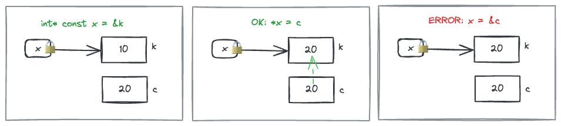

# Consts

Ref: 

* ClassConst.cpp
* make-demos/learn-cmake/hello-world

## Variables

I can make any variable immutable by declaring it as `const`, I just need to assign it a value at declaration time and then it can never change.

```c++
const int x = 10;
```

Similarly for user defined types -

```c++
const Cookie cookie;
```

In this case, there are some restrictions placed on which methods/attributes of the `Cookie` class this particular immutable variable can access.

* It only has read-only access to public attributes
* It can only call public methods that have the `const` keyword

In turn `const` methods can themselves only call other `const` methods and have only read-only access to all the data members - whether public or private.

```c++
class Cookie {
public:
  int calories;
  string flavor;
  
public:
  int servings;
  
  void save();
  
  void serve() const;
  
  void bake() const
  {
    // Cannot -
    // - change the values of calories, flavor, or servings
    // - call save()
    // Can -
    // - read the values of calories, flavor, and servings
    // - call serve()
  }
};

const Cookie cookie;
// Can only -
// - read servings
// - call serve and bake
```

## Pointers

Consider a pointer to an int `int* x = &k`.

There are two re-assignment patterns of pointers -

```c++
*x = c;  // Overwrite the address that x is pointing to with something else
x = &c;  // Have x point to some other address
```

There are three ways to apply consts to pointer types that will restrict one or all of the above two re-assignments.

1. The address that the pointer is pointing to is immutable, i.e., it cannot be overwritten with anything else. However, the pointer itself is free to point anywhere else.
2. The pointer itself is immutable, i.e., it cannot point to any other address. However, the address it is pointing to can be overwritten.
3. Both the pointer and the address it is pointing to are immutable.

## Immutable Address

This is declared as `const int* x` or `int const* x`. Both can be read as `x` points to a `const int`. Which means that address it is pointing to is const, i.e., immutable.


```c++
// setup
int k = 10;
int c = 20;

const int* x = &k;
*x = c;  // NOT ALLOWED
x = &c;  // OK
```

## Immutable Pointer

This can be declared as `int* const x` which can be read as `const x` points to an `int`, i.e., `x` itself is const aka immutable.



```c++
int* const x = &k;
*x = c;  // OK
x = &c;  // NOT ALLOWED
```

## Immutable Everything

This can be declared as `const int* const x` which can be read as `const x` points to a `const int`.


```c++
const int* const x = &k;
*x = c;  // NOT ALLOWED
x = &c;  // NOT ALLOWED
```

## With Structs

Lets say I have the following struct and variable-

```c
typedef struct {
  int* counter1;
  int* counter2;
} Counter;

Counter c = {
    .counter1 = malloc(sizeof(int)),
    .counter2 = malloc(sizeof(int))
}
```

Now I create a pointer to a constant `Counter` like so -

```c
const Counter* ptr = &c;
```

This means that I cannot change the value at the address `ptr` is pointing to, i.e., it is equivalent to -

```c
int* const counter1;
int* const counter2;
```

If I do something like this it will give a compiler error -

```c
p->counter1 = malloc(sizeof(int)); // Compile error!
```

But I can totally do something like this -

```c
*p->counter1 = 10;
*p->counter2 = 20;
```

## Caveat

Lets say I have the following declarations -

```c
int a[3] = {};
const int* b = a;
*b = 3; // compile error! b is pointing to const int.
```

Now I have  bad function -

```c
void badFunc(int* a) {
    a[0] = 3;
}
```

Now I call this function with `a` -

```c
badFunc(a);
```

This will result in the value that `b` is pointing to change!
