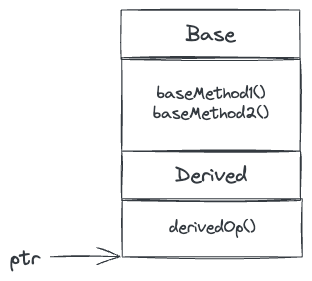

# Inheritance & Polymorphism

See Polymorphism.cpp.

## Inheritance

In C++ I can make the parent class `public`, `protected`, or `public`. 

```c++
class Derived : public Base {...};
class Derived : protected Base {...};
class Derived : private Base {...};
```

* A `public` inheritance means all the accessors of the base class are available as-is to users of the derived class. 
* A `protected` inheritance means that all `public` members of the base class will be available as `protected` in the derived. Everything else will be as-is.
* A `private` inheritance means that all `public` and `protected` members of the base class are available as `private` in the derived class.

I cannot readily think of scenarios where I'd want to make the inheritance anything other than `public`.

By default, when the derived class is created, the default base constructor is called.

```c++
class Base {
public:
  Base()
  {
    std::cout << "Base()" << std::endl;
  }
  
  Base(int x)
  {
    std::cout << std::format("Base({})", x) << std::endl;
  }
};

class Derived : public Base {
public:
  Derived(int x)
  {
    std::cout << std::format("Derived({})", x) << std::endl;
  }
};

Derived d { 10 };
// Output -
// Base()
// Derived(10)
```

The child class can also specify the base ctor to use like this -

```c++
class Derived : public Base {
public:
  Derived(int x) : Base(x)
  {
    std::cout << std::format("Derived({})", x) << std::endl;
  }
};

Derived d { 10 };
// Output -
// Base(10)
// Derived(10)
```

The child class cannot initialize any members of the base class, even if they are available to the child class. E.g., the following won't work -

```c++
class Base {
public:
  int value;
};

class Derived : public Base {
public:
  Derived : value(10) {}
};
```

The idea being that *a* Base ctor is called before any of the Derived initializers are set, so it is possible that Base might've set its members variables in some way, and then Derived will come and change the values. This will not work, e.g., if `vaue` were `const`.

## Mental Model

Here is a good mental model of the memory layout when I have a pointer or a reference to an object. This is not actually how the memory is laid out, it is just a mental model to help reason about polymorphic behavior.


Now when I call `ptr->baseMethod1()` it will start from the bottom and look for the invoked symbol. 

When the object is of type `Derived` which inherits from `Base`, this is what it looks like -



Again, when I call `ptr->baseMethod1()`, it will start from the bottom and eventually find the implementation of the `Base` class. Because the methods in both classes are not declared as `virtual`, there is no polymorphism.

## Polymorphism

If `Base` had declared `baseMethod1` as `virtual` like so -

```c++
class Base {
public:
  virtual void baseMethod1() {...}
  void baseMethod2() {...}
};
```

then instead of the implementation being inside the object, the function name symbol points to a virtual table which contains the address of the implementation.


If `Derived` has not implemented the virtual method then this is what it looks like -


Now when I call `ptr->baseMethod1()` it will go upto the `BaseImpl` and run that. On the other hand if `baseMethod1` is overridden like so -

```c++
class Derived : public Base {
  :::
  public void baseMethod1() override {...}
}
```

The use of the `override` "specifier" is optional, but it protects against silly mistakes in the overridden method's signature, e.g., if the base method was `void baseMethod(int)` and by mistake I override the derived method as `void baseMethod(short)`, then I won't get any compiler errors/warnings, this will just be taken as a new method in derived. However, with the `override` specifier, compiler will warn (error?) me about this mistake.

Anyway back to the mental model in this case:


When I call `ptr->baseMethod1()` it goes to `DerivedImpl`. Here is the interesting polymorphic behavior, if I have a `Base*` pointing to ` Derived` object -

```c++
Base* ptr = new Derived();
```


And I call `ptr->baseMethod1()`, it will still call `DerivedImpl` because of the vtable pointers. Of course with this I cannot call `ptr->derivedOp()` because remeber pointers can only see what's above them, so `ptr` cannot go down and find `derivedOp`.

Another slightly subtle behavior is if `baseMethod2` invokes `baseMethod1` like so -

```c++
void Base::baseMethod2()
{
  ::
  this->baseMethod1();
  ::
}
```

This will also end up calling `DerivedImpl`. This behavior is used in the Factory Method design pattern.

Of course polymorphic behavior is not restricted only to pointers, even stack allocated objects exhibit it -

```c++
void foo(Base& base)
{
  base.baseMethod1();
  base.baseMethod2();
}

Derived d {};
foo(d);
// foo will call DerivedImpl for baseMethod1
```

If a method is marked as virtual, all matching overrides in derived classes are also implicitly considered virtual, even if they are not explicitly marked as such.

> Never call virtual functions from constructors or destructors.

## Final

If I don't want a class to be used as a base class I can mark it as `final`.

```c++
class Noinheritance final {...};
class Derived : public NoInheritance {...};  // ERROR: Cannot derive from a final class.
```

Or more commonly - 

```c++
class Base {...};
class DerivedOne final : public Base {...};
class DerivedTwo : public DerivedOne {...};  // ERROR
```

If I don't want a hitherto virtual method not be virtual anymore, I can mark it with `final`.

```c++
class Base {
public:  
  :::
  virtual void baseMethod1() {...}
};

class Derived : public Base {
public:
  :::
  void baseMethod1() override final {...}
};
```

## Destructors

> Whenever I am dealing with inheritance, I should make any explicit destructors virtual.

If the base class destructor is not virtual, then when a derived object is deleted via a base class pointer, then it will only call the base destructor, it will not call the derived destructor.

```c++
class Base {
public:
  ~Base() {}
};

class Derived : public Base {
public:
  ~Derived() {}
};

Derived* d { new Derived {} };
Base* b { d };
delete b;  // only calls ~Base()
```

Now if I mark the base destructor as virtual in the above code -

```c++
class Base {
public:
  virtual ~Base() {}
};

class Derived : public Base {
public:
  ~Derived() {}
};

Derived* d { new Derived {} };
Base* b { d };
delete b;  // first calls ~Derived() followed by ~Base()
```

I don't need to mark `~Derived()` as virtual, it is implicitly virtual for any of **its** child classes.

## Abstract Base Class

If `baseMethod1` is declared as pure virtual method like so -

```c++
class Base {
public:
  virtual void baseMethod1() = 0;
  
  void baseMethod2() {...}
};
```

Then there is no `BaseImpl`, the vtable points to NULL. This is why it is not possible to instantiate an object of this type. This makes `Base` an abstract base class. Any concrete child class will have to implement this method.


### Interface

A class with no instance variables and only public pure virtual methods is an interface.

```c++
class Logger {
public:
  virtual info(const string&) = 0;
  virtual warn(const string&) = 0;
  virtual error(const string&) = 0;
};
```

## Object Slicing

==TODO:== [25.9 — Object slicing – Learn C++ (learncpp.com)](https://www.learncpp.com/cpp-tutorial/object-slicing/)

## Misc

#### Curiously Recurring Template Pattern (CRTP)

More details [here](https://en.cppreference.com/w/cpp/language/crtp)

```c++
template <class D>
class Base {
public:
    void name()
    {
        D* d = static_cast<D*>(this);
        d->impl();
    }
};

class Derived : public Base<Derived> {
public:
    void impl()
    {
        std::cout << "Derived" << std::endl;
    }
};

Derived d;
d.name();
```

This does not make much sense to me because I can get the same behavior by making `impl` a pure virtual method in `Base` that all child classes have to implement.


A good use of multiple inheritance is mixins. Mixins usually don't have any virtual methods, their methods are supposed to be called as-is. Apart from not having any virtual methods, there is nothing special about mixin base classes.

```c++
class Label {
public:
  void text(const string& content) {...}
};

class TextBox {
public:
  void text(const string& content) {...}
}

class Button : public Label, public TextBox {...}

Button button {};
button.Label::text("This is a label");
button.TextBox::text("This is a text box");
```

