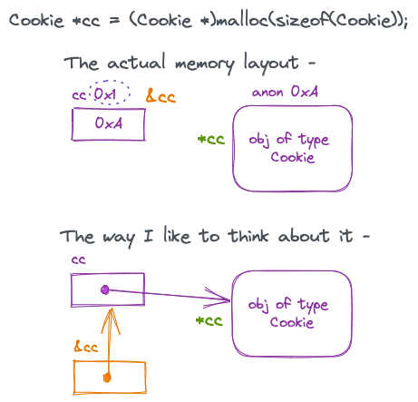
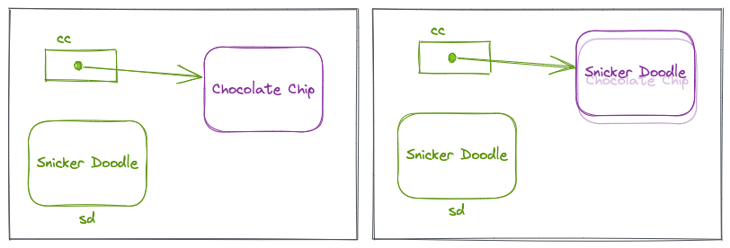
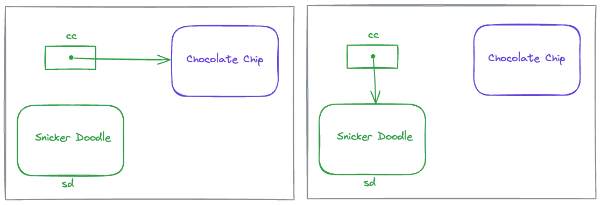
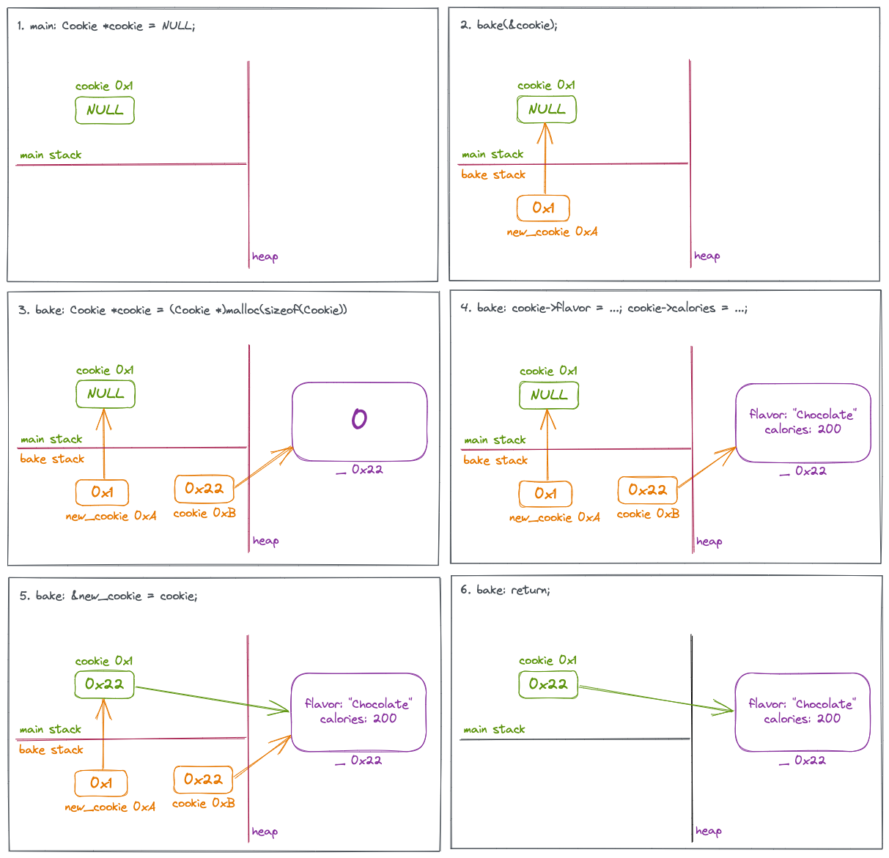
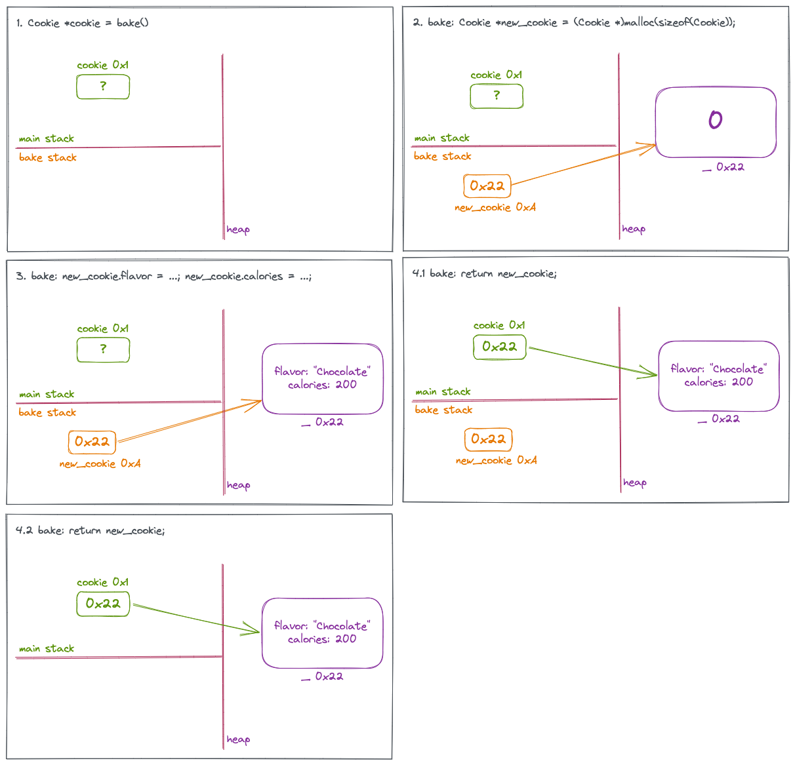
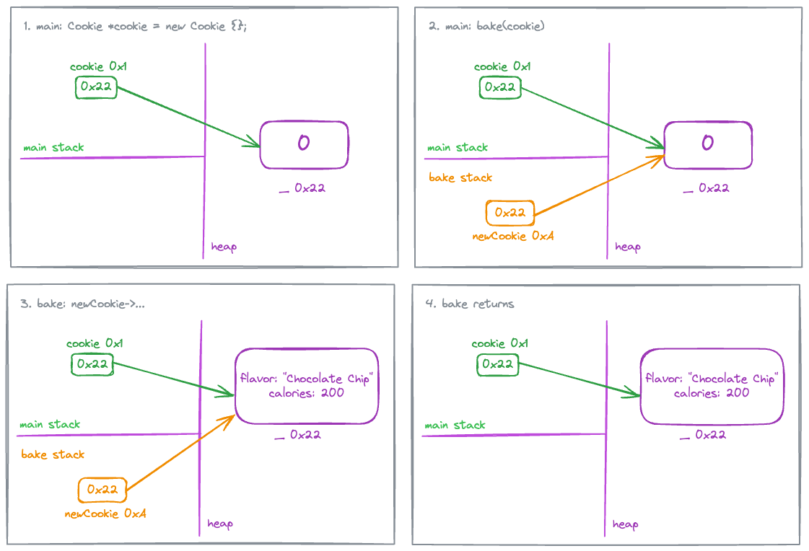
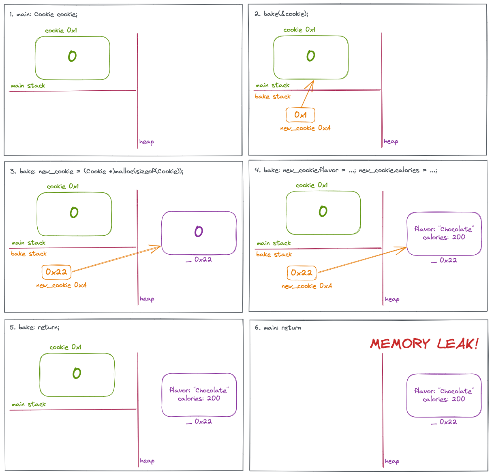

# Pointers

## Pointer Visualization

Consider this code snippet - 

```c
Cookie* cc = (Cookie*)malloc(sizeof(Cookie));
Cookie* cc = new Cookie {};  // Equivalent to above
```

`cc` is a variable of type "pointer to Cookie". This means that its value is the address of a `Cookie` object that lives somewhere in memory, say `0xA`. In this case, because of the `malloc` it lives on the heap. `*cc` is simply this object that `cc` is pointing to. Of course the variable `cc` itself also has an address, say `0x1`, which is `&cc`. The type of `&cc` is `Cookie **`. 



Ways of verbalizing `*cc` -

* Object/address that `cc` is pointing to
* Value at the address in `cc`

Ways of verbalizing `&cc` -

* Address of `cc`

When I see `*cc` I like to think of following the pointer arrow out of `cc` **to** the object/address it is pointing to. When I see `&cc` I like to think of backing away **from** `cc` to another place in memory that holds `cc`'s address.

There are two main patterns of pointer re-assignment =

```cpp
*cc = val;  // overwrite address
cc = &val;  // change address, potential memory leak
```

When I see something like `*cc = sd` I read it as "overwrite the address that `cc` is pointing to by the contents of `sd`".

```c
Cookie* cc = (Cookie*)malloc(sizeof(Cookie));
cc->flavor = "Chocolate Chip";
cc->calories = 200;

Cookie sd;
sd.flavor = "Snicker Doodle";
sd.calories = 180;

*cc = sd;
```

This will literally **overwrite** the object that `*cc` was pointing to. So `cc` still points to the same address on the heap, but its contents will have changed.



When I see something like `cc = &sd` I read it as make `cc` point to the address of `sd` instead of whatever it was pointing to. Here the original object is still in the same address that `cc` was pointing to earlier. But now `cc` points to some other address.



Needless to say, there is a potential for memory leak here.

`*&cc` and `&*cc` both refer to `cc` itself. Lets take `*(&cc)`, `&cc` means we back away from `cc` to another memory location. `*` of that means we follow the pointer out of this memory location to the object it is pointing to, i.e., `cc`. It does not make sense to put the parens like this - `(*&)cc`, and that is why I am guessing we can omit the parens. Let take the other variation `&(*cc)`. With `*cc` we follow the pointer to the object it is pointing to, then with `&` we back away from that object, leading us back to `cc`.

### Null Pointer

```c++
Cookie* cookie;  // This is uninitialized
Cookie* cookie {};  // This is a nullptr
Cookie* cookie { nullptr };  // This is also a nullptr
```

An uninitialized pointer is different from a null pointer. It can point to any garbage memory. Best practice to initialize a pointer to something, even if it is just a nullptr.

A `nullptr` will convert to a False, so when doing a compairson the following are equivalent -

```c++
// cookie :: Cookie*
if (cookie == nullptr) {}
if (cookie) {}
```


## Pointer Passing

There are 3 different ways of passing pointers with pitfalls in all.

```c
void bake(Cookie**);
Cookie* bake();
void bake(Cookie*);
```

### Technique 1

This technique leverages the `*ptr = val` behavior that overwrites the contents of whatever the pointer is pointing to by something else. The caller will pass in the address of a pointer. The pointer will point to an uninitialized object. The called function will allocate a new object and will overwrite the contents of the passed in pointer.

```c
void bake(Cookie** newCookie)
{
  // Allocate a new valid cookie object
  Cookie* cookie = new Cookie {};
  cookie->flavor = "Chocolate Chip";
  cookie->calories = 200;
  *newCookie = cookie;
}

int main()
{
  Cookie* cookie = NULL;
  bake(&cookie);
  :::
  delete cookie;
}  
```



Errata: Pane #5 should read `bake: *new_cookie = cookie`.

Here if I do `newCookie = &cookie` then in the bake stack, `new_cookie` will have the address `0x22`, i.e., it will point to `cookie`. When bake returns, all of that is lost, the main `cookie` is still `NULL` and there is a memory leak of the memory that was allocated inside `bake`.

### Technique 2

This is by far the easiest, but the one drawback that I see is that the function that allocated the memory is no longer there to delete it. It falls upon the caller to delete.

```c++
Cookie* bake()
{
  Cookie* cookie = new Cookie {};
  cookie->flavor = "Chocolate Chip";
  cookie->calories = 200;
  return cookie;
}

int main()
{
  Cookie* cookie = bake();
  :::
  delete cookie;
}
```



### Technique 3

The caller allocates memory before passing the pointer to the called function. The called function is simply supposed to populate the object in some specific way.

```c++
void bake(Cookie* newCookie)
{
  newCookie->calories = 200;
  newCookie->flavor = "Chocolate Chip";
}

int main()
{
  Cookie cookie;
  bake(&cookie);
}

int main()
{
  Cookie* cookie = new Cookie {};
  bake(cookie);
}
```



The way this can be screwed up is if `bake` allocates the memory instead of `main`.

```c++
void bake(Cookie* newCookie)
{
  newCookie = new Cookie {};
  newCookie->flavor = "Chocolate Chip";
  newCookie->calories = 200;
}

int main()
{
  Cookie cookie;
  bake(&cookie);
}
```



### Predefined Pointer-Related types

* `size_t`: Created to provide a safe type for sizes. This is an unsigned integer type. It should be used array indexes, loop counters, and occasionally for pointer arithmetic. It is best to use the `%zu` or `%lu` format specifier to print it.
* `ptrdiff_t`: Created to handle pointer arithmetic.
* `intptr_t` and `uintptr_t`: Used for storing pointer addresses.

### Pointers and Arrays

When an array name is used by itself, it returns the address of the array, which is also the address of the first element of the array. E.g., the output of the following code -

```c
int a[] = {10, 20, 30};
printf("Address of a: %p\n", &a);
printf("Value of a: %p\n", a);
printf("Value pointed by a: %d\n", *a);
```

```shell
Address of a: 0x7ffe846ab98c
Value of a: 0x7ffe846ab98c
Value pointed by a: 10
```

`&a` and `a` have the same value! And we know it is the address of the first element because when we dereference it we get 10.

But if I declare another pointer variable pointing to 10, it will behave like a normal pointer, i.e., its own address will be different than the address it is pointing to, i.e., `&ptr != ptr`. E.g., output of the following code -

```c
int* ptr = a;
printf("Address of ptr: %p\n", &ptr);
printf("Value of ptr: %p\n", ptr);
printf("Value pointed by ptr: %d\n", *ptr);
```

```shell
Address of ptr: 0x7ffe846ab980
Value of ptr: 0x7ffe846ab98c
Value pointed by ptr: 10
```

## Pointer Arithmetic

See Vectors and Arrays.

A pointer is incremented by the size of the data type it is pointing at. On my computer I have the following sizes -

```
size of char: 1
size of short: 2
size of int: 4
size of long: 8
size of float: 4
size of double: 8
```

So if I add 1 to an int pointer, it will get incremented by 4 and if I add one to a long pointer it will get incremented by 8.

```c
int num = 5;
int* pi = &num;
printf("%pi = p\n", pi);
pi += 1;
printf("%pi = p\n", pi);
```

```shell
pi = 0x7ffd2a9abd14
pi = 0x7ffd2a9abd18
```

and here is the corresponding code for long -

```c
long bignum = 2000000000;
long* pl = &bignum;
printf("pl = %p\n", pl);
pl += 1;
printf("pl = %p\n", pl);
```

```shell
pl = 0x7ffd2a9abd18
pl = 0x7ffd2a9abd20
```

Because `void*` does not really have a data type, it will increment by 1, just like a char whose size is 1 byte.

```c
void* pv = &num;
printf("pv = %p\n", pv);
pv = pv + 1;
printf("pv = %p\n", pv);
```

```shell
pv = 0x7ffc022f89dc
pv = 0x7ffc022f89dd
```


## Function Pointers

See Functional.
