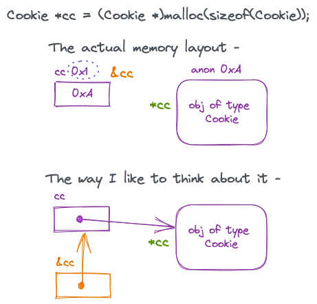
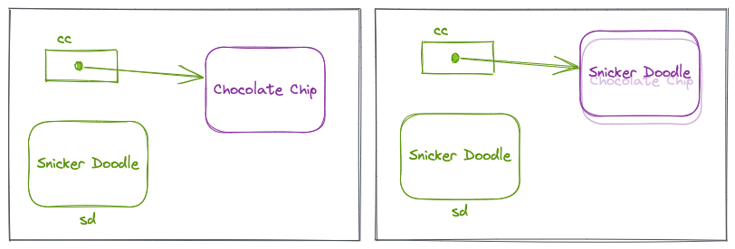
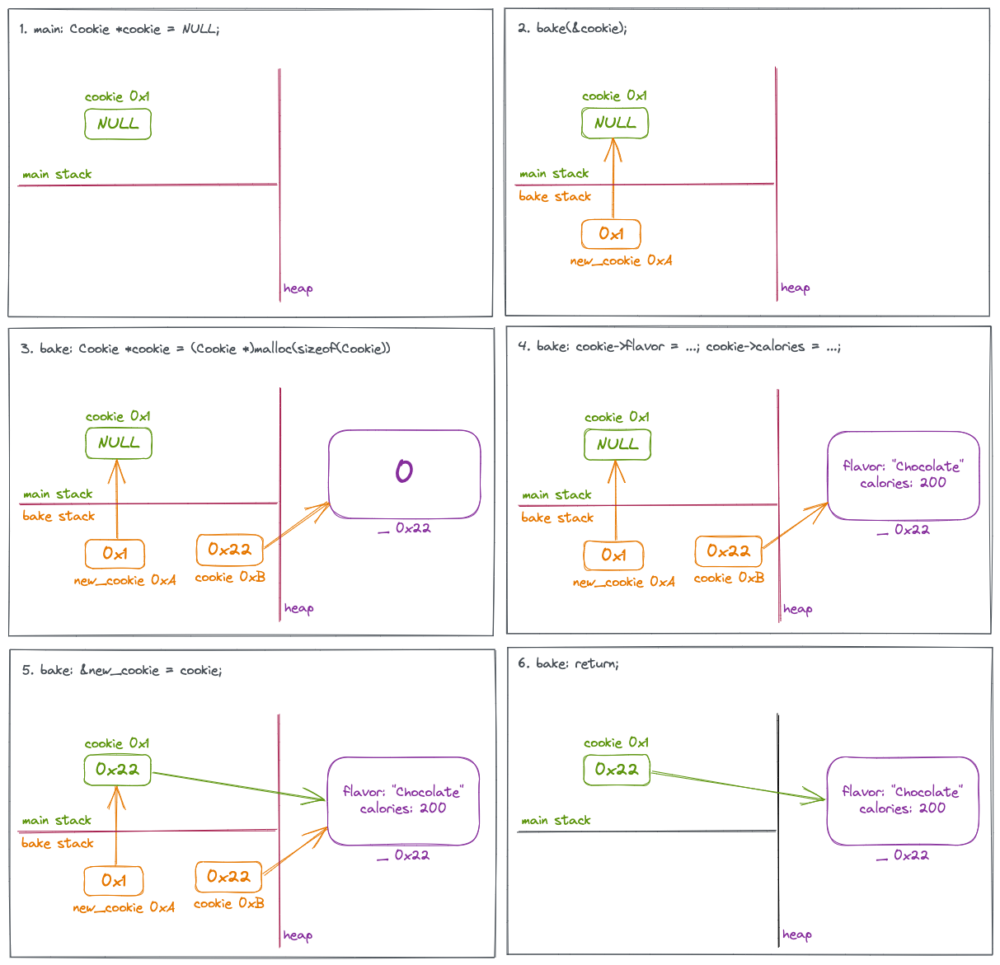
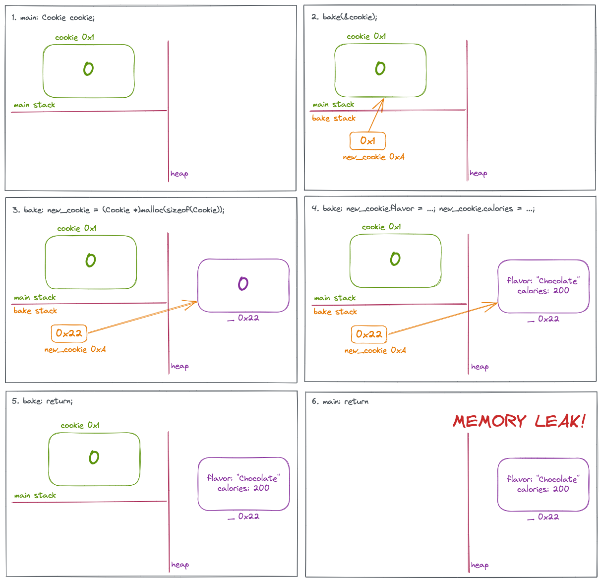
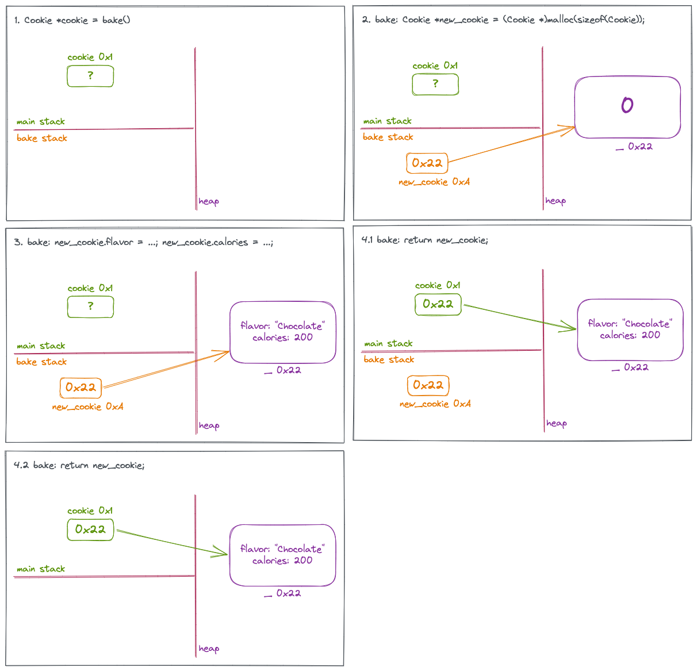
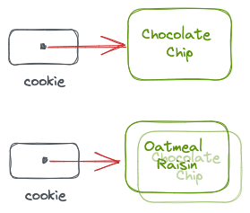
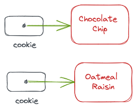

# Notes

## Useful Links

[SEI CERT C Coding Standard](https://wiki.sei.cmu.edu/confluence/display/c/SEI+CERT+C+Coding+Standard) has a bunch of useful information around arrays, error checking, API design, etc.

## Pointers
### Pointer Visualization

Consider this code snippet - 

```c
Cookie* cc = (Cookie*)malloc(sizeof(Cookie));
```

`cc` is a variable of type "pointer to Cookie". This means that its value is the address of a `Cookie` object that lives somewhere in memory, say `0xA`. In this case, because of the `malloc` it lives on the heap. `*cc` is simply this object that `cc` is pointing to. Of course the variable `cc` itself also has an address, say `0x1`, which is `&cc`. The type of `&cc` is `Cookie **`. 




Ways of verbalizing `*cc`:

* Object that `cc` is pointing to.
* Value of the address in `cc`.

Ways of verbalizing `&cc`:

* Address of `cc`.

When I see `*cc` I like to think of following the arrow **from** `cc`. When I see `&cc` I like to think of back-following the array **to** `cc`. In both cases, I start from `cc.`

Now, `*(&cc)` is the object that `&cc` points to, which is ofcourse `cc` itself. Apparently it works without parens as well, i.e., `*&cc` is a valid expression. Here I back up from `cc` to the orange box, and then I follow the arrow out of the orange box, which leads me back to `cc`. And the `&(*cc)` is the address of the object that `cc` points to, which again is `cc` itself. This too works without parens. Here I first follow the arrow from `cc` which leads me to the actual object on the heap. Then I back up from there landing back on `cc`.

When I see soemthing like `*cc = sd`, I read it as "replace (the object that cc points to) by sd". This would work like so -

```c
Cookie* cc = (Cookie*)malloc(sizeof(Cookie));
cc->flavor = "Chocolate Chip";
cc->calories = 200;

Cookie sd;
sd.flavor = "Snicker Doodle";
sd.calories = 100;

*cc = sd;
// The object that cc was pointing has been overwritten by sd's contents
```

This will literally **repalce** the object that `*cc` was pointing to. So `cc` still points to the same address on the heap, but its contents have been changed.



### Pointer Passing

Lets say I have this program which follows the return-error design pattern -

```c
int main(int argc, char **argv) {
  Cookie* cookie = NULL;
  bake(&cookie);
}

int bake(Cookie **new_cookie) {
  Cookie* cookie = (Cookie*)malloc(sizeof(Cookie));
  cookie->flavor = "Chocolate";
  cookie->calories = 200;
  *new_cookie = cookie;
  return OK;
}
```

Here is what the execution flow and memory layout looks like -



Errata: Pane #5 should read `bake: *new_cookie = cookie;`.

1. In the `main` stack, there is a variable `cookie` whose address is memory location `0x1`. It is right now filled with `NULL`.
2. When I call `bake(&cookie)`, the CRT will copy the address of cookie to a variable called `new_cookie` on `bake`s call stack. So the value in `new_cookie` will be `0x1`, which means it is a pointer pointing to cookie in the main stack.
3. When `bake` instantiates a new variable and mallocs it, the CRT will create an empty `Cookie` struct in the heap at address `0x22`. It will further create a variable `cookie` in `bake`s stack and fill it with value `0x22` which means it is a pointer to the newly allocated space.
4. Now the values of the Cookie struct on the heap are set/changed/initialized - call it what you will.
5. In the bake stack, the value of `cookie` is copied over to the address at which `new_cookie` is pointing, which means that `main::cookie` will now contain `0x22`, which means it too is now pointing at the allocated space on the heap.
6. When `bake` returns, its call stack is destroyed, but main's cookie is already pointing to the Cookie on the heap, so everything is fine.


What if instead I had a program that looks like this -

```c
int main(int argc, char **argv) {
  Cookie cookie;
  bake(&cookie);
}

int bake(Cookie* new_cookie) {
  new_cookie = (Cookie*)malloc(sizeof(Cookie));
  new_cookie->flavor = "Chocolate";
  new_cookie->calories = 200;
  return OK;
}
```

Not only is there a memory leak, `main` is still left holding garbage cookie.




What if I didn't follow the API design of always returning the status, but instead returned the actual object instead?

```c
int main(int argc, char **argv) {
  Cookie* cookie = bake();
}

Cookie* bake() {
  Cookie* new_cookie = (Cookie*)malloc(sizeof(Cookie));
  new_cookie->flavor = "Chocolate";
  new_cookie->calories = 200;
  return new_cookie;
}
```

This by far is the simplest and most intuitive execution flow -



A third way of designing this API is -

```c
void bake(Cookie* cookie) {
  // Assume that cookie has already been allocated
  cookie->flavor = "Chocolate";
  cookie->calories = 200;
}

int main() {
  Cookie* cookie = (Cookie*)malloc(sizeof(Cookie));
  bake(cookie);
}
```


## Constants

If the type is a non-pointer type, then the usage of `const` is fairly easy.

```c
int const a = 10; // Declare a as a constant integer
a = 11; // Error: Cannot change the value of a!

// An alternate way of declaring a constant integer
const int b = 10; 
```

For pointer types, the declaration is a bit nuanced. I can say that the pointer itself is immutable, i.e., it can only point to the address it was first declared with, or I can say that the value the pointer points to is immutable, or both. An easy way to remember the syntax is to remember the C convention about pointers - `int* a` means that when `a` is deferenced as `*a` it will point to an `int`. Similarly `int const* a` means that when `a` is derefrenced, `*a` it will point to a `int const`, and so on. 

For the following explanations lets say I have two cookies - Chocolate Chip and Oatmeal Raisin.

```c
Cookie chocolateChip;
Cookie oatmealRaisin;
```

#### Address contents can change, but address pointed to cannot



```c
Cookie* const cookie = &chocolateChip;
*cookie = oatmealRaisin;  // OK: overwriting the address with new contents
cookie = &oatmealRaisin; // Error: Cannot point to a different address
```

#### Address pointed to can change, but address contents cannot



```c
const Cookie* cookie = &chocolateChip;
*cookie = oatmealRaisin; // Error: Cannot change the value at the address
cookie = &oatmealRaisin; // Allowed: Changing the address to point to something different
```

### Neither the address contents, nor the address pointed to can change

```c
const Cookie* const cookie = &chocolateChip;
*cookie = oatmealRaisin; // Error: Cannot change address contents
cookie = &oatmealRaisin; // Error: Cannot point to a different address
```


## API Design

Check out [SEI CERT API](https://wiki.sei.cmu.edu/confluence/pages/viewpage.action?pageId=87151980).

### Summary

```c
int Create1(IntArray *empty_obj);
IntArray ints;
Create1(&ints);

IntArray *Create2();
IntArray *ints = Create2();

int Create3(IntArray **new_obj);
IntArray *ints = NULL;
Create3(&ints);
```

This is my first attempt at defining a user-facing API. I am trying to follow one of the patterns that I have seen so far, where all functions return the status of the function as an int. All output variables are part of the parameter list. There is another more intuitive pattern that I have seen in functions like `malloc` where they return the object they are supposed to. Here error is indicated by returning a `NULL` and setting a global `errno` with the error status. However, there are two things here that are not clear - what to do in case my return type is not a pointer? E.g., in the `Pop` function, how do I indciate that something went wrong? Another is that everywhere I read they say **not** to use `errno` because it is used by syscalls. In which case I'll have to implement my own `errono` equivalent which seems annoying. This is why I am opting for the first, less intuitive pattern, because at least it is consistent.

Places where it is not clear to me if this is a good API design is for simple functions like `Pop` which (semantically) should return the value that was popped. But then how do I indicate that something went wrong? So I'll follow the pattern of returning the status code and have the actual output value be part of the parameter list. A second case where this hits me is simple functions like `Print` where I cannot think of any failure reasons. Here still I'll return a gratutous int status code that is always 1 for consistency.

Another area where I struggle is designing functions which will act on the object. Should I pass a pointer to the object, or should I pass the object (by value)? Rationally thinking it seems that I should pass in the object by value, because the underlying pointer will be copied over so everything should be fine. But my instinct tells me to use pointers because all other languages in the world always pass by reference anyway. For now I'll pass the pointer as a `const`. But maybe I'll create a debug version where I pass in by value and see what happens.

### Error Codes
I had defined the error codes in `array.h` as follows:

```c
const int OUT_OF_MEMORY_ERROR = -1;
const int UNKOWN_ERROR = -2;
const int OK = 1;
```
Now `array.h` is included in multiple .c files in my project. When a .c file is compiled into a .o file, these ints are defined in the .o file. When it comes time to link all the .o files where these ints are defined, it leads to a linker (`ld`) error because the linker is confused by seeing multipled definitons of the same ints. At any rate, I am moving this declaration into `array.c` to avoid this error. But then how does the caller what a particular error means?

**Questions**:
  1. Why doesn't the linker complain about the duplicate function or struct definitions?
  2. What is the common pattern for declaring error codes - header files or code files?
  3. If it code files, how does the caller know what a particular int means? Documentation?

I think these are defined as macros in the header file. Let me try that.

### Rethink Design

This seems to suggest that I follow the simple design over the return-error design. If my function is supposed to return a pointer, then a `NULL` pointer indicates an error, so it is easy to do error handling here. Of course I'll need to learn how to read and write global error states. But if my function returns a full value, then there is no good way to indicate error. Here I guess I should follow the return-error design.

Another alternative is to follow `node.js` style return values, where it always returns a tuple, the second element indicates if the call was successful or not, and the first element is the actual return value. I have not seen any C APIs do this, so I guess this is not very popular in the C world.

## Unit Testing
There seem to be a bunch of unit testing frameworks for C, but right now I am not in the mood to learn a new testing framework. For this I'll just roll my own simple `assert` based tests.

