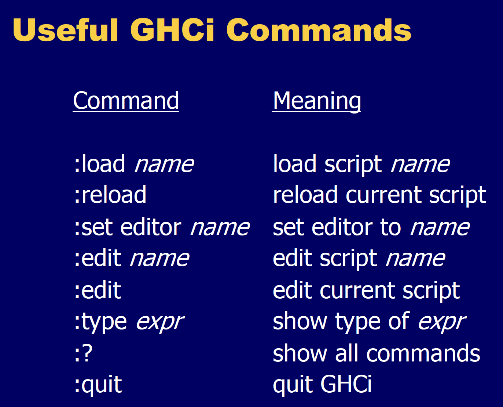
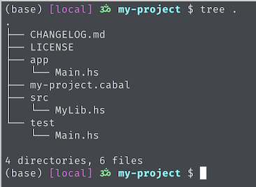

# Installation

Install Haskell by going to the Haskell website. Remember to choose to install `stack`. Otherwise I'll have to install it from another website. While there is a Haskell Jupyter kernel called `iHaskell` the installation does not really work on M1 because of the `magic` lib. I tried using `Docker` but that didn't work either. So for now no Jupyter support.

## Build

To build haskell programs I’ll need LLVM. It should already be there on MacOS but sometimes it isn’t. The easiest thing is to install it via Homebrew and then add it to my PATH. Here is a simple program to test if building works. Create a file called `helloworld.hs` -

```haskell
main = putStrLn "Hello World!"
```

Now build and link it -

```
$ ghc --make helloworld.hs
```

If I get some sort of LLVM or opt error do the following -

```
$ brew install llvm
$ echo 'export PATH="/opt/homebrew/opt/llvm/bin:$PATH"' >> ~/.zshrc
```

I should be able to see the `helloworld` executable in my directory now. I can execute it as usual.

The above will work as long as `helloworld.hs` is a bare module, that it does not have a `module <some name> where` at the beginning. In general the best way to build a simple Haskell executable is to have something like this in a file named `Main.hs` -

```haskell
-- This is in a file named Main.hs
module Main where

main :: IO()
main = putStrLn "Hello, World!"
```

Now build and link it in a single command -

```shell
$ ghc --make Main.hs -o ~/temp/bin/main
```

This will still generate the intermediate object files `.o` and `.in` in the source diretory.

### Compiler Warnings

`ghc` compiler has a bunch of cool warnings that I can enable when compiling as documented [here](https://downloads.haskell.org/ghc/latest/docs/users_guide/using-warnings.html). For example if I have this function -

```haskell
-- defined in Example.hs
example :: (Num a) => Bool -> [a] -> a
example True [] = 0
example False [x, y] = x + y
```

And I compile this as -

```shell
$ ghc -Wincomplete-patterns Example.hs
```

Then GHC will tell me that this module has an incomplete pattern and the best part is that it will actually complete the pattern for me!

```shell
$ ghc -Wincomplete-patterns Example.hs
[1 of 1] Compiling Example          ( Example.hs, Example.o )

Example.hs:17:1: warning: [-Wincomplete-patterns]
    Pattern match(es) are non-exhaustive
    In an equation for ‘example’:
        Patterns of type ‘Bool’, ‘[a]’ not matched:
            True (_:_)
            False []
            False [_]
            False (_:_:_:_)
   |
17 | example True [] = 0
   | ^^^^^^^^^^^^^^^^^^^...
```

## REPL

Haskell does come up with a REPL called `ghci`. I can also load a Haskell script into the REPL by `ghci myscript.hs`. This will make all the functions defined in `myscript.hs` available in the REPL.



In general this is a very poor repl as compared the IPython repl, e.g., pattern matching functions where I define the same function for different input patterns does not work reliably. It is best to write the functions in a haskell module file and then load it in. E.g., the following is in a file named `Scratch.hs` -

```haskell
-- This is Scratch.hs
module Scratch where

double x = 2 * x
```

Now load it in the repl with -

```shell
ghci Scratch.hs
```

The `double` function will be available in the REPL.

To enable multi-line inputs in the REPL either do `:set +m` or wrap multiple lines in `:{` `:}` More details [Multiline commands in ghci](https://stackoverflow.com/questions/8443035/multi-line-commands-in-ghci)

## Importing

Nice and succing explanation [Importing modules](https://wiki.haskell.org/Import). 

## Cabal

[Welcome to the Cabal User Guide — Cabal 3.4.0.0 User's Guide](https://cabal.readthedocs.io/en/3.4/index.html)

Cabal is one of the ways to create full Haskell project. Another way is `stack` but these days `cabal` is in favor.

Run the following to create a project skeleton -

```shell
$ mkdir my-project
$ cd my-project
$ cabal init -p my-project
```

This will ask a bunch of questions like whether I want to create a library or an executable or both, what kind of license I want, which language I want to use, whether I want a test directory or not, etc.



This is what my-project.cabal looks like -

```cabal
cabal-version:      3.0
name:               my-project
version:            0.1.0.0
common warnings
    ghc-options: -Wall

library
    import:           warnings
    exposed-modules:  MyLib
    build-depends:    base ^>=4.17.2.1
    hs-source-dirs:   src
    default-language: Haskell2010

executable my-project
    import:           warnings
    main-is:          Main.hs
    build-depends:
        base ^>=4.17.2.1,
        my-project
    hs-source-dirs:   app
    default-language: Haskell2010

test-suite my-project-test
    import:           warnings
    default-language: Haskell2010
    type:             exitcode-stdio-1.0
    hs-source-dirs:   test
    main-is:          Main.hs
    build-depends:
        base ^>=4.17.2.1,
        my-project
```

To run it I can do -

```shell
$ cd my-project
$ cabal run
```

This will build and run the main target. I can also specify a target like `cabal run my-project:my-project-test` to run the test project.

To install an external library package from Hackage do -

```shell
cabal install --lib aeson
```

To install an external executable package from Hackage do -

```shell
cabal install <pkgname>
```

This will install the package in some global cache on disk mostly somewhere under `~/.cabal`. AFAIK - there is no way of isolating the packages into sort of a Python virtual env.

To run the GHCi REPL with my project package, run 

```shell
cabal repl <TARGET>
```

Not giving the target name will build the default package. I think just like Makefile, this would be the first target, `library` in this example. If I run the repl with my executable package instead, it will build the library package since my executable depends on it, but any deps of the library will not be available directly. They will be available in "hidden" form.

This is what a typical Main.hs looks like in a professional Haskell project -

```haskell
module Main (main) where

import qualified MyModule

main :: IO ()
main = MyModule.main
```

