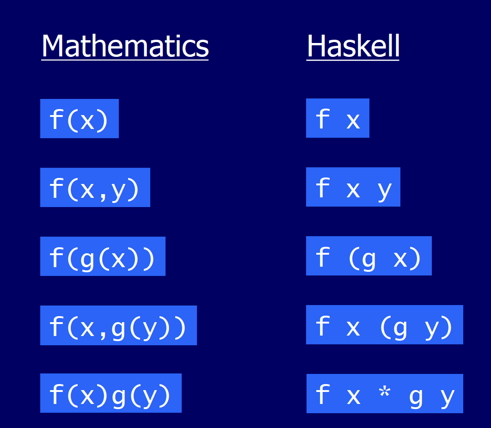

# Getting Started

## Common Data Types

* Numeric types are all grouped together as `Num` or `Real`. These are not really data types but are interfaces (aka typeclass) as explained in the note on `Types`. There are specific numeric types like `Integer`, `Float`, etc. which are actualy data types. There is also `Int`. Converting from one to another can be painful but functions like `fromInteger` or `fromIntegral` from the `Num` and `Real` interfaces can be useful.
* Boolean type is `Bool` and it has only two values `True` and `False` pretty much like Python.
* List type is represented as `[a]` and any other data type can be put in a list. However, as the representation indicates, a list cannot have elements of different types in it, only elements of the same type are allowed. `[1, 2, 3]` if of type `[Integer]` or `[True, False, True]` is of type `[Bool]`, etc.
* A single character is represented by the `Char` type. Strings are just syntactic sugar for `[Char]`. 
* A tuple can have elements of different types. `(Int, String)` is a tuple of 2 elements, first being an integer and second being a string. `(1, "Avilay")`, `(2, "APTG")`, etc. are values of this type. I can always have a list of tuples like so - `[(Int, String)]` where `[(1, "Avilay"), (2, "APTGT")]` is a value of this type.

## (Un) Common Operators

#### Division

By default all division is floating point when using the `/` operator. To do integral division use the `div` function.

```haskell
-- normal (fractional) division
10/3
3.333333333335

-- integral division
10 `div` 3
3
```

#### Not-Equals

The not-equals operator is written as `/=`, e.g., `1 /= 2` will evaluate to `True`.

#### Wildcards

Just like in Python `_` is a wildcard that means that the program does not really care about the value in this argument. E.g., this function `f _ 0 = 0` will accept two arguments but if the second argument is 0, it will always return a 0 regardless of the first argument.

## Defining a Function

```haskell
double x = x + x
quadruple x = double (double x)
```

Here is a good table showing how Haskell definitions work -



### Binary functions are special

The usual way to call any function is `f x y`. But if a funciton is binary, i.e., it accepts two values, then it can be called as ``x `f` y``, e.g., `div` which is integer division can be called as ``5 `div` 2 = 2``. 

All arithmetical functions are binary functions, i.e, they can be called as `(+) 2 3`. However, contrary to the above rule, we don't have to surround them by backticks when calling them in the `value <op> value` pattern, in fact it is a syntax error if we do so.

```haskell
ghci> (+) 2 3
5
ghci> 2 + 3
5
ghci> 2 `+` 3

<interactive>:50:4: error: parse error on input ‘+’
```

### First Class Constructs

Functions are just like any other value, they can be assigned to variables, passed to another function as an input argument, returned from another function as output, etc.

```haskell
ghci> double x = x + x
ghci> timesTwo = double  -- timesTwo is just an alias for double
ghci> double 10
20
ghci> timesTwo 10
20
ghci> map double [1, 2, 3]
[2,4,6]
```

### Lambdas

The usual anonymous functions. Most useful for defining single use functions. The syntax is as follows -

```haskell
ghci> map (\x -> x^2) [1, 2, 3]
[1,4,9]
```

### Partial Functions

All functions are partial by default. Unlike Python, I don't have to do anything special for that.

```haskell
ghci> divide x y = x / y
ghci> fourBy = divide 4
ghci> fourBy 2
2.0
ghci> fourBy 5
0.8
ghci>
```

Partial functions can be constructed by supplying the earlier parameters. In the example above, `divide 4` creates a function like `4/ y`. There is no way I can create a partial by supplying the second value first.

However, here too binary operators are different. With these I can create a partial by providing either the left (first) or the right (second) params. These are called **operator sections**.

```haskell
-- provide the lhs in the partial
ghci> fourBy = (4/)
ghci> fourBy 2
2.0
ghci> fourBy 5
0.8

-- provide the rhs in the partial
ghci> halve = (/2)
ghci> halve 5
2.5
ghci> halve 2
1.0
```

### Throwing errors

Use the `error` function to throw an error. `bad _ = error “cannot allow that!”` is a function that will always throw an error no matter the input.

### Multiple Lines

```haskell
usingLet x =
  let y = 10
      z = foo y
   in x + y - z
   
usingWhere x = go 10 x
  where
    go a b = a + b
```

#### do-notation with let-in

`usingLet` function can be re-written as -

```haskell
usingLet x = do
  let y = 10
      z = foo y
  x + y - z
```

This looks more like a "normal" function. Also see do-notation in Monads.

### Glasgow Idiom

[The Glasgow Idiom](https://stackoverflow.com/questions/5844653/haskell-why-the-convention-to-name-a-helper-function-go) is a common programming pattern in Haskell is to call inner helper functions as `go`. 

```haskell
topLevelFunc x = go 0
  where
    go n = n + 1
```

### If-Then-Else

```haskell
usingIf x y = 
  if x > 10 && y > 10
    then "Big" 
    else "Small"

usingGuards x
  | x < 0 = "Negative"
  | x == 0 = "Zero"
  | otherwise = "Positive"
```

`if`, `let`, `where`, guards can all be combined to create long programs.

All logical operators are implemented as functions. It might seem that Haskell supports the `and` `or` keywords, they are just functions that behave slightly differently than `&&` `||`.

```haskell
ghci> :info &&
(&&) :: Bool -> Bool -> Bool 	-- Defined in ‘GHC.Classes’
infixr 3 &&
ghci> :info and
and :: Foldable t => t Bool -> Bool 	-- Defined in ‘Data.Foldable’

ghci> :info ||
(||) :: Bool -> Bool -> Bool 	-- Defined in ‘GHC.Classes’
infixr 2 ||
ghci> :info or
or :: Foldable t => t Bool -> Bool 	-- Defined in ‘Data.Foldable’

ghci> :info not
not :: Bool -> Bool 	-- Defined in ‘GHC.Classes’
```

### Pattern Matching

In Haskell a common way to implement functions is to use pattern matching. Best explained by examples -

```haskell
-- Literals in function signature
eval :: Char -> Int -> Int -> Int
eval '+' x y = x + y
eval '-' x y = x - y
eval '*' x y = x * y
eval '/' x y = x `div` y
eval _ _ _ = 0

-- Using case-of
calc :: Char -> Int -> Int -> Int
calc op x y = case op of
  '+' -> x + y
  '-' -> x - y
  '*' -> x * y
  '/' -> x `div` y
  _ -> 0
```

#### Common Mistakes

##### Incorrect Order

```haskell
isEmpty :: [Int] -> Bool
isEmpty _ = False
isEmpty [] = True
```

This will always evaluate to `False` because`_` will match everything, the implementation will never reach the third line. In the following example, the variable names in the second line will match everything.

```haskell
headOrDefault :: Int -> [Int] -> Int
headOrDefault def list = def
headOrDefault _ [x : xs] = x
```

Again, the implementation will never reach the third line.

##### Patterns on Variable Names
As tempting as it will seem, we cannot pattern match on variable names - 
```haskell
areSame :: Int -> Int -> Bool
areSame x x = True
areSame _ _ = False
```
Will flat out result in a syntax error in the second line because I am try to use the same variable name for two different values.

##### Incomplete Patterns
A function is **total** if it is defined for all possible input patterns, otherwise it is called **partial**. A common implementation error is to leave a function as partial. The Haskell compiler offers a good way to check this. Lets define a partial function in Example.hs -

```haskell
example :: (Num a) => Bool -> [a] -> a
example True [] = 0
example False [x, y] = x + y
```

And then compile this file with the appropriate warning enabled -

```shell
$ ghc -Wincomplete-patterns Example.hs
[1 of 1] Compiling Example          ( Example.hs, Example.o )

Example.hs:17:1: warning: [-Wincomplete-patterns]
     Pattern match(es) are non-exhaustive
     In an equation for ‘example’:
         Patterns of type ‘Bool’, ‘[a]’ not matched:
             True (_:_)
             False []
             False [_]
             False (_:_:_:_)
    |
 17 | example True [] = 0
    | ^^^^^^^^^^^^^^^^^^^...
```

### Function Composition

In math we rhave function compositions like $(f \circ g)(x) \equiv f(g(x))$. Haskell has a similar operator `.` which works as `(f . g) x = f (g x)`. Just like in λ-calculus, function composition are right associative, i.e., `(f. g. h) x = f (g (h x))`.  As with everything in Haskell, the dot-operator `.` is just a function `(.)` which is implemented as follows -

```haskell
(.) :: (b -> c) -> (a -> b) -> a -> c
(.) f g = \x -> f (g x)
```

Here are some examples -

```haskell
ghci> words "Hello, world!"
["Hello,","world!"]
ghci> (length . words) "Hello, World!"
2
ghci> map (length . words) ["Hello, World!", "The quick brown fox jumped over the lazy dog"]
[2,9]
```

#### η Reduction

Just like in λ-calculus, we can η-reduce function calls. 
$$
\forall x : f(x) \equiv g(x) \implies f \equiv g
$$

```haskell
showInt :: Int -> String
showInt n = show n
-- I can rewrite this as 
showInt = show

onlyEven :: [Int] -> [Int]
onlyEven xs = filter even xs
-- I can rewrite this as 
onlyEven = fliter even
```

In `onlyEven` we are **not** using function composition with `filter even`, we are simply creating a partial on `filter` by providing it with its first argument, a predicate function. 

Here is a more complex example -

```haskell
-- takes in a list of lists and returns the first 5 lists which have an even length
takeEven5 :: [[a]] -> [[a]]
takeEven5 lists = take 5 (fliter (\list -> even (length list)) lists)

-- Contrary to first impressions, I cannot η-reduce lists just yet because in order to do that I should have 
-- f x = g x
-- But here I have f x = g (h x)
-- Step 1: Compose even and length inside the lambda
-- \list -> even (length list) = \list -> (even . length) list
takeEven5 lists = take 5 (filter (\list -> (even . length) list) lists)

-- Step 2: η-reduce the lambda
-- \list -> (even . length) list = (even . length)
takeEven5 lists = take 5 (filter (even . length) lists)

-- Step 3: Compose take 5 and filter
takeEven5 lists = (take 5 . filter (even . length)) lists

-- Step 4: Now I can η-reduce lists
takeEven5 = (take 5 . filter (even . length))

-- Get rid of redudant parens
takeEven5 = take 5 . filter (even . length)
```

#### Precendence and `$` operator

Function calls (not functions themselves) are like expressions in λ-calculus in that they are left associative, i.e., `f g h x` where `f`, `g`, and `h` are all unury functions that take in a single parameter will be evaluated as follows -

1. `f` is applied to `g`. The result better be a function that takes in at least one param, also two.
2. If the result is another unary function, lets call it `f'`, then it is now applied to `h`, `f' h`. Again this better produce another unuary function. Lets call it `h'`.
3. This is now applied to `x` `h' x`. 

So the full evaluation is `((f g) h) x`.  A concrete example - 

```haskell
sqrt 9 + 16 = (sqrt 9) + 16 = 3 + 16 = 19
sqrt (9 + 16) = sqrt 25 = 5
```

Chaining a lot of these functions together causes clutter. Enter the `$` operator - to the left is a function and to the right is the input argument.

```haskell
f $ x = f x
```

This may seem like a silly operator but is useful in chaining functions together - 

```haskell
f (g (h x)) = f $ g $ h $ x
```

Of course I also chain functions using function composition, e.g., I could've chained the above as -

```haskell
f (g (h x)) = (f . g . h) x
```

But now I can lose the extra parens -

```haskell
f (g (h x)) = f . g . h $ x
```

Both `.` and `$` are right-associative so everything works.

> If I have something like `f x = g . h $ x` then `f` is η-reducible `f = g . h` 

## Lists

### Patterns on List

The basic idea is that an empty list can be matched by `[]` and a full list with a head and tail can be matched by `(x : xs)` where `x` is the first element and `xs` are all the remaining elements in a list. This is safer than using `head` and `tail` functions because they can throw errors if the list is empty. OTOH the pattern won't even match an empty list.

Syntactic sugar to break a composite data type into its components. `ps@(p:pt)` gives me access to all three values - the original list `ps`, the head of the list `p` and the tail of the list `pt` at once.

```haskell
isEmpty :: [Int] -> Bool
isEmpty [] = True
isEmpty _ = False

sumOfTwoInThree :: [Int] -> Int
sumOfTwoInThree [x, _, y] = x + y
sumOfTwoInThree _ = 0

oneOrTwoZeros :: [Int] -> Bool
oneOrTwoZeros list = case list of
	[0] -> True
	[0, 0] -> True
	_ -> False
	
headOrDefault :: Int -> [Int] -> Bool
headOrDefault defaultValue [] = defaultValue
headOrDefault _ (x : _) = x

dropHead :: [Int] -> [Int]
dropHead [] = []
dropHead (_ : xs) = xs

-- This is weird, the second _ matches multiple elements, but the first one matches just one.
-- isSecondZero [1, 0, 2, 3, 4, 5] = True
-- isSecondZero [1, 1, 1, 0, 1, 1, 1] = False
secondIsZero :: [Int] -> Bool
secondIsZero (_ : 0 : _) = True
secondIsZero _ = False

count :: Int -> [Int] -> Int
count n list = go 0 list
	where
		go :: Int -> [Int] -> Int
		go acc [] = acc
		go acc (x : xs)
			| x == n = go (acc + 1) xs
			| otherwise = go acc xs
```

### List Functions

There are bunch of functions defined in the `Prelude` which is its standard library to work on lists.

```haskell
-- Range operator
> [1..3]
[1,2,3]

> [1..]
--will give an infinite list

-- Checking for empty list
> null [1, 2, 3]
False

> null []
True

-- Prepending to a list using the cons (:) operator
> 1 : [2, 3]
[1,2,3]

-- Concatenating two lists
> [1, 2, 3] ++ [4, 5]
[1,2,3,4,5]

-- length of a list
> length [1, 2, 3]
3

> length []
0

-- element at index
> ['A', 'B', 'C'] !! 1
'B'

-- first element of a list
> head [1, 2, 3]
1

-- all but first elements of a list
> tail [1, 2, 3]
[2, 3]

-- all but the last element of a list
> init [1, 2, 3]
[1, 2]

-- last element of a list
> last [1, 2, 3]
3

-- first n elements
take 3 [1, 2, 3, 4, 5]
[1, 2, 3]

-- all but first n elements
> drop 3 [1, 2, 3, 4, 5]
[4, 5]

-- sum of all elements in a list
> sum [1, 2, 3]
6

-- product of all elements in a list
> product [1, 2, 3]
6

-- reverse a list
> reverse [1, 2, 3]
[3, 2, 1]


-- map a given function to all elements of a list
> f x = x ^ 2
> map f [1, 2, 3]
[1, 4, 9]

-- zip takes two lists and creates a single list
> zip [1, 2, 3] ['a', 'b']
[(1,'a'),(2,'b')]

-- maximum/minimum element
> maximum [4, 3, 8, 1]
8

> minimum [4, 3, 8, 1]
1

-- checks if element is in the list
> 2 `elem` [4, 3, 8, 1]
False

-- fills a list with the same value
> replicate 3 10
[10,10,10]
```

### List Comprehensions

A good way to think about this is to think of how we define sets in math $A = \{x^2 : x \in \{1, 2, 3\} \}$ we define list comprehensions using similar syntax -

```haskell
[x^2 | x <- [1..5]]
[1, 4, 9, 16, 25]
```

Comprehensions can have nested generators (the left arrow operator) with multiple nesting levels and each level can reference the variables in the outer generators. Another way to think about nested generators is that the inner ones change their values more rapidly than the outer ones.

```haskell
-- y's values change faster than x's values
> [(x, y) | x <- [1, 2, 3], y <- [4, 5]]
[(1,4),(1,5),(2,4),(2,5),(3,4),(3,5)]

-- the order in which they are placed in the tuple is irrelevant
> [(y, x) | x <- [1, 2, 3], y <- [4, 5]]
[(4,1),(5,1),(4,2),(5,2),(4,3),(5,3)]

-- dependent generator
> [(x, y) | x <- [1, 2, 3], y <- [x..3]]
[(1,1),(1,2),(1,3),(2,2),(2,3),(3,3)]
```

 A cool way to flatten multiple nested lists into a single list using nested generators -

```haskell
flatten :: [[a]] -> [a]
flatten xss = [x | xs <- xss, x <- xs]
```

Just like in Python, list comprehensions can be conditional -

```haskell
[x | x <- [1..10], even x]
```

#### Fun Examples

##### Find all primes less than a bound

```haskell
-- Find all the factors of an integer
factors :: Int -> [Int]
factors n = [x | x <- [1..n], n `mod` x == 0]

-- Check whether a given number is prime or not
prime :: Int -> Bool
prime n = factors n == [1, n]

-- Find all prime numbers below a bound
primes :: Int -> [Int]
primes n = [x | x <- [2..n], prime x]
```

##### Check if a list is sorted

```haskell
-- Return pairs of adjacent elements in a list
pairs :: [a] -> [(a, a)]
pairs xs = zip xs (tail xs)

-- Check if a list is sorted or not
sorted :: Ord a => [a] -> Bool
sorted xs = and [x <= y | (x, y) <- pairs xs]
```

##### Get indexes of an element from a list

```haskell
indexes :: Eq a => a -> [a] -> [Int]
indexes x xs = [i | (x', i) <- zip xs [0..], x == x']
```

##### Count the number of times a character is repeated in a string

```haskell
count :: Char -> String -> Int
count x xs = length [x' | x' <- xs, x == x']
```

## Debugging

We can use the function `trace :: String -> a -> a` from the module `Debug.Trace` to peek into Haskell evaluation. The expression `trace "message" x` is the same as `x`, but prints message when it is evaluated (forced).

```
ghci> import Debug.Trace
ghci> trace "a" True
a
True
ghci> head [trace "first" 1, trace "second" 2, trace "third" 3]
first
1
```

## Useful Higher Order Functions

| Function    | Example                                | Description                                                  |
| ----------- | -------------------------------------- | ------------------------------------------------------------ |
| `map`       | `map (+ 1) [1, 2, 3] = [2, 3, 4]`      | Apply the given function to each element of the given list and return a new list. |
| `filter`    | `filter even [1 .. 5] = [2, 4]`        | Select only those elements from a list that pass the given predicate function to form a new list. |
| `all`       | `all even [2, 4, 6] = True`            | Check if all the elements of the given list pass the given predicate. |
| `any`       | `any even [2, 5, 7] = True`            | Check if at least one element of the given list passes the given predicate. |
| `takeWhile` | `takeWhile even [2, 4, 7, 8] = [2, 4]` | Keep selecting successive elements from the given list until you hit an element that does not pass. |
| `dropWhile` | `dropWhile even [2, 4, 7, 8] = [7, 8]` | Keep dropping successive elements from the given list until you hit an element that does not pass. |

## Useful Types

### `Text`

Using `Text` instead of `String`. [Doc](https://hackage.haskell.org/package/text)

```haskell
ghci> import qualified Data.Text as T

ghci> name = T.pack "Avilay Parekh"
ghci> :t name
name :: T.Text
ghci> name' = T.unpack name
ghci> :t name'
name' :: String
ghci> name'
"Avilay Parekh"
```

### Collections

Using dicts (or Maps), sets, and sequences [Doc](https://haskell-containers.readthedocs.io/en/latest/)

#### Maps

```haskell
ghci> import Prelude hiding (lookup)
ghci> import qualified Data.Map.Strict as Map

-- creating a map
ghci> nums = Map.fromList [("one", 1), ("two", 2), ("three", 3)]
ghci> nums
fromList [("one",1),("three",3),("two",2)]

-- lookups
ghci> Map.lookup "three" nums
Just 3
ghci> :t nums
nums :: Num a => Map String a
ghci> Map.lookup "four" nums
Nothing

-- len
ghci> Map.size nums
3

-- inserting and deleting
ghci> fewerNums = Map.delete "one" nums
ghci> fewerNums
fromList [("three",3),("two",2)]

ghci> moreNums = Map.insert "four" 4 nums
ghci> moreNums
fromList [("four",4),("one",1),("three",3),("two",2)]

-- custom data types as keys
ghci> data Cookie = Cookie {flavor :: String, calories :: Int} deriving (Eq, Ord)
ghci> cookie1 = Cookie "Chocolate Chip" 200
ghci> cookie2 = Cookie "Snicker Doodle" 180
ghci> cookie3 = Cookie "Double Chocolate Chip" 250
ghci> cookies = Map.fromList [("chocolate", [cookie1, cookie3]), ("sugar", [cookie2])]
ghci> :t cookies
cookies :: Map String [Cookie]

-- Other useful Map functions
Map.findWithDefault
Map.alter
```

#### Sets

```haskell
ghci> import qualified Data.Set as Set

-- Creating a set
ghci> nums = Set.fromList ["one", "two", "three"]
ghci> nums
fromList ["one","three","two"]

-- Checking membership in set
ghci> Set.member "one" nums
True
ghci> Set.member "four" nums
False

-- len
ghci> Set.size nums
3

-- Adding and removing elements
ghci> moreNums = Set.insert "four" nums
ghci> moreNums
fromList ["four","one","three","two"]

ghci> lessNums = Set.delete "one" nums
ghci> lessNums
fromList ["three","two"]

-- Duplicate element handling
ghci> Set.insert "one" nums
fromList ["one","three","two"]

-- Empty set handling
ghci> Set.null Set.empty
True
ghci> Set.null nums
False

-- Custom data types as set elements
ghci> data Cookie = Cookie {flavor :: String, calories :: Int} deriving (Show, Eq, Ord)
ghci> c1 = Cookie "Chocolate Chip" 200
ghci> c2 = Cookie "Snicker Doodle" 220
ghci> cookies = Set.fromList [c1, c2]
ghci> cookies
fromList [Cookie {flavor = "Chocolate Chip", calories = 200},Cookie {flavor = "Snicker Doodle", calories = 220}]
```
