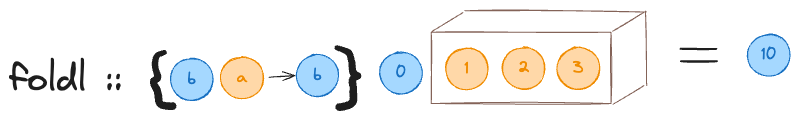

# Folding

All the folding methods are defined as part of the typeclass `Foldable` which is a typeclass for type constructors.

```haskell
ghci> :info Foldable
type Foldable :: (* -> *) -> Constraint
class Foldable t where
  Data.Foldable.fold :: Monoid m => t m -> m
  foldMap :: Monoid m => (a -> m) -> t a -> m
  Data.Foldable.foldMap' :: Monoid m => (a -> m) -> t a -> m
  foldr :: (a -> b -> b) -> b -> t a -> b
  Data.Foldable.foldr' :: (a -> b -> b) -> b -> t a -> b
  foldl :: (b -> a -> b) -> b -> t a -> b
  Data.Foldable.foldl' :: (b -> a -> b) -> b -> t a -> b
  foldr1 :: (a -> a -> a) -> t a -> a
  foldl1 :: (a -> a -> a) -> t a -> a
  Data.Foldable.toList :: t a -> [a]
  null :: t a -> Bool
  length :: t a -> Int
  elem :: Eq a => a -> t a -> Bool
  maximum :: Ord a => t a -> a
  minimum :: Ord a => t a -> a
  sum :: Num a => t a -> a
  product :: Num a => t a -> a
  {-# MINIMAL foldMap | foldr #-}
  	-- Defined in ‘Data.Foldable’
```

The two main methods we'll see are `foldr` and `foldl` -

```haskell
foldr :: (a -> b -> b) -> b -> t a -> b
foldl :: (b -> a -> b) -> b -> t a -> b
```

> The accumulator function in `foldr` has the accumulated value on the **right**. `def accumulator(x, acc)`
>
> The accumulator function in `foldl` has the accumulated value on the **left**. `def accumulator(acc, x)`

Equivalent in Python would be -

```python
def foldr(accumulator, initial, iterable)
def foldl(accumulator, initial, iterable)
```

As is pretty obvious, `accumulator` is a binary function.

It is easier to think of `t a` as a `[a]`. 


Both the functions are reducers, i.e., they reduce a list of values to a single value. `foldr` starts from the rightmost element and works itself back to the first element, `foldl` on the other hand starts from the first element (the leftmost element) and works itself to the last one.


```haskell
foldr :: (a -> b -> b) -> b -> [a] -> b
foldr _ z [] = z
foldr f z (x : xs) = f x (foldr f z xs)
-- f will use z as the second argument
-- f x z

foldr f 0 [1, 2, 3] = f 1 (foldr f 0 [2, 3]) = f 1 v0
v0 = foldr f 0 [2, 3] = f 2 (foldr 0 [3]) = f 2 v1
v1 = foldr f 0 [3] = f 3 (foldr 0 []) = f 3 v2
v2 = foldr 0 [] = 0

v1 = f 3 0
v0 = f 2 (f 3 0)
foldr f 0 [1, 2, 3] = f 1 (f 2 (f 3 0))
```
$$
R(f, 0, [1, 2, 3]) = f(1, R(f, 0, [2, 3])) \\
\text{Let } R(f, 0, [2, 3]) = v_0 \\
R(f, 0, [1, 2, 3]) = f(1, R(f, 0, [2, 3])) = f(1, v_0) \\
\\
v_0 = R(f, 0, [2, 3]) = f(2, R(f, 0, [3])) \\
\text{Let } R(f, 0, [3]) = v_1 \\
v_0 = R(f, 0, [2, 3]) = f(2, R(f, 0, [3])) = f(2, v_1) \\
\\
v_1 = R(f, 0, [3])) = f(3, R(f, 0, [])) \\
\text{Let } v_2 = R(f, 0, []) \\
v_1 = R(f, 0, [3])) = f(3, R(f, 0, [])) = f(3, v_2) \\
\\
v_2 = R(f, 0, []) = 0 \\
\\
\text{Substituting back -}\\
v_1 = f(3, v_2) = f(3, 0) \\
v_0 = f(2, v_1) = f(2, f(3, 0)) \\
R(f, 0, [1, 2, 3]) = f(1, f(2, f(3, 0)))
$$

Here $R$ is the `foldr` function.

Because $f(x, y)$ is a binary function, I can also write in terms of some operator $x \oplus y$. I can write the above expansion as -
$$
R(\oplus, 0, [1, 2, 3]) = 1 \oplus (2 \oplus (3 \oplus 0))
$$




```haskell
foldl :: (b -> a -> b) -> b -> [a] -> b
foldl _ z [] = z
foldl f z (x : xs) = foldl f (f z x) xs
-- f will use z as the first argument
-- f z x

foldl f 0 [1, 2, 3] = foldl f (f 0 1) [2, 3] = foldl f v0 [2, 3]
foldl f v0 [2, 3] = foldl f (f v0 2) [3] = foldl f v1 [3]
foldl f v1 [3] = foldl f (f v1 3) [] = foldl f v2 []
foldl f v2 [] = v2

v2 = f v1 3 = f (f v0 2) 3 = f (f (f 0 1) 2) 3
```

$$
L(f, 0, [1, 2, 3]) = L(f, f(0, 1), [2, 3]) \\
\text{Let } f(0, 1) = v_0 \\
L(f, 0, [1, 2, 3]) = L(f, f(0, 1), [2, 3]) = L(f, v_0, [2, 3]) \\
\\
L(f, v_0, [2, 3]) = L(f, f(v_0, 2), [3]) \\
\text{Let } f(v_0, 2) = v_1 \\
L(f, v_0, [2, 3]) = L(f, f(v_0, 2), [3])  = L(f, v_1, [3]) \\
\\
L(f, v_1, [3]) = L(f, f(v_1, 3), []) \\
\text{Let } f(v_1, 3) = v_2 \\
L(f, v_1, [3]) = L(f, f(v_1, 3), []) = L(f, v_2, [])\\
\\
L(f, v_2, []) = v_2 \\
\\
\text{Substituting back -}\\
v_2 = f(v_1, 3) = f(f(v_0, 2), 3) = f(f(f(0, 1), 2), 3)
$$

Here $L$ is the `foldl` function.

Writing the above expansion in terms of a binary operator -
$$
L(\oplus, 0, [1, 2, 3]) = ((0 \oplus 1) \oplus 2) \oplus 3
$$

> Even though conceptually it seems as if the elements are processed from right-to-left or left-to-right, in implementation they are always processed from left-to-right. The only thing changes is where the function is applied.

If the binary operator a.k.a the accumulator function is commutative, i.e., $x \oplus y = y \oplus x$ then both `foldr` and `foldl` give the same result, otherwise not. E.g., addition is commutative, which is why -
$$
R(+, 0, [1, 2, 3]) = 1 + (2 + (3 + 0)) = 1 + (2 + 3) = 1 + 5 = 6 \\
L(+, 0, [1, 2, 3]) = ((0 + 1) + 2) + 3 = (1 + 2) + 3 = 3 + 3 = 6
$$

```haskell
ghci> foldr (\x acc -> x + acc) 0 [1, 2, 3]
6
ghci> foldl (\acc x -> acc + x) 0 [1, 2, 3]
6
```

But subtraction is not so we get different results -
$$
R(-, 0, [1, 2, 3]) = 1 - (2 - (3 - 0)) = 1 - (2 - 3) = 1 - -1 = 2 \\
L(-, 0, [1, 2, 3]) = ((0 - 1) - 2) - 3 = (-1 - 2) - 3 = -3 - 3 = -6
$$

```haskell
ghci> foldr (\x acc -> x - acc) 0 [1, 2, 3]
2
ghci> foldl (\acc x -> acc - x) 0 [1, 2, 3]
-6
```

Normal subtraction is where I subtract the right operand from the left operand. But what if I define a crazy subtract where I subtract the left operand from the right operand?

```haskell
-- normal subtraction
subtract x y = x - y

-- crazy subtraction
crazySubtract x y = y - x
```

`foldl` with `crazySubtract` will give the same result as `foldr` with sane `subtract` and vice-versa.

```haskell
ghci> foldl (\acc x -> x - acc) 0 [1, 2, 3]
2
ghci> foldr (\x acc -> acc - x) 0 [1, 2, 3]
-6
```

At first glance it might seem that by reversing the accumulator I can make `foldl` and `foldr` behave like the other, but it is really not the case. Expanding the function calls makes this very clear to see -

Normal subtract -
$$
L(-, 0, [1, 2, 3]) = ((0 - 1) - 2) - 3 \\
R(-, 0, [1, 2, 3]) = 1 - (2 - (3 - 0))
$$
Crazy subtract -
$$
L(\ominus, 0, [1, 2, 3]) &= ((0 \ominus 1) \ominus 2) \ominus 3 \\
&\equiv 3 - (2 - (1 - 0)) \\
\\
R(\ominus, 0, [1, 2, 3]) &= 1 \ominus (2 \ominus (3 \ominus 0)) \\
&\equiv 1 \ominus (2 \ominus (0 - 3)) \\
&= 1 \ominus ((0 - 3) - 2) \\
&= ((0 - 3) - 2) - 1
$$
From this it is clear to see that `foldl` with crazy subtract is equivalent to `foldr` with normal subtract but with reversed iterable and vice-versa!
$$
L(-, 0, [1, 2, 3]) = ((0 - 1) - 2) - 3 \\
R(\ominus, 0, [3, 2, 1]) = ((0 - 1) - 2) - 3 \\
\\
R(-, 0, [1, 2, 3]) = 1 - (2 - (3 - 0)) \\
L(\ominus, 0, [3, 2, 1]) = 1 - (2 - (3 - 0))
$$

```haskell
foldl f 0 [1, 2, 3] = foldr f' 0 [3, 2, 1]
foldr f 0 [1, 2, 3] = foldl f' 0 [3, 2, 1]
```

Here `f'` is lexically reversed `f`. 

Python's `reduce` is equivalent to `foldl`.

### Memory Leaks (Spikes)

Lets say $f$ is lazy in the second argument, i.e., $f(x, ?) = X$ for any value of $?$. More formally - $f(x, y) = f(x, z) \forall \; y, \; z$. `&&` is such a function, because if the first argument is `False`, it does not matter what the second argument is, the answer is always `False`. For such functions it is more efficient to use `foldr` because $f(1, f(2, f(3, 0))) \equiv f(1, ?)$. It does not matter what the rest of the terms result in, the answer will only depend on $f(1)$.  This is why `foldr` can be used with infinite lists -

```haskell
ghci> foldr (&&) True (repeat False)
False
```

Here is what is happening -
$$
R(\&, T, (F_1, F_2,\cdots)) = \&(F_1, ?) = F_1
$$
Here $F_n$ is just the $n^{th}$ `False`. It does not matter what the `?` is, it can be `True` or `False`, the answer is always going to be `False`.

Another example -

```haskell
ghci> foldr (\x _ -> Just x) Nothing [1..]
Just 1
```

$$
R(\lambda, \Phi, [1, 2, 3, \cdots]) = \lambda(1, ?) = \text{Just}\;1
$$

Unlike `foldr`, it is not possible for `foldl` to short circuit its calculation. And because of lazy evaluation in Haskell, the entire function stack of $f(f(f(0, 1), 2), 3)$ is held in memory until the result is actually used. This is why for very long lists, `foldl` will incur a memory spike. This is also why `foldr` is also inefficient to use for binary functions like `(+)`, because it cannot short circuit and has to hold the entire function stack in memory. This is true for any naively implemented `length` or `sum` function -

```haskell
sum [] = 0
sum (x : xs) = x + sum xs
```

Now `sum [1, 2, 3]` evaluates to -
$$
\begin{align}
sum(1, 2, 3) &= 1 + sum(2, 3) \\
&= 1 + (2 + sum(3)) \\
&= 1 + (2 + 3 + sum())
\end{align}
$$
Now this entire expression will be carried in memory until such time as it is actually used. I can bypass lazy evaluation and force in-place evaluation by using the so-called "Bang Pattern" feature of the language -

```haskell
{-# LANGUAGE BangPatterns #-}

sum :: [Int] -> Int
sum = go 0
	where
		go !acc [] = acc
		go !acc (x : xs) = go (acc + x) xs
```

This will force the evaluation of the `acc` variable and we can get rid of the memory spike.

It is best to use `foldl'` for binary functions, finding the length of a list, etc. because it forces immediate evaluation. According to the course I can import this from `Data.List`, but it is also available in `Data.Floldable` with a bunch of other folding methods.

As can be seen from their method signatures, these methods work not only on lists, but on any container aka type constructor. A type constructor can implement either `foldr` or `foldMap` to become a full instance of `Foldable`. 

`foldMap` is similar to `fmap`, but with two main differences - it only acts on containers that are `Monoid`s, i.e., they should have the `mempty` attribute, and it returns the raw contained type, not something wrapped in the container.


Contrast this with `fmap` -


```haskell
ghci> foldMap show (Just 10)
"10"

ghci> fmap show (Just 10)
Just "10"
```

A lot of builtin functions use the `Foldable` constraint -

```haskell
ghci> :t sum
sum :: (Foldable t, Num a) => t a -> a
ghci> :t concat
concat :: Foldable t => t [a] -> [a]
```

Even though `Foldable` works on any container, its usage is discouraged for `Maybe`. ==TODO: Why?==
