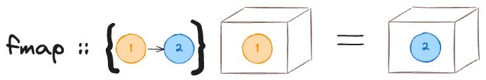

# Functors

A useful typeclass for type constructors is `Functor`. It has a single method `fmap` that takes a function and a container, yanks the value out of the container, applies the function, and wraps the resulting back into a container.



```haskell
class Functor f where
	fmap :: (a -> b) -> f a -> f b
	
	
instance Functor Maybe where
	fmap _ Nothing = Nothing
	fmap f (Just x) = Just (f x)
	
instance Functor Either a where
	fmap _ (Left x) = Left x
	fmap f (Right x) = Right (f x)
```

Some examples - 

```haskell
ghci> fmap (+ 5) (Just 10)
Just 15
ghci> fmap (+ 5) Nothing
Nothing

ghci> fmap (+ 5) (Left 10)
Left 10
ghci> fmap (+ 5) (Right 10)
Right 15
```

Functors have to obey the following mathematical rules - 
$$
\text{fmap} \; id \equiv id \\
\text{fmap} \; (f \circ g) \equiv \text{fmap} \; f \circ \text{fmap}\;g
$$
Where $id$ is the identity function -

```haskell
ghci> :info id
id :: a -> a 	-- Defined in ‘GHC.Base’
```


