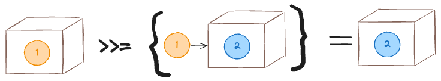
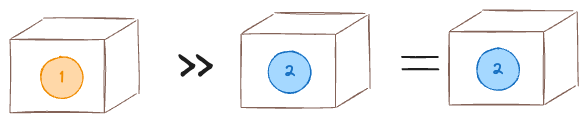

# Monads

Monad is a typeclass for containers (aka type constructors) and has three methods -

* The bind operator `>>=`
* The and-then operator `>>`
* The `return` method

```haskell
class Monad m where
	(>>=) m a -> (a -> m b) -> m b
	(>>) :: m a -> m b -> m b
	return :: a -> m a
	{-# MINIMAL (>>=) #-}
```

#### `return` method

The `return` method is very simple, it just takes a value and wraps it in the container (aka type constructor). Here is what its implementation for `Maybe` probably looks like -

```haskell
instance Monad Maybe where
	return x = Just x
	...
```

#### bind operator

The bind operator first tries to unbox the given container. If the container is empty (for some definition of empty for that container), then it just returns the empty container. On the other hand, if there a value inside the container, bind will call the given function with this value. The function (and bind) both return a container. Of course all of this will only work if the container has implemented the monad interface.



Again, here is a probably implementation for `Maybe` -

```haskell
instance Monad Maybe where
	(>>=) Nothing _ = Nothing
	(>>=) (Just x) f = f x
```

Here `f :: a -> Maybe a`. 

The left side of the bind operator should evaluate to a container, which means it can also be a function call that returns a container.

```haskell
ghci> timesTen x = Just (10 * x)
ghci> increment x = Just (1 + x)
ghci> (timesTen 1) >>= increment
Just 11
```

I can pipeline multiple such functions together, where func1 acts on the value contained in the container, its output gets extracted and goes to func2 and so on.

```haskell
Container v0 >>= func1 >>= func2 >>= func3
```

This is equivalent to -

```haskell
Container v0 >>= func1 >>= func2 >>= func3
= (Container v0 >>= func1) >>= func2 >>= func3
= (Container v1 >>= func2) >>= func3
= Container v2 >>= func3
= Container v3
```

Here -

```haskell
func1 v0 = Container v1
func2 v1 = Container v2
func3 v2 = Container v3
```

#### and-then operator

The and-then operator looks a bit silly on first glance, it just takes in two containers containing different types, and returns the second container type. Just like the bind operator, it first tries to unbox the left container, if it is empty that is returned, otherwise it returns the right container.



And just like in the bind operator, the containers can be replaced with functions that return the respective containers. In practice two function calls are used, and the and-then operator runs the first function, throws its output away, and-then runs the second function and returns whatever that second function returns. This is Haskell's answer to running "impure" functions that have side-effects. I can chain multiple such functions together - 

```haskell
f x >> g y >> h z
```

This will run `f x`, throws away its output, and then runs `g y`, throws away its value, and then runs `h z`.
$$
\begin{align}
f(x) >> g(y) >> h(z) &= (f(x) >> g(y)) >> h(z) \\
&= g(y) >> h(z) \\
&= h(z)
\end{align}
$$
Of course I can have some input for which one of the functions returns an empty container which will then break the chain at that point. The and-then operator can be implemented in terms of the bind operator as follows -

```haskell
(>>) :: Monad m => m a -> m b -> mb
action1 >> action2 = action1 >>= \_ -> action2
```

#### Mathematical Laws

Monads are supposed to obey three mathematical laws. First let us re-write the monad in math -
$$
r(x) = m[x] \\
m[\phi] \oplus f = m[\phi] \\
m[x] \oplus f = f(x)
$$
Here $r$ is the `return` method which when applied to some value $x$ will wrap that value in a container. I am denoting a container wrapping $x$ as $m[x]$.

$\oplus$ is the bind operator whose left side is a container and right side is a function that returns a container. The result of the bind operation is always a container of the same type as the LHS. The resulting container is empty if the left side was an empty container, otherwise it is the result of applying $f$ to the value contained within. 

> The domain of $f$ is a set of containers $m$, which can be filled in or empty. This is to say that $f$ maps any value to container that may be empty or filled with some other value.

> Even though I say LHS has to be container, it can always be a function invocation that returns a container. It just cannot be a bare function that has not been invoked. Often times this is how it is -
> $$
> g(z) \oplus f
> $$
> where $g(z)$ evaluates to $m[x]$


Now the three laws -

1. Left identity

$$
r(x) \oplus f \equiv f(x)
$$

This says that if I bind the function $f$ with the result of the `return` method, i.e., with the result of $r(x)$, it is equivalent to applying function $f$ directly to $x$. Lets see this for `Maybe`.

```haskell
return x = Just x
return x >>= f = Just x >>= f = f x
```


2. Right identity

$$
m[x] \oplus r \equiv m[x]
$$

This says if I bind the `return` method with a filled in container, it is equivalent to the filled in container. Lets  see this for `Maybe`.

```haskell
Just x >>= return = return x = Just x
```


3. Associativity

$$
(m[x] \oplus f)\;\oplus g \equiv m[x] \oplus \lambda \\
\text{where }\lambda(x) = f(x) \oplus g
$$

This one is a bit harder to parse. First we bind the function $f$ to a filled in container $m[x]$. The result of this will be a another filled in container. A second function $g$ is then bound to this resultant filled in container. All of this is equivalent to binding a function $\lambda$ to the filled in container $m[x]$. Here $\lambda$ is a function that gives the result of binding $g$ to the result of $f(x)$. As the name might have hinted, this is usually given as a lambda anonymous function. Again, lets see this for `Maybe` -

```haskell
Just x >>= f >>= g = f x >>= g = g (f x)
Just x >>= \x -> f x >>= g = f x >> g = g (f x)
```

#### FAMily

`Monad` is part of this FAMily of typeclasses -

```haskell
class Functor f where
	fmap :: (a -> b) -> f a -> f b
	
class Functor f => Applicative f where
	pure :: a -> f a
	(<*>) :: f (a -> b) -> f a -> f b
	
class Applicative m => Monad m where
	return :: a -> m a
	return = pure  -- default implementation of return is just calling pure
	
	(>>=) :: m a -> (a -> m b) -> m b
```

These days everyone uses `pure` instead of `return`. 

## do-notation

The `do` notation is syntactic sugar on monads. 

#### do with bind

Lets say I have two functions `g` and `h`, both of which take in a raw value and return a container containing the same type as the raw value, i.e., `g, h :: a -> t a`. I can then define a function `f` with the same signature which calls `g` with its input, extracts the value out of `g`'s output, and calls `h` with it. It then returns whatever `h` returns with.

```haskell
f :: a -> t a
g :: a -> t a
h :: a -> t a
f x = g x >>= h

-- can be rewritten as
f x = do
  y <- g x
  h y
```

In the do-notation implementation, in the third line it seems as if `h` is being called with `y` as its argument, but that cannot be possible because `h :: a -> t a`. In reality, `h` is being called with whatever is contained inside `y` as the argument. `y` itself is of type `y :: t a`. 

> The `<-` is an indication that `y` can now be used with the "do magic" where if it is used as an argument in any function, "do magic" will extract the value inside its container and pass it as the real argument to the function. Like `h` takes in `a` but is given `t a`. "Do magic" will extract `a` out of `t a` and pass it to `h`.

If I have a workflow function -

```haskell
workflow x = f x >>= g >>= h

-- can be rewritten as
workflow x = do
  y <- f x
  z <- g y
  h z
```

Instead of `g :: a -> t a`, lets say I have `g' :: a -> a`. I can still use the do-notation by mixing it in with the let syntax -

```haskell
workflow x = do
  y <- f x
  let z = g' y
  h z
```

Here in the second line, do-notation is still doing its magic and extracting the value out of `y` and giving it as argument to `g'`. But `z :: a` so it can be fed directly to `h`.

#### do with and-then

Lets say I want to call `g` and `h` but don't really care about `g`'s output. I can then define a function `f` like so -

```haskell
f x y = g x >> h y

-- can be rewritten as
f x y = do
  g x
  h y
```


Also see do with let-in in Gettting Started.

---

---

From the course lecture -

Let us consider the function `addTwo` which takes in two `Maybe`s. If either the first or the second value is `Nothing`, `addTwo` does `Nothing`, otherwise it `Just` adds the two values up.

```haskell
	addTwo :: Maybe Int -> Maybe Int -> Maybe Int
	addTwo Nothing _ = Nothing
	addTwo _ Nothing = Nothing
	addTwo (Just x) (Just y) = Just (x + y)
```

Here is a long-winded way to read the pattern matching - it first tires to unbox the first `Maybe`, if there is nothing in it, it returns `Nothing`. It then tries to unbox the second `Maybe`. Again if there is nothing in it, it returns `Nothing`. If both the `Maybe`s have values, then they are added. 

Another more convoluted way to implement this function is -

```haskell
-- helper function was called andThen in the tutorial
-- I am calling it hasValueThenCall to make the point easier to digest
hasValueThenCall :: Maybe Int -> (Int -> Maybe Int) -> Maybe Int
hasValueThenCall Nothing _ = Nothing
hasValueThenCall (Just x) f = f x

addTwo maybex maybey = hasValueThenCall maybex lambda1
	where lambda1 x = hasValueThenCall maybey lambda2
		where lambda2 y = Just (x + y)
		
-- hasValueThenCall is a binary function so I can call it like an op
addTwo maybex maybey = maybex `hasValueThenCall` lambda1
	where lambda1 x = maybey `hasValueThenCall` lambda2
		where lambda2 y = Just (x + y)
```

Here is how I can read this implementation - 

`hasValueThenCall` takes a `Maybe` and a function. It first tries to unbox the `Maybe`, if the `Maybe` contains nothing, it returns `Nothing`. If `Maybe` has a value, it calls the given function with that value.

`addTwo` first calls `hasValueThenCall` with the first `Maybe` and some function. If the first `Maybe` has nothing, `hasValueThenCall` will return `Nothing` as will `addTwo`. If there is a value in it, then `hasValueThenCall` will call the given function with this value. The given function is another call to `hasValueThenCall` with the second `Maybe`. Again if the second `Maybe` has nothing in it, the second `hasValueThenCall` returns `Nothing` which will bubble its way up. If there is a second value, the second `hasValueThenCall` will call the given function with the second vlaue. The given function has the first value in a closure and it `Just` adds the two values up.

Here is a more compact way of writing the new implementation of `addTwo` -

```haskell
addTwo mx my = mx `hasValueThenCall` (\x -> my `hasValueThenCall` (\y -> Just (x + y)))
```

Enter the `Monad`. Here is how it is defined -

```haskell
class Monad m where
	(>>=) m a -> (a -> m b) -> m b
	(>>) :: m a -> m b -> m b
	return :: a -> m a
	{-# MINIMAL (>>=) #-}
```

It can be seen that it is only defined for type constructors, not for concrete types. In other words, Monads only work for "container" types. Let us first see an implementation by `Maybe` -

```haskell
instance Monad Maybe where
	return x = Just x
	
	(>>=) Nothing _ = Nothing
	(>>=) (Just x) f = f x
```

The bind operator (`>>=`) is exactly like our `hasValueThenCall`. In general terms, it first tries to unbox the given container. If the container is empty (for some definition of empty for that container), then it just returns the empty container. On the other hand if there is a value inside the container, the bind operator will call the given function with this value.

I can now re-write `addTwo` like this using bind and `return` -

```haskell 
addTwo mx my = (>>=) mx (\x -> (>>=) my (\y -> return (x + y)))

--equivalent to
addTwo mx my = mx >>= \x -> my >>= \y -> return (x + y)
```
