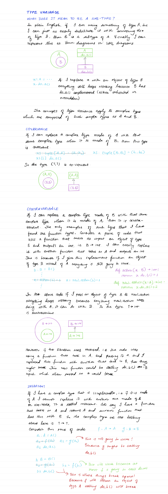

# Typing Notes

## Basics

```python
def my_function(a: int, b: str = "default value") -> float:
  # redundant type annotating on x and flag, it can be easily inferred that it is an int and a bool
  # respectively. But good practice (as per APTG)
  x: int = 1
  flag: bool = a < 100
  
  # I don't have to have a default value at the time of declaration, I can defer assignment to later.
  no_default_val: int
  :::
  no_default_val = 10
  
  # When I don't know the type or don't want to annotate it.
  mystery: Any = do_something()
  
  vec: list[float] = [-1.1, 0, 1.1, 2, -2.2]
  # Sequence for anything with len and [] op
  generic_vec: Sequence[float] = [-1.1, 0, 1.1, 2, -2.2]
  
  uniqs: set[str] = {'a', 'b', 'c'}
  # Iterable for anything that can be used in a for
	generic_uniqs: Iterable[str] = {'a', 'b', 'c'}  
  
  sparse_vec: dict[int, float] = {0: -1.1, 48: 0.1, 100: 2.2}
  # Mapping or MutableMapping
  generic_sparse_vec: Mapping[int, float] = {0: -1.1, 48: 0.1, 100: 2.2}
  
  maybe: int | None = None
  vals: list[str | int | None] = [1, "one", 2, "apple", None, "banana"]
  name_value_pair: list[tuple[str, float]] = [("APPL", 245), ("META", 600)]
  
  # tuple of variable size (but same type)
  origin_nd: tuple[float, ...] = (0, 0, 0, 0)
  

def func_without_return_val() -> None:
  ...
  
import asyncio

# A coroutine is typed like a normal function
async def countdown(tag: str, count: int) -> str:
    while count > 0:
        print(f'T-minus {count} ({tag})')
        await asyncio.sleep(0.1)
        count -= 1
    return "Blastoff!" 
```

### Revealing Types

Can be used for debugging, not a good idea to use in the main flow of the program.

```python
from typing import reveal_type

reveal_type(some_super_complex_obj)
```

### Casting

Doesn't really do anything, just keeps the type-checker quiet.

```python
x: str | int = "haha" if random.randint(1, 10) < 5 else 10
print(x)
y = cast(str, x)
print(len(y))
```

Even if `x` happens to be an `int`, the cast will shut the type-checker up. I'll just end up with a runtime error 50% of the time.

### Null Values

```python
cookie: Cookie | None = None
:::
cookie = some_function()
:::
tot_cals += cookie.calories
```

Type checker might complain about the last line saying that `cookie` might be `None`. There are four ways to fix this -

* Comment with `# type: ignore` in the same line.

```python
tot_cals += cookie.calories  # type: ignore
```

* Wrap the call with an `if cookie is not None`

```python
if cookie:
  tot_cals += cookie.calories
```

* Put an `assert cookie is not None` in the preceeding line.

```python
assert cookie is not None
tot_cals += cookie.calories
```

* Cast it to `Cookie`

```python
cookie: Cookie | None = None
:::
cookie = some_function()
:::
cookie = cast(Cookie, cookie)
tot_cals += cookie.calories
```

## Type Narrowing

Type narrowing refers to code that takes a variable that has a broad type, and makes it so that the type inferenence will only infer a single or less number of types than it originally had. Some common ways to do this are -

* `isinstance`
* `issubclass`
* `type`
* `callable`
* `cast`
* `conditionals` for `None`

We have already seen examples of the last two. Here is a contrived example function that demos the remaining.

```python
def bake(dessert: Cookie | Cake | type[Cookie] | type[Cake]) -> None:
    sweet: Cookie | Cake | None = None
    if callable(dessert):
        # This is a constructor
        if issubclass(dessert, Cookie):
            sweet = Cookie("Chocolate Chip", 200)
        elif issubclass(dessert, Cake):
            sweet = Cake(2, "Vanilla")
    else:
        if isinstance(dessert, Cookie):
            sweet = dessert
            sweet.calories += 10
        elif type(dessert) is Cake:
            sweet = dessert
            sweet.n_layers += 1
    print(sweet)
    

bake(Cookie)
>>> Cookie(flavor='Chocolate Chip', calories=200)

bake(Cookie("Snicker Doodle", 200))
>>> Cookie(flavor='Snicker Doodle', calories=210) 

bake(Cake)
>>> Cake(n_layers=2, frosting='Vanilla')

bake(Cake(1, "Strawberry"))
>>> Cake(n_layers=2, frosting='Strawberry')
```

There are some more esoteric ways of narrowing types using [`TypeGuard`](https://mypy.readthedocs.io/en/stable/type_narrowing.html#user-defined-type-guards) and [`TypeIs`](https://mypy.readthedocs.io/en/stable/type_narrowing.html#typeis) ops. I'll document them some other time.

==TODO:== Document `TypeGuard` and `TypeIs`.

## Classes

### Annotating init methods

It is ok to leave out annotating the return type of an `__init__` method (which is always `None`) if I have some annotated input params. Otherwise, annotate it.

```python
class A:
  # A fully annotated init method
  def __init__(self, v: int) -> None:
    self._a = v  # _a will be inferred to have type int
    
class B:
  # Even though the output annotation is missing, this init is still considered
  # annotated because the input params are annotated
  def __init__(self, v: int):
    :::
      
class C:
  # The output needs to be annotated because there are no input params.
	def __init__(self) -> None:
    :::
      
class D:
  # This will be considered un-annotated
  def __init__(self):
    :::
```

### Class Variables vs. Instance Variables

Generally, when a class has a class variable, I automatically get an instance variable of the same name. So the following is still legit -

> I still don't understand how that works!!

```python
class Cookie:
  flavor: str = "Chocolate Chip"
  
  def __init__(self, calories: int) -> None:
    ...
    
Cookie.flavor
>>> "Chocolate Chip"

c = Cookie(200)
c.flavor = "Snicker Doodle"
```

The class variable is still "Chocolate Chip", but the instance variable is "Snicker Doodle". To prevent this behavior, i.e., if I want to mark `c.flavor` as a type error I can do the following -

```python
from typing import ClassVar

class Cookie:
  flavor: ClassVar[str] = "Chocolate Chip"
  
c.flavor = "Snicker Doodle"  # will be a type error  
```

The `ClassVar[T]` syntax is based on Generics discussed later in this note.


## Generators and Iterators

An `Iterator` is more specific than an `Iterable` so it is better to choose that when faced with a choice.
> An iterable's only job is to return an iterator. An iterator on the other hand can output successive contained elements. It can also output itself. An iterator has to implement both `__iter__` and `__next__`, whereas an iterable only has to implement `__iter__`. This makes an iterator more specific than an iterable.
>
> ```python
> iter_ator = iter(iter_able)
> element = next(iter_ator)
> ```

For simple functions `yield`ing values, return `Iterator`.

```python
def squares(n: int) -> Iterator[int]:
  for i in range(n):
    yield i * i
```

If I have a "two-way" co-routine then I should use `Generator[YieldType, SendType, ReturnType]`. 

```python
def echo_round() -> Generator[int, float, str]:
  sent = yield 0
  while sent >= 0:
    sent = yield round(sent)
  return "Done"
```

Usually, if my co-routine aka generator is not sending or returning any values, only yielding values, then I can use an Iterator as mentioned above. However, if I am calling `close()` or `throw()` on these, I will still want to annotate them as `Generator[int, None, None]` for example. See [generators_coroutines.ipynb](learn-asyncio/generators_coroutines.ipynb) for details on how co-routines work.

## Variadic Args

Varidaic args are where I can pass in any number of positional arguments via (`*args`) or keyword args via (`**kwargs`). I just annotate the type of each element for positional arguments, and the type of the value for the keyword arguments. 

The `jar` function will accept any number of `Cookie` objects. 

```python
def jar(*cookies: Cookie) -> None:
  ...
  
c1 = Cookie("Chocolate Chip", 200)
c2 = Cookie("Snicker Doodle", 220)
jar(c1, c2)
```

The portfolio function will accept a dictionary of `dict[str, int]`. Note that the key will always be a `str` so I only have to specify the value type.
```python
def portfolio(**stocks: int) -> None:
  ...
  
portfolio(appl=100, msft=110)  
```

## Function Types

### Basic Form

The basic form is - `Callable[[input_type_1, input_type_2, input_type_3, ...], outupt_type]`

```python
your_function: Callable[[int, str], float]
your_function = my_function
```

These are useful when I have a higher-order function that takes in another function as input or outputs another function.

```python
def register(n: int, err_callback: Callable[[int, str], float]) -> float:
  ...
```

The most general function type is `Callable[..., Any]` which means that this function can take in any number of arguments and can return any type. It is technically correct to annotate any function with this type. 

### Limitations

While these can be used for functions accepting variadic arguments, there is a more specific way of annotating such functions using `Protocol`s as explained later in this note.

`Callable` can only be used to annotate functions that have positional only args without any default values. For anything else use the much more flexible `Protocol` pattern.

Lambdas are usually not annotated, the types are inferred.

### `NoReturn`

There are some functions that don't return anything, e.g., signal handlers that exit the program after handling the signal, or a function similar to `abort`  in C which ends in raising an exception. Use `NoReturn` annotation for such functions.

```python
def abort() -> NoReturn:
  :::
  sys.exit(1)
```

### Overloaded Functions

Normal Python does not support overloaded functions. The official [mypy docs](https://mypy.readthedocs.io/en/stable/more_types.html#function-overloading) have a really good motivating example that I'll reproduce here. Lets say I want a `mouse_event` that will interpret a mouse event as either a click or a drag depending on whether it is passed just a single pair of coordinates (x and y) or two pairs of coordinates (x1, y1 and x2, y2). I can write two different functions -

```python
def mouse_click(x: int, y: int) -> ClickEvent:
  :::
    
def mouse_drag(x1: int, y1: int, x2: int, y2: int) -> DragEvent:
  :::
```

But if there is a lot of code overlap, I might just do something like -

```python
def mouse_event(x1: int, y1: int, x2: int | None, y2: int | None) -> ClickEvent | DragEvent:
  :::
```

However, I am not able to fully express the semantics of this function, e.g., `mouse_event(1, 1, 10)` is syntatically valid, but semantically incorrect. In such cases I can use `@overload` decorator. It does not do anything at runtime, but is useful for catching type errors.

```python
from typing import overload

@overload
def mouse_event(x1: int, y1: int) -> ClickEvent:
  ...
  
@overload
def mouse_event(x1: int, y1: int, x2: int, y2: int) -> DragEvent:
  ...
  
# Actual implementation
def mouse_event(x1: int, y1: int, x2: int | None = None, y2: int | None = None) -> ClickEvent | DragEvent:
  ::::
```

In the above code snippet, the implementation of the overloaded functions is in fact an `Ellipsis` object.

This covers the basic usage, there is a lot more to this in the docs.

## Forward References

Just import `__future__.annotations` for it to work -

```python
from __future__ import annotations
from dataclasses import dataclass

@dataclass
class Node:
  data: int
  next: Node
```

Without the `__future__.annotations` import, the last line will give a type error. Pre-3.9 I'd have to wrap the type in a string.

## Typing Alias

This is similar to using `typedef` in C. There are three ways to do this - 

```python
type Vector = list[float]  # type keyword is new in 3.12

Vector = list[float]  # pre-3.12 this is how to do it

from typing import TypeAlias
Vector: TypeAlias = list[float]  # pre-3.12 but making it more explicit
```

It is good to use the more explicit way because the non-explicit way can be mistaken for a variable declaration. The difference between the non-explicit way and un-annotated variable declarations is implict.

### New Types

Instead of defining an alias, I can define a brand new type without having to create a class for it.

```python
from typing import NewType

ProductId = NewType("ProductId", int)

def display(product: ProductId) -> None:
  print(f"Product is {product}")
  
display(ProductId(1))
# Product is 1
```

However, it does not seem to be a "true" subclass of `int` as can be seen by this -

```python
issubclass(ProductId, int)

>> TypeError: issubclass() arg 1 must be a class
```

As opposed to something like `Amount` defined below, which does happen to be a **true** subclass.

```python
class Amount(int):
    pass
  
issubclass(Amount, int)
>> True
```

Another drawback is that I cannot create subclasses deriving from `ProductId`, however I can create other `NewType`s that are derived from it.

```python
class PremiumProductId(ProductId):
    pass
>> TypeError: Cannot subclass an instance of NewType.
```

```python
PremiumProductId = NewType("PremiumProductId", ProductId)
```

## Named Tuples

The old-school way of defining named tuples makes all the attributes have the `Any` type.

```python
from collections import namedtuple

# Both x and y have the Any type
Point = namedtuple("Point", ["x", "y"])

def distance(p1: Point, p2: Point) -> float:
  ...
```

The new way of defining makes it possible to have attributes of specific types.

```python
from typing import NamedTuple

class Point(NamedTuple):
  x: float
  y: float
  
  # Can also have methods
  def distance_from_origin(self) -> float:
    :::
```

## Literals and Typed Dicts

> APTG: I consider usage of these as a bad code smell. If I see code that uses these or am thinking of using these myself, there are other better ways to express my types. I have seen Pydantic use Literal, so let me learn about these.

### Literals

Lets say I have a function that takes input `str`, but only specific values of `str`.

```python
def bake_cookie(flavor: str) -> Cookie:
  if flavor == "Chocolate Chip":
    return Cookie("Chocolate Chip", 200)
  elif flavor == "Snicker Doodle":
    return Cookie("Snicker Doodle", 220)
  else:
    raise ValueError()
```

The type annotation of the function is not able to express this semantic. I can use `Literal` to do this better -

```python
from typing import Literal

def bake_cookie(flavor: Literal["Chocolate Chip", "Snicker Doodle"]) -> Cookie:
  :::
```

I can also compose multiple `Literal` types -

```python
type PrimaryColors = Literal["red", "green", "blue"]
type SecondaryColors = Literal["purple", "green", "orange"]
type AllowedColors = Literal[PrimaryColors, SecondaryColors]

def paint(color: AllowedColors) -> None:
  :::
```

### Typed Dicts

If I want to "lock" the keys and the value type of each key, I can use `TypedDict`. Lets say I have the following dict -

```python
movie = {'name': 'Blade Runner', 'year': 1982}
```

I can create a `TypedDict` s.t the dict cannot have keys that were not declared.

```python
from typing import TypedDict

Movie = TypedDict("Movie", {"name": str, "year": int})

# Following will raise a type error because genre is not a valid key.
movie: Movie = {"name": "Blade Runner", "year": 1982, "genre": "Sci-Fi"} 

# Can also be used as a ctor
movie = Movie(name="Blade Runner", year=1982)

# Can also be declared with a class-like syntax
class Movie(TypedDict):
  name: str
  year: int
```

### Exhaustiveness Checking

A typical pattern when using `Literal` input params is to have an `if-then` or a `match-case` to check against each possible value and raise a `ValueError` if the input is outside of the allowed values. This is error-prone in the case where after-the-fact I add more literals to my allowed values. A better way to check this is using `assert_never`.

```python
type PossibleFlavors = Literal["Chocolate Chip", "Snicker Doodle"]

def bake_cookie(flavor: PossibleFlavors) -> None:
  if flavor == "Chocolate Chip":
    do_something()
  elif flavor == "Snicker Doodle":
    do_something_else()
  
  assert_never(flavor)  
```

Now, if i add a third flavor to `PossibleFlavors`, a `ValueError` would have blown up at runtime, but an `assert_never` will raise a type error.  I can use exhaustiveness checking for Enums as well.


There is a lot more to [`Literal`](https://mypy.readthedocs.io/en/stable/literal_types.html) and [`TypedDict`](https://mypy.readthedocs.io/en/stable/typed_dict.html) that I am very unlikely to use.

## Final

This section introduces these related features:

1. *Final names* are variables or attributes that should not be reassigned after initialization. They are useful for declaring constants.
2. *Final methods* should not be overridden in a subclass.
3. *Final classes* should not be subclassed.

All of these are only enforced by mypy, and only in annotated code. There is no runtime enforcement by the Python runtime.

```python
from typing import Final, final

# type of PI is Final[float]
PI: Final[float] = 3.14

# type of E is Literal[float]
E: Final = 2.72
```

```python
class Base:
  @final
  def method(self, x: int) -> None:
    :::
      
# The following will raise a type error because method is final, it cannot be overridden.      
class Derived(Base):
  @override
  def method(self, x: int) -> None:
    :::
```

```python
@final
class Base:
  :::
    
# type error because Base is a final class, it cannot be further sub-classed.    
class Derived(Base):
  :::
```

## Generics

### Syntax

Here is a very simple generic class templated by type `T`.

```python
class Stack[T]:
  def __init__(self) -> None:
    self.items: list[T] = []
    
  def push(self, item: T) -> None:
    self.items.append(item)
    
  def pop(self) -> T:
    return self.items.pop()
  
  def empty(self) -> bool:
    return not self.items
```

And here is a generic function -

```python
def first[T](seq: Sequence[T]) -> T:
  return seq[0]
```

This syntax is available from Python v 3.12 onwards. For previous versions here is how it will look -

```python
from typing import TypeVar, Generic

T = TypeVar["T"]

class Stack(Generic[T]):
  .. everything else remains the same ..
  
def first(seq: Sequence[T]) -> T:
  .. everything else remains the same ..
```

Here is how the `Stack` class will be used -

```python
stack = Stack[int]()
stack.push(2)
stack.pop()
>>> returns 2

stack.push("X")  # Type error
```

Another example -

```python
class Box[T]:
  def __init__(self, content: T) -> None:
    self.content = content
    
Box(1)  # Ok, inferred type is Box[int]
Box[int](1)  # Also ok
Box[int]("X")  # Type error
```

When calling generic functions, I don't need to specify the type, it is automatically inferred from the argument types.

```python
first((1, 2, 3))  # first[int] is used
first(("X", "Y"))  # first[str] is used
first[int]((1, 2))  # Syntax error
```

### Upper Bounds


### Functions - Protocols, Generics, and Generic Protocols

When a function takes in a concrete type, everything is simple.

```python
def prepare(cookie: Cookie) -> Cake: ...
```

Complexity creeps in when we try to generalize the types. Generics is of course one way to generalize the function, another one is using protocols (aka interfaces), and then there is the big boss of them all, the generic protocol. 

Lets start with Generics. So far I have only ever seen generic functions operate on generic containers or other complex types (types which are composed of other types). 

```python
def head[T](xs: Sequence[T]) -> T:
  return xs[0]

def tail[T](xs: Sequence[T]) -> Sequence[T]:
  return xs[1:]
```

I am yet to come across an example where the generic function operates directly on a generic type. I can easily convert that usage into using protocols for either input or output params. 

```python
def does_not_exist[T](arg: T) -> None:
  ...
```

This is because I want `T` to behave in a some specific way inside the function. And that behavior is defined as some operator or method that it supports, or that it is a subtype of some other type that have the desired properties that are needed in this function's implementation. If it is just some attributes - methods or instance properites - I can make `arg` an instance of a `Protocol`. If I want `arg` to be of a specific type or its subtypes then I just make `arg` be of that type. For example if I make `arg` of type `MediaPlayer`, then `MediaPlayer` and all its subtypes will work.

> The function itself is contravariant, i.e., if I have a function `Base -> None` then I cannot replace its usage with `Derived -> None`. But I can totally call this function with `Dervied` instead of `Base` because the argument is covariant.

These kinds of bare templated examples are given in C++. Some common examples in C++ we see are -

```C++
template <typename T>
T max(T a, T b) {
    return (a > b) ? a : b;
}
```

I'd argue that this is better suited to using a generic protocol of objects that support the `>` operator. In C++ I get a compile error when I pass in objects that don't have the `>` operator overloaded. So I'd go with something like -

```python
class Ordered(Protocol):
  def __gt__[T](self: T, other: T, /) -> bool: ...
  def __lt__[T](self: T, other: T, /) -> bool: ...
	
def max[T: Ordered](a: T, b: T) -> T
  return a if a > b else 
```

Another common C++ template example is - 

```C++
template<typename T>
void print_array(T arr[], int size) {
  for (int i = 0; i < size; i++) {
    std::cout << arr[i] << " ";
  }
  std::cout << std::endl;
}
```

But this too is operating on a sequence, which is a container (complex type) over the simple type `T`. In Python this would be like - 

```python
def print_array[T](vals: Sequence[T]) -> None:
    for val in vals:
      print(f"{val} ", end="")
    print("\n")
```

Lets look at protocols next -

```python
class Bakeable(Protocol):
    def bake(self) -> None: ...

def prepare_dessert(sweet: Bakeable) -> None:
    print(f"Preparing {sweet}")
    sweet.bake()

class Cookie:
    def bake(self) -> None:
        print("Baking cookie")

class Cake:
    def bake(self) -> None:
        print("Baking cake")

cookie = Cookie()
cake = Cake()
prepare_dessert(cookie)
prepare_dessert(cake)
```

Now lets look at generic protocols. 

```python
@dataclass
class A:
    cookie: int
```

And correspondingly two complex types -

```python
class First:
    def __init__(self) -> None:
        self._a = A(1)
```

Now lets define a generic protocol -

```python
class Getter[T](Protocol):
    def get_value(self) -> T: ...
```

Let me define this method on `First`.

```python
class First:
    def __init__(self) -> None:
        self._a = A(1)

    def get_value(self) -> A:
        return self._a
```

Finally we define the generic function -

```python
def do[T](getter: Getter[T]) -> T:
  return getter.get_value()

first = First(A(1))
obj = do(first)
# obj is of type A
```

However, if I define a non-generic function that acts on a generic protocol, I need to take the type variance into account -

```python
@dataclass
class A:
    cookie: int

    def do_a(self) -> int:
        print(f"A[{self.cookie}]:do_a()")
        return 1

class B(A):
    def do_b(self) -> int:
        print(f"B[{self.cookie}]: do_b()")
        return 2
      
class Getter[T](Protocol):
    def get_value(self) -> T: ...
    
class Setter[T](Protocol):
    def set_value(self, val: T) -> None: ...    
    
    
# Getters are covariant
# Setters are contravariant
class First:
    def __init__(self) -> None:
        self._a = A(1)

    def get_value(self) -> A:
        return self._a

    def set_value(self, val: A) -> None:
        val.do_a()
        self._a = val


class Second:
    def __init__(self) -> None:
        self._b = B(2)

    def get_value(self) -> B:
        return self._b

    def set_value(self, val: B) -> None:
        val.do_b()
        self._b = val    
```

And now functions that act on generic protocols -

```python
def do_get(getter: Getter[A]) -> None:
    a = getter.get_value()
    a.do_a()

def do_set(setter: Setter[A]) -> None:
    setter.set_value(A(100))
```

Here we can see that because `set_value` is a contravariant function, I cannot simply replace a `A -> None` with `B -> None`.

```python
do_get(First())
do_get(Second())

do_set(First())
do_set(Second())  # type error!
```


## Type Variance




---

## Type of Class

Lets say I have the following code:

```python
class MediaPlayer:
  ...
  
class AudioPlayer(MediaPlayer):
  def volume_control(self, volume: int) -> None:
    ...
    
    
class VideoPlayer(MediaPlayer):
  def picture_control(self, brightness: int, contrast: int) -> None:
    ...
    
    
def setup_media(make_player, content):
  # Setup the media player depending on the content
  player = make_player()
  :::
  return player

audio_player = setup_media(AudioPlayer, podcast.wav)
audio_player.volume_control(10)

video_player = setup_media(VideoPlayer, clip.mp4)
video_player.picture_control(10, 11)    
```

How do I annotate `setup_media` function? I cannot do `setup_media(make_player: MediaPlayer)` because `make_player` is not an instance of `MediaPlayer`, it is an actual class, in this case a subclass of `MediaPlayer`. 

I can use `Callable`s -

```python
def setup_media(make_player: Callable[[], MediaPlayer]) -> MediaPlayer:
  # Setup the media player depending on the content
  player = make_player()
  :::
  return player
```

But this will give type errors when I try to call `.volume_control` or `.picture_control` on the returned object because `MediaPlayer` itself does not have these methods defined.

I can try to use the `type` annotation, but it has the same drawback -

```python
def setup_media(make_player: type[MediaPlayer]) -> MediaPlayer:
  ...
```

If I use Generics, then their "upper bound" characteristic gets rid of this problem -

```python
def setup_media[T: MediaPlayer](make_player: type[T]) -> T:
  ...
```

Here what I am saying is that `T` will be `MediaPlayer` or its subclass, and whatever type I pass as input, I expect to get that exact same type as output.

## Decorators

A bare decorator is a function that takes in a function type and returns the same function type. 

If I want my decorator to be only used with a specific function type, I can define a special type for my function and use that -

```python
type MyFunction = Callable[[int, str], float]
def mydeco(func: MyFunction) -> MyFunction:
  ...
```

But what if my decorator is some sort of a timer or a logger, in that it can be used with any function. I can do something like -

```python
type AnyFunc = Callable[..., Any]
def mydeco(func: AnyFunc) -> AnyFunc:
  ...
```

However, according to this typespec my input and output functions can have completely different signatures. That is not what I wanted to say. What I wanted to say was that this decorator works on any function type, but I also want to assure the reader (and the type-checker) that the input and the output functions will have the exact same type. Generics to the rescue.

```python
def mydeco[F: Callable[..., Any]](func: F) -> F:
  :::
```

A parameterized decoartor is simply a function that takes in a bunch of normal parameters and outputs a "bare"  decorator. I can similarly use generics to annotate that  as follows:

```python
def deco_maker[F: Callable[..., Any]](arg1: str, arg2: int) -> Callable[[F], F]:
  :::
```

## Structural Subtyping

#### Protocols

This is a fancy way of saying duck-typing with static types. Here is a classic duck-typing scenario. Lets say we have a function to prepare desserts that can take in any object that has a `.bake()` method defined on it. 

```python
def prepare_dessert(sweet) -> None:
    print(f"Preparing {sweet}")
    sweet.bake()
    
    
class Cookie:
    def bake(self) -> None:
        print("Baking cookie")


class Cake:
    def bake(self) -> None:
        print("Baking cake")
        
cookie = Cookie()
cake = Cake()
prepare_dessert(cookie)
prepare_dessert(cake)
>> Preparing <__main__.Cookie object at 0x736184023230>
>> Baking cookie
>> Preparing <__main__.Cake object at 0x736184115160>
>> Baking cake
```

How to annotate the input param `sweet`? I can define a `Protocol` class that defines this one method and no implementation `...`, and make `sweet` an instance of that.

```python
class Bakeable(Protocol):
    def bake(self) -> None: ...


def prepare_dessert(sweet: Bakeable):
    print(f"Preparing {sweet}")
    sweet.bake()
```

This is better than abstract base classes because in here I don't have to change the `Cookie` and `Cake` classes.

#### Type-annotating Complex Callables

`Protcol` classes are also good for defining the type signatures of complex `Callable` types. Lets say I have a function that takes in another function that accepts a variadic number of arguments (with a `*args`). 

```python
# This is the sum pool function, there can be any number of different pool functions
# like average pool, max pool, min pool, etc.
def sum_pool(*vecs: list[float]) -> list[float]:
  pooled: list[float] = []
  dim = len(vecs[0])  # Assume all vecs have the same length
  for i in range(dim):
    x = sum(vec[i] for vec in vecs)
    pooled.append(x)
  return pooled

# `pool` takes in any pool function, the `average` function does not care how the pooling is done.
# Each `vec` is a list of floats, and the `average` function accepts an arbitrary number of them.
def average(pool, *vecs: list[float]) -> float:
  v = pool(*vecs)
  return sum(v) / len(v)
```

How to annotate `pool`? There is no syntax like `Callable[[*list[float]], list[float]]`. Instead, I can create a callable `Protocol` class with the right function signature.

> `Callable[[input_type_1, input_type_2], output_type]` is used to annotate a function. Lets say I have a function that takes in string and an int and returns a Cookie object -
>
> ```python
> def create(flavor: str, calories: int) -> Cookie:
>   ...
> ```
>
> The way to annotate this is -
>
> ```python
> create: Callable[[str, int], Cookie]
> ```

```python
class Pooler(Protocol):
  def __call__(self, *vecs: list[float]) -> list[float]:
    ...
    
def average(pool: Pooler, *vecs: list[float]) -> float:
  v = pool(vecs)
  return sum(v) / len(v)
```

#### Generic Protocols

Les say in our above example, `bake` returns the class itself, i.e, `Cookie.bake` will return `Cookie` and `Cake.bake` will return `Cake`. How do I define the `Protocol` for that?

```python
def prepare_dessert(sweet):
    print(f"Preparing {sweet}")
    return sweet.bake()


class Cookie:
    def bake(self) -> "Cookie":
        print("Baking cookie")
        return self


class Cake:
    def bake(self) -> "Cake":
        print("Baking cake")
        return self


cookie = Cookie()
cake = Cake()
prepare_dessert(cookie)
prepare_dessert(cake)
```

One way is to define `Bakeable` like so -

```python
class Bakeable(Protocol):
    def bake(self) -> "Bakeable": ...
```

But this erases the actual `Cookie` or `Cake` type. Instead I can use generic protocols -

```python
class Bakeable[T](Protocol):
  def bake(self) -> T: ...
```

The pre-3.12 way of doing this is  -

```python
T = TypeVar("T")

class Bakeable(Protocol[T]):
  def bake(self) -> T: ...
```

#### Runtime Checks

The title of this section is a bit of a misnomer, it is not like the protocols can be type-checked at runtime. This is more about using the Protocol with `isinstance ` or `issubclass`.

```python
@runtime_checkable

```


