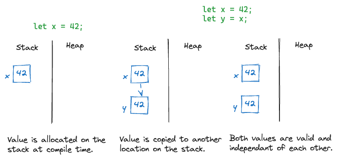
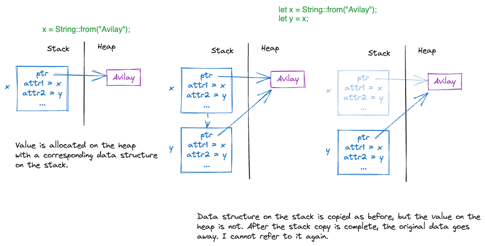
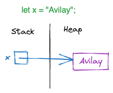

#  	Rust Notes

## Quickstart

To start a new project -

```shell
cargo new hello_world
```

This will create the following directory structure -

```
hello_world
  src
    main.rs
  Cargo.toml
```

To build a project -

```shell
cd hello_world
cargo build
```

This will create a debug build inside a newly created `target` directory along with a bunch of artifacts. The executable will be in `hello_world/target/debug/hello_world`. 

To build a release version of the project -

```
cd hello_world
cargo build --release
```

This will create a `hollo_world/target/release/hello_world`. 

I can run the executable after building or I can build and run in the same command -

```shell
cd hello_world
cargo run
```

Another nifty command is `cargo check` which checks whether everything compiles without actually building anything. Useful in dev iteration. Hopefully is integrated with rust-analyzer extension in VS Code.


## Ownership

Data types either implement the "copy" semantics or the "move" semantics. Usually data allocated on the stack follows "copy" and data allocated on the heap follows "move". 

With copy semantics both the old and new values are valid at the same time.



This can be tested as follows -

```rust
fn main() {
  let x = 42;
  let y = x;
  println!("{x} {y}");
}
```

With move semantics, the old value goes away -



The `String` type has a bunch of properties like its length, its capacity, etc. that are all allocated on the stack. The actual data is allocated on the heap. When I assign `y`, then the actual data is not copied, rather its ownership is "moved" from `x` to `y`. After this call, `x` can never be used again. Its like I called `del x` (in Python terms). This is so that the Rust runtime will know which memory location to clean up. When `y` goes out of scope, Rust runtime will clean up its memory, i.e., `drop` its memory. If `x` were also valid, then Rust would've tried to free up the memory twice. This can be tested as follows -

```rust
fn main() {
    let name = String::from("Avilay");
    let name2 = name;
    println!("{name} {name2}"); --> this will raise a compile error
}
```

Of course nothing was stopping the authors of `String` from implementing copy-semantics by copying the value on the heap as well. Its a design choice.

### Borrowing

Instead of a full-on copy or move, a variable can borrow another variable by using a reference. A reference’s scope starts from where it is introduced and continues through the last time that reference is used. The reference is very similar to a C pointer, except instead of pointing to the actual data in the heap, it points to the accompanying structure on the stack.

This way all the dot-methods on `String` that were available to `x` are also available to `y`. Now I can pass `y` to another function and still use `x` after that.

```rust
fn main() {
    let x = String::from("Avilay");
    let y = x; --> x got moved to y
    let n = x.len(); --> compiler error, I cannot use x any more
    println!("{y}");
}
```

```rust
fn main() {
    let x = String::from("Avilay");
    let y = &x; --> y is only borrowing x so everything works. y is of type &String.
    println!("{x}");
    println!("{y}");
}
```

This is also useful in for-in loops because behind the scenes for-in is just calling `into_iter` which borrows the collection.

```rust
fn main() {
  let v = vec![1, 2, 3];
  for x in v {
    println!("{x}");
  }
  // I cannot use v for anything else now.
}

fn main() {
  let v = vec![1, 2, 3];
  for x in &v {
    println!("{x}");
  }
  // v is still usable
}
```


#### Mutability

Continuing with the example above, I can introduce mutability in four ways -

1. Make only `y` mutable.
2. Make `x` mutable, but keep `y` as-is, i.e., as a reference to (or a borrower of) an immutable `String`.
3. Make `x` mutable, make `y` immutable, but make it a reference to a mutable `String` (or a mutable borrower).
4. Make everything mutable, i.e., `x` is mutable, `y` is a mutable reference to a mutable `String`.

#### Make `y` mutable

The benefit is that I can now assign `y` to some other string's reference as shown below where first `y` is a reference to `x` and then a reference to `z`. I still cannot do any mutating operation with `y` because the undelrying data structure it is pointing to is still immutable.

```rust
fn main() {
    let x = String::from("Avilay");
    let mut y = &x; --> y is still of type &String
    println!("{x} {y}");
    let z = String::from("Anika");
    y = &z;
    println!("{y}");
    y.push_str(" Parekh"); --> Compile error
}
```

#### Make `x` mutable

Just making `x` mutable while keeping everything else as-is means I can change `x` or do destructive operations on it **after I am done using `y`.** While `y` is in scope, `x` cannot be changed because it was borrowed as an immutable. 

```rust
fn main() {
  let mut x = String::from("Avilay");
  let y = &x; --> y is still of type &String
  x.push_str(" Parekh"); --> compile error
  x = String::from(" Parekh"); --> also compile error
  println!("{x} {y}")
  x.push_str(" Parekh"); --> ok, because y is out of scope
  x = String::from("Anika"); --> ok, because y is out of scope
}
```

#### Make `y` a mutable reference

First off, `y` can only be a mutable reference if `x` itself is mutable. But here things get interesting. There can only be **one** borrower if that borrower is mutable, there can be no other borrowers, even if they are immutable. In the example below, calling `println!` means that the function is borrowing an immutable reference to `x` and that is not allowed while even a single mutable reference is still in scope. Of course I still cannot assign anything else to `y`, because while its reference is mutable, it itself is still immutable.

```rust
fn main() {
  let mut x = String::from("Avilay");
  let y = &mut x; --> y is of type &mut String
  y.push_str(" Parekh");
  println!("{y}"); --> ok
  println!("{x}"); --> ok as long as y's scope has ended, otherwise compile error
}
```

#### Make `y` mutable and a mutable reference

Now I can do mutating operations on `y` and change it to point something else if I choose. But still the rule of only one borrower if it is a mutable borrower remains.

```rust
fn main() {
  let mut x: String::from("Avilay");
  let mut y = &mut x;
  y.push_str(" Parekh");
  println!("{x} {y}"); --> compile error because x cannot be borrowed while y in scope
  let mut z = String::from("Anika");
  y = &mut z;
  println!("{x} {y}"); --> ok because y has now borrowed z, so x is free
}
```

### String Literals

One way to initialize a string is `let x = "Avilay";` this makes it of type `&str`, which is a reference to the type `str`. This is different from `String`. I am not sure if this goes on the heap or the stack but my hunch is that it goes on the heap because the author of `str` data type did not know the size in bytes to allocate. When I am using it, of course the compiler does know the size but that does not help in stack allocation. Here is my mental model of what this looks like -



When I slice a `String` I get back a `&str`, my mental model is that I get reference to the heap address. Not sure if this is correct or not.


