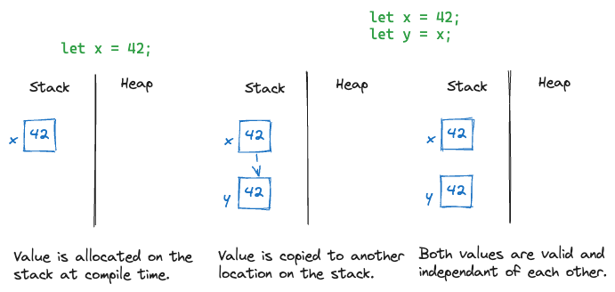
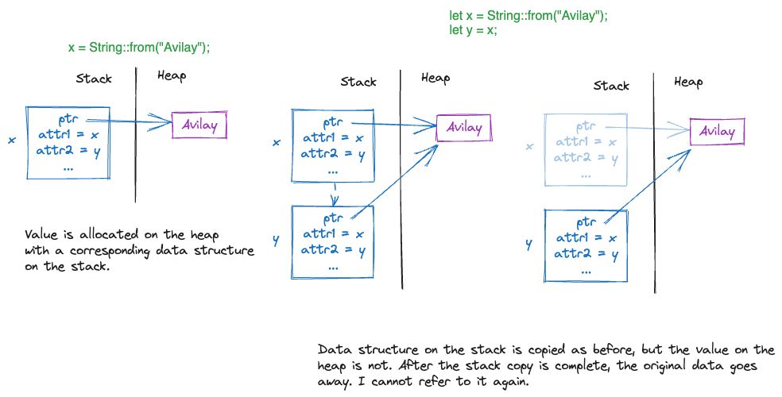
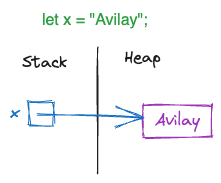

#  	Rust Notes

## Learning Plan

* [ ] Rust Book

  * [x] Ch 1: Getting Started

  * [x] Ch 2: Programming a Guessing Game

  * [x] Ch 3: Common Programming Concepts

  * [x] Ch 4: Understanding Ownership

  * [x] Ch 5: Using Structs to Structure Related Data

  * [x] Ch 6: Enums and Pattern Matching

  * [x] Ch 7: Packages, Crates, and Modules

  * [ ] Ch 8: Common Collections

  * [ ] Ch 9: Error Handling

  * [ ] Ch 10: Generic Types, Traits, and Lifetimes

  * [ ] Ch 11: Writing Automated Tests

  * [ ] Ch 12: An I/O Project: Building a Command Line Program

  * [ ] Ch 13: Functional Language Features: Iterators and Closures

    ---

  * [x] Ch 19: Patterns and Matching

  * [ ] Ch 15: Smart Pointers

  * [ ] Ch 16: Fearless Concurrency

* [ ] Rust Design Patterns

## Quickstart

To start a new project -

```shell
cargo new hello_world
```

This will create the following directory structure -

```
hello_world
  src
    main.rs
  Cargo.toml
```

To build a project -

```shell
cd hello_world
cargo build
```

This will create a debug build inside a newly created `target` directory along with a bunch of artifacts. The executable will be in `hello_world/target/debug/hello_world`. 

To build a release version of the project -

```
cd hello_world
cargo build --release
```

This will create a `hollo_world/target/release/hello_world`. 

I can run the executable after building or I can build and run in the same command -

```shell
cd hello_world
cargo run
```

Another nifty command is `cargo check` which checks whether everything compiles without actually building anything. Useful in dev iteration. Hopefully is integrated with rust-analyzer extension in VS Code.

`cargo` is very similar to `uv` with a lot of the same CLI options.

* `cargo add <pkg>` to add a package to the local Cargo.toml.
  * `cargo add serde@1.0.0` to add exact version 
  * `cargo add serde@^1.0.0` to add compatible (>=1.0.0, <2.0.0) — default behavior
  * `cargo add serde@~1.0.0` patch-level (>=1.0.0, <1.1.0) 
  * `cargo add serde@>=1.0,<1.5` range
* `cargo remove <pkg>` to remove a package from the local Cargo.toml.

To install an executable or otherwise binary package, I don't need to be inside a rust project directory, there is no Cargo.toml needed. I can just do `cargo install <pkgname>`. This will install the executable in the `~/.cargo/bin` directory.

## REPL & Jupyter

This capability is given by the `evcxr` package. It comes in the REPL version as well as the Jupyter version. For the REPL do `cargo install evcxr_repl` and then run `evcxr` from the terminal. For Jupyter install the cargo package and the jupyter kernel with:

```shell
cargo install evcxr_jupyter
evcxr_jupyter --install
```

I can also use the [Rust Playground](https://play.rust-lang.org) for a browser based environment. This is great for sharing code snippets.

## Misc

### Disable Compiler Warnings

When learning the lang, I'll often have multiple unused functions in the same file. To disable the compiler warning for this I can use the `[allow(dead_code)]` directive. I can use it on top a particular function to silence the warning for that particular function, or I can use it with an `!` as **the very first line** of my file - `![allow(dead_code)]` to silence it for all the functions in the file.

### Generating Random Values

Add the `rand` crate:

```shell
cargo add rand
```

or if I am in a notebook, then use the magic command `:dep`

```
:dep rand = "0.9"
```

```rust
use rand::Rng;

let mut rng = rand::rng();

// Generate any integer
let n: u32 = rng.random();
println!("{n}");

// Generate an integer in a range
let dice = rng.random_range(1..=6);
println!("{dice}");

let f: f32 = rng.random();
println!("{f}");

let b: bool = rng.random();
println!("{b}");
```

## Data Types

Primitive types are called "scalar" types in Rust. These are:

* Integer types: `i8`, `u8`, `i16`, `u16`, etc. till `i128` and `u128`. There also the `isize` which is architecture dependent.
* Floating-Point types: `f32` and `f64`.
* Boolean type: `bool` which has `true` and `false` as values.
* Character type: `char` can take in unicode characters `let c = '🤓';`

In addition there are the so-called "compound" types:

* Tuple type: Fixed number of mixed type elements. 

  ```rust
  let tup: (i32, f64, u8) = (500, 6.4, 1);
  
  // Access elements via destructuring just like Python
  let (x, y, z) = tup;
  
  // Can also use index value but weird syntax
  let five_hundred = x.0;
  ```

* Array type: Fixed number of same type elements. In most cases, I will want to use the vector type which are Rust's dynamic sized arrays. The "primitive" arrays are allocated on the heap because everything about them is known at compile time.

  ```rust
  let a = [1, 2, 3];
  let one = a[0];
  
  let b: [i32; 5] = [1, 2, 3, 4, 5];
  
  let c = [3; 5];
  // c = [5, 5, 5]
  ```

Division works like in C-style languages:

```rust
let x = 5.0/2.0;
// x = 2.5

let x = 5/2;
// x = 2
```

## Expressions & Statements

Almost everything in Rust is an expression. Things like `if/else`, `match`, `loop`, blocks `{}`, etc. are all expressions and will evaluate to something. Blocks will evaluate to the last expression they contain. Things like `fn`, `trait`, `let`, etc. are statements. Any expression that is followed by a `;` has its evaluated value thrown away. 

* `10` is an expression, evaluates to 10.
* `10;` is an expression statement, an expression whose value has been discarded.
* `let x = 10` is a statement, it is syntactically incomplete without a `;` at the end.
* `let x = 10;` is a complete `let` statement.

A block `{}` scope will evaluate to the last expression it contains. Of course if the last expression was followed by a `;`, the containing block will evaluate to `()` which is simiilar to Haskell's `Unit ()` type.

* `let a = { 1 + 2 };` the block will evaluate to 3 and that is what goes to the `let` statement resulting in `a = 3`. Note, the `let` statement has to end with a `;`.
* `let b = { 1 + 2; };` the block will evaluate to `()` because of the semicolon after 2, resulting in `b = ()`.
* `let c = { let x = 5; x };` will result in `c = 5`.

There does exist the `return` keyword. The convention is to use it for bailing out early, but use expressions as the final return value.

```rust
fn foo(x: i32) {
  if x < 0 {
    // early return has ;
    return 0;
  }
 	let y = x + 10;
  
  // value of the last expression with no ; at the end is returned
  sqrt(y)
}
```

## Mutability

Variables are immutabe by default. But I can change that by explicitly declaring the variable as a mutable variable.

```rust
let x = 10;
x += 1;  // ERROR: Cannot assign twice to immutable variable `x`

let mut y = 10;
y += 1;  // y = 11
```

## Functions

```rust
struct Cookie {
    flavor: String,
    calories: i32
}

fn bake(calories: i32) -> Cookie {
    if calories == 200 {
        Cookie { flavor: String::from("Choclate Chip"), calories: 200 }
    } else {
        Cookie { flavor: String::from("Snicker Doodle"), calories: 180 }
    }
}

let cookie = bake(200);
println!("<Cookie(flavor={}, calories={})>", cookie.flavor, cookie.calories);
// println!("<Cookie(flavor={cookie.flavor}, calories={cookie.calories})>")
// Gives an error
```

## Disciminated Unions aka Enums

In Rust discriminated unions are called Enums. Here is a straightforward example:

```rust
enum Shape {
    Rectangle { width: f32, height: f32 },
    Circle { radius: f32 },
    Triangle { base: f32, height: f32 },
}
```

I can use it with `match` statements to pattern match the object type and its fields. `match` needs to be exhaustive, i.e., it must have "arms" for all the variants.

```rust
fn area(shape) -> f32 {
    match shape {
        Shape::Rectangle { width, height } => width * height,
        Shape::Circle { radius } => 3.14 * radius * radius,
        Shape::Triangle { base, height } => 0.5 * base * height,
    }
}
```

The variants of an enum can be tuple like or struct like. 

```rust
// struct like
enum Node<T> {
  DataNode { data: T },
  EmptyNode
}

let n = Node::DataNode { data: 42 };  // named construction
match n {
  Node::DataNode { data } => // impl here,
  Node::EmptyNode => // impl here
}

// tuple like
enum Node<T> {
  DataNode(T),
  EmptyNode
}

let n = Node::DataNode(42);  // positional construction
match n {
  Node::DataNode(x) => // impl here,
  Node::EmptyNode => // impl here
}
```

Tuple like is idiomatic when there's one field, or when the variant is self-describing (`Some(T)`, `Ok(T)`, `Err(E)`). Struct-like when there are multiple fields and names add clarity.

Enums can even have a mixture of structs as tuples.

```rust
// Structs inside enums
struct IpvAddr {...}
struct Ipv6Addr {...}
enum IpAddr {
  V4(IpvAddr),
  V6(Ipv6Addr)
}
```

But I was not able to figure out how to use this inside `match`.

```rust
#[derive(Debug)]
struct Cookie {
    flavor: String,
    calories: i32
}

#[derive(Debug)]
struct Chips {
    is_baked: bool,
    flavor: String,
    calories: i32
}

#[derive(Debug)]
enum Snack {
    Sweet(Cookie),
    Savory(Chips)
}

let snack = Snack::Sweet(Cookie { flavor: String::from("Chocolate Chip"), calories: 200 });
println!("{snack:?}");

// The following does not compile
// [E0382] Error: borrow of partially moved value: `snack`
match snack {
    Snack::Sweet(cookie) => println!("Cookie calories: {}", cookie.calories),
    _ => ()
}
```

### Pattern Matching with Primitives

Pattern matching isn't restricted to enums only, I can do pattern matching on any value.

```rust
let num = roll_dice();
match num {
  3 => add_fancy_hat(),
  7 => add_fancy_hat(),
  _ => ()
}
```

### Exhaustive Pattern Matching

```rust
fn foo(x: bool) -> f32 {
    if x {1.2} else {2.1}
}

#[derive(Debug)]
enum Union {
    VariantOne { arg1: String, arg2: u32 },
    VariantTwo { arg1: bool, arg2: String, arg3: f32, arg4: u32},
    VariantThree { arg1: String },
    VariantFour,
    VariantFive { arg1: String, arg2: u32 },
    VariantSix { arg1: bool, arg2: bool }
}

let obj = Union::VariantOne { arg1: String::from("hello"), arg2: 12 };

match obj {
    Union::VariantOne { arg1, arg2 } => {
        arg1.len() as f32 / arg2 as f32
    },
    Union::VariantTwo { arg1, .. } => foo(arg1),
    Union::VariantThree { .. } => 2.718,
    Union::VariantFour => 3.141,
    _ => -1.0
}
```

**Ignoring fields:** In the match I can ignore some or all of the fields using `..` as can be seen for `VariantTwo` and `VariantThree`. Another way to ignore the field value but be explicit about the field names being ignored is to use this syntax: `Union::VariantThree { arg1: _ }`.

**Ignoring Variants:** I can ignore the rest of the variants by using the `_ => //code` syntax. This will still meet the criteria of exhaustive pattern matching. If I want to use the ignored variant in the code block, I can give it a variable name like `other`.

```rust
match obj {
    Union::VariantOne { arg1, arg2 } => {
        arg1.len() as f32 / arg2 as f32
    },
    Union::VariantTwo { arg1, .. } => foo(arg1),
    Union::VariantThree { .. } => 2.718,
    Union::VariantFour => 3.141,
    other => {
        println!("{other:?}");
        -1.0
    }
}
```

### `Option<T>`

Very important union. Ref: https://doc.rust-lang.org/stable/std/option/enum.Option.html

```rust
pub enum Option<T> {
  None,
  Some(T),
}
```

### `if-let` and `let-else`

In the example below, `usefoo1` is a fairly common use case, where if the input is None return some default otherwise process it further. This is even more useful when an enum has a lot of variants and we only care about a single variant. `usefoo1` is using `match` and `usefoo1` is the same logic but using the `if-let` syntax.

```rust
fn usefoo1(val: Option<i32>) -> i32 {
    match val {
        Some(x) => x + 10,
        _ => -1
    }
}

fn usefoo2(val: Option<i32>) -> i32 {
    if let Some(x) = val {
        x + 10
    } else {
        -1
    }
}
```

Another common sub-pattern is when we want to do some lengthy processing of the existing value. We would have to nest it inside the `if` block. See `usefoo3` for an example. To simplify this we can use the `let-else` syntax as shown in `usefoo4`.

```rust
fn usefoo3(val: Option<i32>) -> i32 {
    let x = if let Some(x) = val {
        x
    } else {
        return -1;
    };
    if x < 50 {
        x + 50
    } else {
        x - 50
    }
}

fn usefoo4(val: Option<i32>) -> i32 {
    let Some(x) = val else {
        return -1;
    };
    if x < 50 {
        x + 50
    } else {
        x - 50
    }
}
```

## Handling Results

When a function returns a `Result<T, E>` or an `Option<T>` enum, there are a number of ways to deal with it. Both have a success case `Ok/Some` or error case `Err/None`.

* `unwrap()` will ignore the error case. If there is an error it will panic and die. If not, it will pull the value out of the success case and return it.

* `expect(msg)` will still not handle the error case, but it will not ignore it entirely. It will print the `msg` before panicing. If not, it will pull the value out of the success case and return it.

* `?` at the end of the function call (`func()?`) will propagate the error case down the call stack. This will only work inside functions that are also returning `Result` or `Option`.

* Use `match` to properly handle both the cases:

  ```rust
  match func() {
    Ok(v) => use(v),
    Err(e) => handle(e)
  }
  ```

## Ownership

Data types either implement the "copy" semantics or the "move" semantics. Usually data allocated on the stack follows "copy" and data allocated on the heap follows "move". 

With copy semantics both the old and new values are valid at the same time.



This can be tested as follows -

```rust
fn main() {
  let x = 42;
  let y = x;
  println!("{x} {y}");
}
```

With move semantics, the old value goes away -



The `String` type has a bunch of properties like its length, its capacity, etc. that are all allocated on the stack. The actual data is allocated on the heap. When I assign `y`, then the actual data is not copied, rather its ownership is "moved" from `x` to `y`. After this call, `x` can never be used again. Its like I called `del x` (in Python terms). This is so that the Rust runtime will know which memory location to clean up. When `y` goes out of scope, Rust runtime will clean up its memory, i.e., `drop` its memory. If `x` were also valid, then Rust would've tried to free up the memory twice. This can be tested as follows -

```rust
fn main() {
    let name = String::from("Avilay");
    let name2 = name;
    println!("{name} {name2}"); --> this will raise a compile error
}
```

Of course nothing was stopping the authors of `String` from implementing copy-semantics by copying the value on the heap as well. Its a design choice.

The mutability of the object is deep.

```rust
#[derive(Debug)]
// derive(Debug) gives the struct printability
struct Cookie {
    flavor: String,
    calories: i32
}

#[derive(Debug)]
struct CookieJar {
    num_cookies: i32,
    cookie: Cookie
}

let jar = CookieJar {
    num_cookies: 10,
    cookie: Cookie { flavor: String::from("Chocolate Chip"), calories: 200 }
};
println!("{jar:?}");
jar.cookie.calories = 280;  
// [E0594] Error: cannot assign to `jar.cookie.calories`, as `jar` is not declared as mutable
```

### Borrowing

Instead of a full-on copy or move, a variable can borrow another variable by using a reference. A reference’s scope starts from where it is introduced and continues through the last time that reference is used. The reference is very similar to a C pointer, except instead of pointing to the actual data in the heap, it points to the accompanying structure on the stack.

This way all the dot-methods on `String` that were available to `x` are also available to `y`. Now I can pass `y` to another function and still use `x` after that.

```rust
fn main() {
    let x = String::from("Avilay");
    let y = x; --> x got moved to y
    let n = x.len(); --> compiler error, I cannot use x any more
    println!("{y}");
}
```

```rust
fn main() {
    let x = String::from("Avilay");
    let y = &x; --> y is only borrowing x so everything works. y is of type &String.
    println!("{x}");
    println!("{y}");
}
```

This is also useful in for-in loops because behind the scenes for-in is just calling `into_iter` which borrows the collection.

```rust
fn main() {
  let v = vec![1, 2, 3];
  for x in v {
    println!("{x}");
  }
  // I cannot use v for anything else now.
}

fn main() {
  let v = vec![1, 2, 3];
  for x in &v {
    println!("{x}");
  }
  // v is still usable
}
```

There is distinction to be made in whether the binding is mutable or not, and whether the reference (borrowing) is mutable or not.

```rust
// binding is immutable, reference is also immutable
let refval = &orig;

// binding is mutable, reference continues to be immutable
let mut refval = &orig;

// binding is immutable, reference is mutable
let refval = &mut orig;

// binding is mutable, and so is the reference
let mut refval = &mut orig;
```

For the most part, the borrow checker concerns itself with the mutability of the reference. The mutability of the binding simply determines whether the variable can bind to another value or not.

```rust
let refval = &orig;
refval = &neworig;  // ERROR: cannot assign twice to immutable variable `refval`
```

This is the same error I'd get when I make any immutable binding point to a different value. We saw this before as well.

All the interesting borrow checker semantics flow from whether the reference itself is mutable or not. There are four distinct cases here:

|                         | Immutable Value | Mutable Value |
| ----------------------- | --------------- | ------------- |
| **Immutable Reference** | (1)             | (2)           |
| **Mutable Reference**   | (3) is ERROR    | (4)           |

(1) is 

```rust
let orig = String::from("APTG");
let refval = &orig;
```

I can have as many immutable references to an immutable value as I want. I don't need to worry about the scope of the reference variable.

(2) is 

```rust
let mut orig = String::from("APTG");
let refval = &orig;
```

Here even though the original value is mutable, I have taken an immutable reference to it. While this immutable reference is in scope, I cannot mutate the original value, or in any way take another mutable reference.

```rust
orig.push_str("Avilay"); // [E0502] Error: cannot borrow `orig` as mutable because it is also borrowed as immutable

let r2 = &mut orig; // Same error
```

I can still take as many immutable references as I want.

(3) is

```rust
let orig = String::from("APTG");
let refval = &mut orig;  // ERROR: cannot borrow `orig` as mutable, as it is not declared as mutable
```

(4) is

```rust
let mut orig = String::from("APTG");
let refval = &mut orig;
```

With this `refval` has exclusive access to `orig` for the duration of its scope. No other references, either mutable or immutable can be obtained. Even calling `orig.len()`, where `orig` is passed in as an immutable reference, is not allowed until `refval` is out of scope.

```rust
let x = orig.len();
println!("{refval}");
// [E0502] Error: cannot borrow `orig` as immutable because it is also borrowed as mutable

let r2 = &orig;
println!("{refval}")
// Same error

let r2 = &mut orig;
println!("{refval}");
// [E0499] Error: cannot borrow `orig` as mutable more than once at a time
```

### String Literals

One way to initialize a string is `let x = "Avilay";` this makes it of type `&str`, which is a reference to the type `str`. This is different from `String`. I am not sure if this goes on the heap or the stack but my hunch is that it goes on the heap because the author of `str` data type did not know the size in bytes to allocate. When I am using it, of course the compiler does know the size but that does not help in stack allocation. Here is my mental model of what this looks like -



When I slice a `String` I get back a `&str`, my mental model is that I get reference to the heap address. Not sure if this is correct or not. In general, whenever I am passing strings as input params to functions, I should use `&str` so it will work with everything. Whenever I am returning a string created inside the function, it will have to a `String` type because the value will have to be `move` d to the caller.

## Structs

To make my structs printable I can decorate them with the `Debug` trait.

```rust
#[derive(Debug)]
struct Cookie {
  flavor: String,
  calories: i32
}

println!("{cookie:?}")
// Output: Cookie { flavor: "Chocolate Chip", calories: 200 }
```

### Field Init Shorthand

```rust
struct Cookie {
    flavor: String,
    calories: i32
}

struct CookieJar {
    num_cookies: i32,
    cookie: Cookie
}

fn filljar(flavor: String) -> CookieJar {
	let calories = 220;
	if flavor == "Choclate Chip" {
  	let calories = 200;
	}
  // Using the so-called "field init" shorthand to set the value of flavor
  // but the value will now move from the input param to the struct
  // which is why I cannot use `String&` as the input param.
	CookieJar { num_cookies: 12, cookie: Cookie { flavor, calories: calories } }
}
```

### Struct Update Syntax

When I want to copy the values from one object to another, I can use the struct update syntax, but with the same caveat as field init, any move-style fields will be moved, and any copy-style fields will be copied. If I only copy coyp-style fields, I can still use the original struct. If I copy move-style values, then the original struct will be unusable.

```rust
let chocolate = Cookie { flavor: String::from("Chocolate Chip"), calories: 200 };
let snicker = Cookie {
  flavor: "Snicker Doodle",
  ..chocolate  // will copy all remaining fields, i.e., calories
};
println!("{chocolate:?}");
println!("{snicker:?}");

let cookie = Cookie {
  calories: 220,
  ..chocolate  // willy copy all remaining fields, i.e., flavor
};	
println!("{cookie:?}");
println!("{chocolate:?}");
// [E0382] Error: borrow of partially moved value: `chocolate`
```

### Tuple Structs

The fields don't have names, the entire object is a type, but with a tag.

```rust
struct Color(i32, i32, i32);
struct Point(i32, i32, i32);

let black = Color(0, 0, 0);
let origin = Point(0, 0, 0);

// Destructuring works slightly differently.
let Point(x, y, z) = origin;
```

### Methods

```rust
#[derive(Debug)]
struct Rectangle {
    width: u32,
    height: u32
}

impl Rectangle {
    // Associated function aka classmethod
    // new often shows up like this
    fn square(side: u32) -> Self {
        Self {
            width: side,
            height: side
        }
    }

    // Methods
    // can take in immutable ref
    fn area(&self) -> u32 {
        self.width * self.height
    }

    // can take in mutable ref
    fn transform(&mut self, delta: u32) {
        self.width += delta;
        self.height += delta;
    }

    // can also return Self
    fn duplicate(&self) -> Self {
        Self {
            width: self.width,
            height: self.height
        }
    }

    // can move self
    fn transpose(self) -> Self {
        Self {
            width: self.height,
            height: self.width
        }
    }
}

let sq = Rectangle::square(5);
println!("{sq:?}");

// Even though the input to area is &self
// Compiler will do the magic of calling this as (&sq).area()
let a = sq.area();
// let a = (&sq).area();
println!("Area of the square is {a}");

let mut rect = Rectangle { width: 10, height: 5 };
// Compiler magic in action
rect.transform(3);
println!("{rect:?}");

let fixedrect = rect.duplicate();
// Even though rect is mut, fixedrect is not
// fixedrect.width = 0;  ERROR
println!("Transformed rectangle {fixedrect:?}");

let t = fixedrect.transpose();
println!("{t:?}");
// fixedrect was moved, is not usable anymore
// println!("{fixedrect:?}"); ERROR
```


