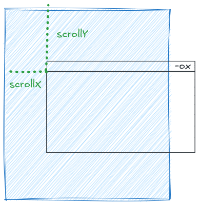
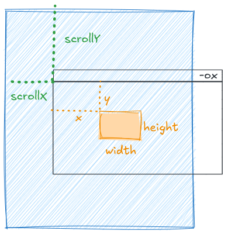

# Learn Typescript Running Notes

## Installation

```shell
nvm install 24  // Install node
npm install -g typescript  // Install typescript compiler
npm install -g tsx
```

`tsc` is the typescript compiler that transpiles TS code into JS. I can then run the JS code with node. 

If I want to run the TS directly, then I can use the `tsx` utility that will still use node, but will skip the intermediate step of compiling to JS.

```shell
tsc app.ts  // Will output app.js
node app.js
```

Or,

```shell
tsx app.ts
```

In my current node version 24, I can run TS directly but it is an experimental feature so will result in a warning.

```shell
node app.ts
```

### Build Tools

The easiest way to set up a Typescript project is to use `vite`. This needs `node` and `npm` both installed. Do the following -

```shell
npm create vite@latest
```

And then follow the prompts to create a Vanilla project. This will setup the tsc build config and do some more magic where I can reference the `main.ts` script in the html and everything will still work in dev mode. After the project has been created do -

```shell
npm install
```

to install all the deps. While in development do 

```shell
npm run dev
```

This will run a dev server on port 5713. To build the full build do -

```shell
npm run build
```

This will create a `dist` directory generate the html, js, css, etc. files in there. Here the html will reference the generated .js file instead of the ts.

### Formatting

The equivalent of Black in Javascript is Prettier. However, unlike Black which uses the bundled binary in VS Code, it is recommended to install Prettier in the project's local env.

```shell
npm install prettier -D --save-exact
```

And set it as the formatter for JS and TS in settings.json -

```json
"[javascript]": {
    "editor.tabSize": 2,
    "editor.maxTokenizationLineLength": 2500,
    "editor.defaultFormatter": "esbenp.prettier-vscode",
    "editor.formatOnSave": true
},

"[typescript]": {
    "editor.tabSize": 2,
    "editor.maxTokenizationLineLength": 2500,
    "editor.defaultFormatter": "esbenp.prettier-vscode",
    "editor.formatOnSave": true
},
```

Usually the tab size is controlled by Prettier, but I have it in my settings just for consistency with every other language. If I want to override the Prettier defaults in any way, I should add those to a `.prettierrc` file. I usually like to add these two settings -

```json
{
  "singleQuote": false,
  "trailingComma": "none"
}
```

I can find the full list of settings in the [Prettier docs](https://prettier.io/docs/options). However, the `trailingComma` setting did not take effect with this. I had to go and change it at the editor level in my settings.json -

```json
"prettier.useEditorConfig": false,
"prettier.trailingComma": "none",
```

## Modules

A Typescript file that either imports or exports stuff is deemed a module. Lets say `module1.js` is a module which is imported into `module2.js`. Module 2 can use any variables, functions, classes, consts, etc. that have been exported from Module 1. Modules can export multiple things. But they also have the option to export a single entity, called the default export. The way default and non-default entities are imported is a bit different.

```js
// Module 1 - exporting multiple things
export let stocks = ["APPL", "MSFT", "META"];
export const PI = 3;
export class Cookie {
  flavor: string;
  calories: number;
  constructor(flavor: string, calories: number) {
    this.flavor = flavor;
    this.calories = calories;
  }
}

// Module 2
import { stocks, PI, Cookie } from "./Module1.js";
...
```

```js
// Module 1 - exporting only one thing
export default class Cookie {
  flavor: string;
  calories: number;
  constructor(flavor: string, calories: number) {
    this.flavor = flavor;
    this.calories = calories;
  }
}

// Module 2 - No need for curly braces when importing
import Cookie from "./Module1.js";
```

In TS types are usually defined in a `.d.ts` file. 

When adding a script to an HTML, I can either add it as a "script" or a "module" -

```html
<script type="text/javascript" src="script.js"></script>
<script type="module" src="module.js"></script>
```

When included as a script I can use any functions, variables, etc. declared in the script file directly in my HTML -

```javascript
// script.js
function handleClick() {
  alert("Button clicked!");
}
```

```html
<script type="text/javascript" src="script.js"></script>
:::
<button onclick="handleClick()">Click Me!</button>
```

However, when included as a module, there is no way for me to import any of the exported functions, variables, etc. The module just runs the code from top to bottom and stops.

```javascript
// module.js
export function handleClick() {
  alert("Button clicked!");
}
```

```html
<script type="module" src="module.js"></script>
:::
<button onclick="handleClick()">Click Me Wont Work!</button>
```

This code will result in a runtime error `Uncaught ReferenceError: handleClick is not defined`. 

If I want to use functions defined in modules, I need to add them to the [globalThis](https://developer.mozilla.org/en-US/docs/Web/JavaScript/Reference/Global_Objects/globalThis) object.

```javascript
// module.js
export function handleClick() {
  alert("Button clicked!");
}

globalThis.handleClick = handleClick;
```

However, the prevailing wisdom is to attach the event handler to the button inside the module instead of using `globalThis`.

```javascript
// module.js
function handleClick() {
  alert("Button clicked!");
}

const button = document.getElementById('my-btn');
button.onclick = handleClick;
// - OR - a more general way of adding an event listener
button.addEventListener('click', handleClick);
```

```html
<button id="my-btn">Click Me!</button>
```

## Hoisting

I'll come across this term a lot when reading up JS documentation. Variable and function **declarations** are moved to the top of their containing scope during compilation before code execution. So code that looks like this -

```javascript
console.log(getCookie());

function getCookie() {
  return "Chocolate Chip";
}
```

will look like this post-compilation -

```javascript
function getCookie() {
  return "Chocolate Chip";
}

console.log(getCookie());
```

And for variables, this -

```javascript
console.log(cookie);

// Runtime error! ReferenceError: Cannot access 'cookie' before initialization
const cookie = "Chocolate Chip";
```

will conceptually look like this -

```javascript
const cookie;
console.log(cookie);
cookie = "Chocolate Chip";
```

Same with `let` and `var` variables. However, the following code will not result in a runtime error, it will just report the variable as `undefined`.

```javascript
console.log(cookie);
var cookie = "Choclate Chip";
```

## `var` vs `let`

The main differences between `let` and `var` in JavaScript relate to scope, hoisting behavior, and redeclaration rules:

### Scope

**`var`** is function-scoped or globally-scoped. It's accessible throughout the entire function where it's declared, regardless of block boundaries:

```javascript
function example() {
  if (true) {
    var x = 1;
  }
  console.log(x); // 1 - accessible outside the if block
}
```

**`let`** is block-scoped. It's only accessible within the nearest enclosing block (between curly braces):

```javascript
function example() {
  if (true) {
    let y = 1;
  }
  console.log(y); // ReferenceError: y is not defined
}
```

### Hoisting

**`var`** declarations are hoisted to the top of their function scope and initialized with `undefined`:

```javascript
console.log(a); // undefined (not an error)
var a = 5;
```

**`let`** declarations are also hoisted but remain in a "temporal dead zone" until the declaration is reached:

```javascript
console.log(b); // ReferenceError: Cannot access 'b' before initialization
let b = 5;
```

### Redeclaration

**`var`** allows redeclaration within the same scope:

```javascript
var name = "Alice";
var name = "Bob"; // No error
```

**`let`** doesn't allow redeclaration in the same scope:

```javascript
let name = "Alice";
let name = "Bob"; // SyntaxError: Identifier 'name' has already been declared
name = "Bob";  // This will work because this is not redeclaration
```

### Loop Behavior

This difference is particularly important in loops:

```javascript
// With var
for (var i = 0; i < 3; i++) {
  setTimeout(() => console.log(i), 100); // Prints: 3, 3, 3
}

// With let
for (let i = 0; i < 3; i++) {
  setTimeout(() => console.log(i), 100); // Prints: 0, 1, 2
}
```

In general, `let` is preferred in modern JavaScript because it provides more predictable scoping behavior and helps prevent common bugs related to variable scope.

## `==` vs `===`

The difference between `==` and `===` in JavaScript is about type coercion:

### `===` (Strict Equality)

**`===`** compares both value and type without any type conversion. Both operands must be exactly the same type and value:

```javascript
5 === 5        // true
5 === "5"      // false (number vs string)
true === 1     // false (boolean vs number)
null === undefined // false (different types)
```

### `==` (Loose Equality)

**`==`** performs type coercion before comparison. If the operands are different types, JavaScript tries to convert them to the same type:

```javascript
5 == "5"       // true (string "5" converted to number 5)
true == 1      // true (boolean true converted to number 1)
false == 0     // true (boolean false converted to number 0)
null == undefined // true (special case)
"" == 0        // true (empty string converted to 0)
```

### Why This Matters

The type coercion with `==` can lead to unexpected results:

```javascript
"0" == false   // true
"0" == 0       // true
0 == false     // true
// But:
"0" == ""      // false
false == ""    // true
```

### Best Practice

Most JavaScript developers prefer `===` because it's more predictable and explicit:

```javascript
// Recommended
if (userInput === "admin") {
  // Only matches exact string "admin"
}

// Can be problematic
if (userInput == "admin") {
  // Could match in unexpected ways due to type coercion
}
```

The same principle applies to `!==` (strict inequality) vs `!=` (loose inequality). Using strict comparison operators (`===` and `!==`) helps avoid bugs caused by unexpected type conversions and makes your code's intent clearer.

## Patterns

### Updating objects

There are two ways of doing this - one is in-place using `Object.assign` and another is using the spread operator.

```javascript
const obj1 = {
  propOne: 1,
  propTwo: 2
};

const obj2 = {
  propTwo: 3,
  propThree: 3
};

const obj3 = { ...obj1, ...obj2 };

console.log("Using the spread op -");
console.log("obj1: ", obj1);
console.log("obj2: ", obj2);
console.log("obj3: ", obj3);

console.log("Using in-place Object.assign -");
Object.assign(obj1, obj2);
console.log("obj1: ", obj1);
console.log("obj2: ", obj2);
```

The output is -

```shell
Using the spread op -
obj1:  { propOne: 1, propTwo: 2 }
obj2:  { propTwo: 3, propThree: 3 }
obj3:  { propOne: 1, propTwo: 3, propThree: 3 }

Using in-place Object.assign -
obj1:  { propOne: 1, propTwo: 3, propThree: 3 }
obj2:  { propTwo: 3, propThree: 3 }
```

### Frozen Objects

In Javascript it is possible to make an object immutable by calling `Object.freeze`. This will make the immediate properties of the object immutable, i.e., they cannot be edited or removed, but if the property is itself referencing another object, that contained object is not frozen. This also works for arrays. The object is frozen in-place.

```javascript
const asset = {
  recordedOn: Date(),
  quantity: 1000,
  stock: {
    symbol: "NVDA",
    price: 125
  }
};

// Now asset will be frozen
Object.freeze(asset);

// quantity will not change.
// this will give an error in "strict" mode.
asset.quantity = 9999;
console.log(asset);
/*
Output:
{
  recordedOn: 'Wed Jul 09 2025 00:15:37 GMT-0700 (Pacific Daylight Time)',
  quantity: 1000,
  stock: { symbol: 'NVDA', price: 125 }
}
*/

// stock symbol will change
asset.stock.symbol = "APPL";
console.log(asset);
/*
Output: 
{
  recordedOn: 'Wed Jul 09 2025 00:15:37 GMT-0700 (Pacific Daylight Time)',
  quantity: 1000,
  stock: { symbol: 'APPL', price: 125 }
}
*/
```

## Functions

### Traditional and Arrow Functions

Two ways to define functions - using `function` keyword and using arrow syntax.

```typescript
// function declaration - is hoisted
function add(x: number, y: number): number {
  return x + y;
}

// anonymous function expressions - is NOT hoisted
const add = function(x: number, y: number): number {
  return x + y;
}

// arrow function - implicit return of the expression if used without curly braces
const add = (x: number, y: number): number => x + y;

// arrow function - need explicit return with braces
const sub = (x: number, y: number): number => { return x - y; }
```

One difference is around hoisting, I can use `function` functions before they are declared, but arrow functions can only be used after their declaration.

The second and more important difference between these two is how they setup the `this` context. Here is an unrealistic example given by Claude.

```typescript
const obj = {
  name: 'Alice',
  greet: function() {
    console.log(this.name); // 'Alice'
        
    const inner = function() {
      console.log(this.name); // undefined (or global object)
    };
        
    const innerArrow = () => {
      console.log(this.name); // 'Alice' - inherits from greet()
    };
  }
};
```

Realistically it matters when I am passing the functions around as function pointers. 

```typescript
class Cookie {
  flavor: string = "Chocolate Chip";
  calories: number = 200;

  getFlavor(): string {
    return this.flavor;
  }

  getCalories = () => this.calories;
}

const cookie = new Cookie();

const flavorGetter = cookie.getFlavor;
// Runtime error!
// const val = flavorGetter();

const calGetter = cookie.getCalories;
const val = calGetter();
console.log(val);
// Correctly outputs 200

const obj = {
  flavor: "Snicker Doodle",
  calories: 220,
  
  // Inside getFlavor, `this` is set to obj, not cookie!
  flavorGetter: cookie.getFlavor,
  
  // getCalories retains its original cookie `this`
  calGetter: cookie.getCalories
};
const val2 = obj.flavorGetter();
console.log(val2);
// Outputs Snicker Doodle

const val3 = obj.calGetter();
console.log(val3);
// Outputs 200 not 220
```

### Default Params

```typescript
function discountedTotal(amts: number[], discount = 10): number {
  return amts.reduce((acc, val) => acc + val) - discount;
}
```

### Rest and Spread Syntax

This is similar to Python's `*args` -

```py
def sumall(*args: int) -> int:
  return reduce(lambda acc, x: acc + x, args, 0)

nums = [1, 2, 3]
sumall(*nums)

sumall(1, 2, 3)
```

```js
function sumall(...args: number[]): number {
    return args.reduce((acc, x) => acc + x);
}

let nums: number[] = [1, 2, 3];
const tot = sumall(...nums);

const tot = sumall(1, 2, 3);
```

Another complicated example -

```typescript
type Vector = number[];

function sumPool(...vecs: Vector[]): Vector {
  let pooled: Vector = [];
  const dim = vecs[0].length;
  for (let i = 0; i < dim; i++) {
    let col: number[] = [];
    vecs.forEach((vec) => col.push(vec[i]));
    const x = col.reduce((acc, c) => acc + c, 0);
    pooled.push(x);
  }
  return pooled;
}

function average(
  pool: (...vecs: Vector[]) => Vector,
  ...vecs: Vector[]
): number {
  const pooled = pool(...vecs);
  return pooled.reduce((acc, p) => acc + p, 0) / pooled.length;
}

const pooled = sumPool([1, 2, 3], [4, 5, 6], [7, 8, 9]);
console.log(pooled);

const avg = average(sumPool, [1, 2, 3], [4, 5, 6], [7, 8, 9]);
console.log(avg);
```

## Defining Types

Typescript is structurally typed, i.e., if two objects have the same properites and methods, they are considered compatible even though they weren't explicitly declared as such. Think of this as compile time "duck typing".

### Classes

```typescript
class Vector2 {
  x: number = 0;
  y: number = 0;
  readonly memoryLayout = "C-Style";

  constructor(xy: number[]) {
    this.x = xy[0];
    this.y = xy[1];
  }

  // `add` is a method, does not need the `function` keyword
  // "fake" method overloading like in Python
  add(other: number[]): Vector2;
  add(other: Vector2): Vector2;
  
  add(other: Vector2 | number[]): Vector2 {
    // full implementation here
  }

  // `dot` is just a property like `x`, note the `=`
  // its type is Vector2 -> number (in Haskell notation)
  dot = (other: Vector2): number => {
    return this.x * other.x + this.y * other.y;
  };
}

const v = new Vector2([-1, 2]);
console.log(v);
// Output: Vector2 { x: -1, y: 2, memoryLayout: 'C-Style' }

const u = new Vector2([2, -3]);
console.log(u);
// Output: Vector2 { x: 2, y: -3, memoryLayout: 'C-Style' }

const w = v.add(u);
console.log(w);
// Output: Vector2 { x: 1, y: -1, memoryLayout: 'C-Style' }

const p = v.dot(u);
console.log(p);
// Output: -8
```

#### Constructors

* Can be overloaded like regular methods
* Cannot have type params.
* Cannot have return type annotations.
* For derived classes, need to call `super` before using `this`.

```typescript
class Vector3 extends Vector2 {
  z: number = 0;

  constructor(x: number, y: number, z: number) {
    super(x, y);
    this.z = z;
  }
}
```

#### Getters/Setters

```typescript
class Thing {
  _size = 0;
 
  get size(): number {
    return this._size;
  }
 
  set size(value: string | number | boolean) {
    let num = Number(value);
 
    // Don't allow NaN, Infinity, etc
 
    if (!Number.isFinite(num)) {
      this._size = 0;
      return;
    }
 
    this._size = num;
  }
}
```

#### Index

Typescript has something similar to Python's `__getitem__`, but I don't think I'll be building such complex classes in TS anytime soon.

#### Inheritance

* Can `implement` an interface.

```typescript
interface Player {
  play(content: number[]): void;
}

class AudioPlayer implements Player {
  play(content: number[]): void {
    console.log("playing -");
    content.forEach((c) => console.log(`${c} `));
  }
}
```

* Can `extend` another class
* Possible to override methods in derived classes.

```typescript
class Base {
  methodOne() {
    return "Base::methodOne()";
  }

  methodTwo() {
    return "Base::methodTwo()";
  }
}

class Derived extends Base {
  methodOne() {
    return "Derived::methodTwo()";
  }

  // TS error: Property 'methodTwo' in type 'Derived' is not assignable to the same property in base type 'Base'.
  methodTwo(name: string) {
    return `Base::methodTwo(${name})`;
  }

  methodThree(name: string) {
    return `Base::methodThree(${name})`;
  }
}

Derived::methodTwo()
Base::methodThree(APTG)


const d = new Derived();
console.log(d.methodOne());
// Output: Derived::methodOne()

const b: Base = new Derived();
console.log(b.methodOne());
// Output: Derived::methodOne()

// TS error: Property 'methodThree' does not exist on type 'Base'.ts(2339)
b.methodThree("APTG");
```

#### `this`

If I am using `this` inside a method, it is better to define it as an arrow function. If I cannot do that, it is good to explicitly pass `this` parameter to the method. They will be erased from the generated JS, but TS will ensure that they are used with the proper context.

```typescript
class Cookie {
  flavor: string = "Chocolate Chip";
  
  getFlavor(this: Cookie): string {
    return this.flavor;
  }
}
```

##### Returning `this`

```typescript
class Box {
  contents: string = "";
  
  set(value: string) {  
    this.contents = value;
    // returning this makes set work with derived classes
    // the return type is **not** `Box`, but `this`
    return this;
  }
}

class ClearableBox extends Box {
  clear() {
    this.contents = "";
  }
}

const a = new ClearableBox();
const b = a.set("hello");
// b is of type ClerableBox because set returned this
```

##### Accepting `this`

```typescript
class Vector2 {
  x: number = 0;
  y: number = 0;

  // accepting this makes s.t derived classes will only accept objects of the same
  // type
  add(other: this): this {
    this.x = other.x;
    this.y = other.y;
    return this;
  }
}

class Vector3 extends Vector2 {
  z: number = 0;
}

const v = new Vector3();
v.x = 1;
v.y = 2;
v.z = 3;

const u = new Vector2();
u.x = -2;
u.y = -3;

// TS error: Argument of type 'Vector2' is not assignable to parameter of type 'Vector3'.
const w = v.add(u);
```

See [this documentation](https://www.typescriptlang.org/docs/handbook/2/classes.html#this-types) for more advanced use cases of using `this`.

#### Other

* Classes support member visibility like `public`, `protected`, `private`, but who cares about that!
* There are also static members (but no static classes) - again who cares?!
* Abstract classes.
* Class expressions.

### Type Aliases

```typescript
// simple typedefs
type Grams = number;

// Unions work just like in Python
type ID = number | string;

type Cookie = {
  flavor: string;
  calories: number;
  servingSize?: number;  // optional property
};

// Compound types - nested JS objects
type Asset = {
  recordedOn: Date;
  quantity: number;
  stock: {
    symbol: string;
    price: number;
  };
};

// Compound types - nested types
type Stock = {
  symbol: string;
  price: number;
};

type Asset = {
	recordedOn: Date;
  quantity: number;
  stock: Stock;
};
```

Declaring array types -

```typescript
const cookies: Cookie[] = [];
```

Declaring literal types -

```typescript
type OrderStatus = "ordered" | "completed";
```

Declaring types with index operator -

```typescript
type Arrayish = { [n: number]: unknown };
type Mapish = { [k: string]: boolean };
```

### Interfaces

In online tutorials data containers are used as examples for interfaces.

```typescript
interface Point {
  x: number;
  y: number;
}
```

> APTG: It makes more sense to me to have interfaces define behavior and type aliases define data, even though technically both can define both. However, the typescript official documentation states - "If you would like a heuristic, use `interface` until you need to use features from `type`."

Here are some interface examples with behavior -

```typescript
interface Bakeable {
  bake(): void;
}

function prepareDessert(sweet: Bakeable): void {
  console.log(`Preparing ${sweet}`);
  sweet.bake();
}

// I don't have to explicitly implement Bakeable...
class Cookie {
  bake(): void {
    console.log("Baking cookie");
  }
}

const cookie = new Cookie();
prepareDessert(cookie);
// Ouptut:
// Preparing [object Object]
// Baking cookie

// ...but I could because explicit is better than implict
class Cake implements Bakeable {
  bake(): void {
    console.log("Baking cake");
  }
}

const cake = new Cake();
prepareDessert(cake);
// Output:
// Preparing [object Object]
// Baking cake
```

An interface "implemented" by a function -

```typescript
interface Numberify {
  (val: string): number;
}

function stringToNumber(val: string): number {
  return val === "10" ? 10 : -1;
}

let tp: Numberify = stringToNumber;

console.log(tp("11"));
```

An interface can extend another existing interface (type aliases cannot do this).

```typescript
interface Rectangle {
  width: number;
  height: number;
}

interface Square extends Rectangle {
  side: number;
}
```

Interfaces cannot rename primitives like type aliases can.

### Enums

Javascript/Typescript has enums, but general wisdom is that they are not done properly so should be avoided.

### Generics

```typescript
function identity<T>(arg: T): T {
  return arg;
}
 
let myIdentity: <T>(arg: T) => T = identity;
```

```typescript
interface GenericIdentityFn<T> {
  (arg: T): T;
}
 
function identity<T>(arg: T): T {
  return arg;
}
 
let myIdentity: GenericIdentityFn<number> = identity;
```

```typescript
class GenericNumber<T> {
  zeroValue: T;
  add: (x: T, y: T) => T;
}
 
let myGenericNumber = new GenericNumber<number>();
myGenericNumber.zeroValue = 0;
myGenericNumber.add = function (x, y) {
  return x + y;
};
```

```typescript
interface Lengthwise {
  length: number;
}
 
function loggingIdentity<T extends Lengthwise>(arg: T): T {
  console.log(arg.length); // Now we know it has a .length property, so no more error
  return arg;
}
```

```typescript
function getProperty<Type, Key extends keyof Type>(obj: Type, key: Key) {
  return obj[key];
}
 
let x = { a: 1, b: 2, c: 3, d: 4 };
 
getProperty(x, "a");
getProperty(x, "m");  // Error
```

## Type Narrowing

Here are all the techinques I know of -

* `typeof` operator: will work only on primitive types, compound types will always evaluate to `object`.
* Type guards: functions that examine the structure of the input object. Can work for type aliases and interfaces.
* `instanceof` operator: will work for classes but will not work for type aliases and interfaces.
* Conditionals: will remove the nullable types from unions.
* Type assertions: This is like casting but will only work on "compatible" types, that convert a more specific to a less specific type or vice-versa. This can also be used to "force" remove the null-like values.
* Using the `!` to "force" remove null-like values.
* `Array.isArray()` 

```typescript
const pi: number = 3.14;
console.log(`typeof pi: ${typeof pi}`);
// Output: typeof pi: number

const isAwesome: boolean = true;
console.log(`typeof isAwesome: ${typeof isAwesome}`);
// Output: typeof isAwesome: boolean

const lang: string = "Typescript";
console.log(`typeof lang: ${typeof lang}`);
// Output: typeof lang: string

interface Cake {
  mainFlavor: string;
  frostingFlavor: string;
  numSlices: number;
}

// typeguard
function isCake(obj: any): obj is Cake {
  return (
    obj &&
    typeof obj.mainFlavor === "string" &&
    typeof obj.frostingFlavor === "string" &&
    typeof obj.numSlices === "number"
  );
}

const cake = {
  mainFlavor: "Chocolate",
  frostingFlavor: "cherry",
  numSlices: 3
};
console.log(`type of cake: ${typeof cake}`);
// Output: type of cake: object
console.log(`isCake(cake): ${isCake(cake)}`);
// Output: isCake(cake): true


class Person {
  name: string;
  isAdmin: boolean;
}

const aptg: Person = new Person();
aptg.name = "APTG";
aptg.isAdmin = true;

console.log(`type of aptg: ${typeof aptg}`);
// Output: type of aptg: object
console.log(`aptg is instance of Person: ${aptg instanceof Person}`);
// Output: aptg is instance of Person: true
console.log(`isCake(aptg): ${isCake(aptg)}`);
// Output: isCake(aptg): false

type Cookie = {
  flavor: string;
  calories: number;
};

const cookie: Cookie = { flavor: "Chocolate Chip", calories: 200 };

console.log(`typeof cookie: ${typeof cookie}`);
// Output: typeof cookie: object
console.log(`isCake(cookie): ${isCake(cookie)}`);
isCake(cookie): false

const cookies = [
  "Chocolate Chip",
  "Snicker Doodle",
  "Oatmeal Raisin"
];
// choc: string | undefined
const choc = cookies.find((cookie) => cookie.toLowerCase() === "chocolate chip");
if (choc) {
  // choc: string
  console.log(`Found ${choc}`);
}

// Type assertions have two syntaxes:
const myCanvas = document.getElementById("main_canvas") as HTMLCanvasElement;
const myCanvas = <HTMLCanvasElement>document.getElementById("main_canvas");
const x = "hello" as number;  // This will not work.

// Using ! to force remove null-likes
cosnt myCanvas = document.getElementById("main_canvas")!;
```

## Type Transforms

Typescript has a bunch of type transformers that will take an input type and transform it to an output type. Some are documented under [Type Manipulation](https://www.typescriptlang.org/docs/handbook/2/types-from-types.html) and some under [Utility Types](https://www.typescriptlang.org/docs/handbook/utility-types.html). Here are some of the interesting ones that I think I'll use -

### Function Related

#### `Parameters<F>`

`F` is a callable, and `Parameters` will return a type that is a tuple of all the input args to `F`.

```typescript
function getWeather(
  timestamp: Date, 
  latitude: number, 
  longitude: number): Weather {...}

type WeatherRequest = Parameters<typeof getWeather>;
// WeatherRequest: [Date, number, number]                                 
```

#### `ReturnType<F>`

`F` is a callable, and this gives the return type of the function as an object literal. In the example below, `WeatherResponse` is not `Weather` but the object.

```typescript
type Weather = {
  temperature: number;
  humidity: number;
};

type WeatherResponse = ReturnType<typeof getWeather>;
// WeatherResponse: { temperature: number, humidity: number }        
```

#### `Awaited<T>`

Unwraps `Promise` types to the underlying type. Does not matter how many Promises are nested in each other, this gets the final underlying concrete type.

```typescript
type T = Awaited<Promise<number>>;
// T: number

type U = Awaited<Promise<Promise<string>>;
// U: string                 
```

```typescript
function fetchCookie(): Promise<Cookie> {...}

type Cookie = Awaited<ReturnType<typeof fetchCookie>>;
                                 
function processCookie(cookie: Cookie): void {...}         

processCookie(await fetchCookie());
```

### Change the properites

These group of utility types change the properties of the input type.

#### `Partial<T>`

This makes all the properties of the input type as optional. Any properites that were already optional remain optional. This is useful when writing update functions.

```typescript
type Cookie = {
  id: number;
  flavor: string;
  calories: number;
  servingSize?: number;
};

type UpdateableCookie = Partial<Cookie>;
/*
UpdateableCookie: {
  id?: number;
  flavor?: string;
  calories?: number;
  servingSize?: number;
}
*/

function updateCookie(cookies: Cookie[], cookieId: number, cookie: UpdateableCookie): void {
  ...
}
```

#### `Required<T>`

This is the opposite of `Partial` in that it will take a type and convert all its properties to required (non-optional). Any properties that were already required remain required.

```typescript
type Cookie = {
  id: number;
  flavor?: string;
  calories: number;
  servingSize?: number;
};

type T = Required<Cookie>;
/*
T: {
  id: number;
  flavor: string;
  calories: number;
  servingSize: number
}
*/
```

#### `Pick<T, Keys>`

Creates a new type by picking the keys from the input type.

```typescript
type Cookie = {
  id: number;
  flavor?: string;
  calories: number;
  servingSize?: number;
};

type CookieInfo = Pick<Cookie, "id" | "flavor">;
/*
CookieInfo: {
  id: number;
  flavor?: string;
};
*/
```

#### `Omit<T, Keys>`

Inverse of `Pick`, will get rid of the provided keys.

```typescript
type Cookie = {
  id: number;
  flavor?: string;
  calories: number;
  servingSize?: number;
};

type CookieInfo = Omit<Cookie, "calories" | "servingSize">;
/*
CookieInfo: {
  id: number;
  flavor?: string;
};
*/
```

#### `NonNullable<U>`

`U` is usually a union of some types along with null types like `null` and/or `undefined`. This will strip all null types away from the input union type.

```typescript
type T = NonNullable<string | number | undefined | null>;
// T: string | number
```

### Misc

#### `keyof` Operator

```typescript
type Point = { x: number; y: number };
type P = keyof Point;
// P: "x" | "y"
```

#### `Readonly<T>`

This is a good way to type frozen objects.

```typescript
type Asset = {
  recordedOn: Date;
  quantity: number;
  stock: {
    symbol: string;
    price: number;
  };
};

const asset: Readonly<Asset> = Object.freeze({
  recordedOn: new Date(),
  quantity: 1000,
  stock: {
    symbol: "NVDA",
    price: 125
  }
});

// Cannot assign to 'quantity' because it is a read-only property.ts(2540)
asset.quantity = 9999;
```

#### `Record<Keys, T>`

This is the one that comes closest in spirit to Python's `dict`. The simplest way to use it -

```typescript
type StockPrices = Record<string, number>;

const stocks: StockPrices = {
  "MSFT": 496.62,
  "NVDA": 160
};
```

But the most common use case that I have seen is that the keys are a union of literals and the type then allows only these keys -

```typescript
type UserRole = 'admin' | 'user' | 'guest';
type Permissions = Record<UserRole, string[]>;

const rolePermissions: Permissions = {
  admin: ['read', 'write', 'delete'],
  user: ['read', 'write'],
  guest: ['read']
};

// TypeScript ensures all roles are covered
// If you forget one, you'll get a compile error
```

```typescript
type FormFieldTypes = 'text' | 'email' | 'password' | 'number';

// All fields are required
type FormConfig = Record<FormFieldTypes, { label: string; required: boolean }>;

// Some fields are optional
type PartialFormConfig = Partial<Record<FormFieldTypes, { label: string; required: boolean }>>;

const loginForm: PartialFormConfig = {
  email: { label: 'Email Address', required: true },
  password: { label: 'Password', required: true }
  // text and number fields are optional
};
```

## Javascript Basics

Stuff that is usually part of Javascript tutorials.

### Branching

* Ternery ops work as usual - `conditional ? expression if true : expression if false`

* Switch cases with break work like in C.

### Object Usage

* Object desctructuring works like in Python -

```javascript
const cookie = {
  flavor: "Chocolate Chip",
  calories: 200
};

const { flavor, calories } = cookie;
```

The variable can also have a default value in case the RHS does not have any attribute by that name -

```js
> let book = {title: "The Myth of Sisyphus", author: "Albert Camus"};
undefined
> let { calories = 200 } = book;
undefined
> calories
200
```

### Common Async Functions

#### `setTimeout` Function

`timeoutHandle = setTimeout(func, delayInMills, ...args)`

`clearTimeout(timeoutHandle)`

```typescript
setTimeout((name: string) => console.log(`Hello ${name}`), 1000, "APTG");
```

#### `setInterval` Function

`intervalHandle = setInterval(func, delayInMillis, ...args)`

`clearInterval(intervalHandle)`

```typescript
function shutdown(device: string, delayInSecs: number): void {
  let secsRemaining = delayInSecs;
  const h = setInterval(() => {
    if (secsRemaining <= 0) {
      console.log(`${device} is shutting down now.`);
      clearInterval(h);
    } else {
      console.log(`${device} is shutting down in ${secsRemaining} seconds.`);
      secsRemaining -= 1;
    }
  }, 1000);
}

shutdown("Garuda", 3);
```

### Misc

* Just like in Python, I can use `_` as a number separator.

```javascript
x = 1_000_000_000
```

* Falsy values -
  * `false`
  * `0` or `-0` or `0n`
  * An empty string - `''`, `""`, ``
  * `null`
  * `undefined`
  * `NaN`
* Null coalescing - is similar to the OR operator, where the `v1 || v2` expression will return `v1` if `v1` is truthy, otherwise if `v1` is falsy, it will return `v2`, regardless of whether `v2` is truthy or not. The null coalescing operator `??` does something similar where `v1 ?? v2` will return `v1` if it is not `null` or `undefined`, otherwise `v2` is returned.
* Optional chaining - lets say I have `obj.prop1.prop2` in my code. If for some reason, `obj` does not have `prop1` anymore, then this will throw a runtime `TypeError`. To avoid that, I can do `obj.prop1?.prop2`. This will simply resolve this expression to `undefined`.

### Working with Iterables/Arrays

* `for`: traditional for-loop

  ```javascript
  const cookies = [
    { flavor: "Chocolate Chip", calories: 200 },
    { flavor: "Snicker Doodle", calories: 220 },
    { flavor: "Oatmeal Raisin", calories: 180 }
  ];
  
  let snickerDoodle;
  
  for (let i = 0; i < cookies.length; i++) {
    if (cookies[i].name === "Snicker Doodle") {
  		snickerDoodle = cookies[i];
      break;
    }
  }
  ```

* `for-of`: iterate over the elements of an iterable

  ```javascript
  const cookies = ["Chocolate Chip", "Snicker Doodle", "Oatmeal Raisin"];
  for (const cookie of cookies) {
    console.log(cookie);
  }
  ```

* `for-in`: iterate over object properties

  ```javascript
  const character = {
    title: "Ninja",
    emoji: "🥷",
    powers: ["agility", "stealth", "aggression"]
  };
  
  for (const prop in character) {
    console.log(typeof prop, prop);
  }
  
  // Ouptut -
  // string title
  // string emoji
  // string powers
  ```
  
* `forEach()`: iterate over elements of an array (not any iterable). The `idx` param is optional. 

  ```javascript
  cookies.forEach((cookie, idx) => console.log(`[${idx}]: ${cookie}`))
  ```

  The return value of the lambda is discarded, `.forEach()` returns `void`. This won't work on strings, which are iterable but not arrays. Moreover, there is no way to break out of this loop.

* `.map()`: map each element to some other element. The `idx` param is optional.

  ```javascript
  const distMiles = [4, 8, 7];
  const distKms = distMiles.map((d) => d * 1.6);
  ```

* `.join()`: joins all the elements in the array with the given separator (or `,` by default) in a string

  ```javascript
  const names = ["Vijay", "Dinanath", "Chavan"]
  const fullName = names.join(" ");
  ```

* `.includes()`: similar to `.contains` in Python, returns a boolean `true` if the passed in element is in there or `false` otherwise.

  ```javascript
  const cookies = ["Chocolate Chip", "Snicker Doodle", "Oatmeal Raisin"];

  // Look for "Choclate" in the entire array
  console.log(cookies.includes("Chocolate"));
  // false

  // Look for "Choclate Chip" in the array starting from index 1
  console.log(cookies.includes("Chocolate Chip", 1));
  // false
  ```

* `.find()` - much more versatile than `.includes()` because instead of the exact element I am looking for, I can pass in a lambda.

  ```javascript
  let snickerDoodle = cookies.find((cookie) => cookie.name === "Snicker Doodle");
  ```

* `.filter()` - gets all matching items in an array. Find will get the first match. If I want to filter all the items matching some criteria -

  ```typescript
  const cookies: string[] = [
    "Chocolate chip",
    "Snicker Doodle",
    "Oatmeal Raisin",
    "Double Chocolate Chip",
    "Semi-Sweet Chocolate Chip"
  ];
  
  const chocolates = cookies.filter((cookie) =>
    cookie.toLowerCase().includes("chocolate")
  );
  console.log(chocolates);
  /*
  Ouptut:
  [
    'Chocolate chip',
    'Double Chocolate Chip',
    'Semi-Sweet Chocolate Chip'
  ]
  */
  ```

* `.reduce()` - takes in two params, the reducer lambda and the initial value. The reducer takes in 4 params out of which first two are required (I am guessing) - `accumulator`, `element`, `index of element`, `the array on which reduce was called`.

  ```javascript
  const xs = [1, 2, 3, 4];
  const tot = xs.reduce((acc, x) => acc + x, 0);
  ```

* `.every()` $\equiv$ Python's `all()`
* `.some()` $\equiv$ Python's `any()`
* `.findIndex()`
* `.at(idx)` lets me use negative indices just like Python.

### String Stuff

* `.replace(pattern, replacement)` - if both the pattern and replacement are non-regex strings, the first occurence of the pattern will be replaced by the replacement. If the pattern is a regex with the global flag `g`, e.g., `/dog/g`, this will replace all occurences of `dog` with the replacement. The replacement can also be a function which will be called for each match, regardless of whether the regex is global or not. A similar function is `replaceAll(pattern, replacement)` which replaces all without needing a global regex.

## Error Handling

Ref: [MDN Error doc](https://developer.mozilla.org/en-US/docs/Web/JavaScript/Reference/Global_Objects/Error)

### Basic Usage

```typescript
function bakeCookies(max: number): number {
  if (max > 15) {
    throw new Error(`${max} is too many cookies!`);
  } else if (max < 3) {
    throw "I can throw any type, not just Error objects!";
  }
  return Math.floor(Math.random() * (max + 1));
}

try {
  const numCookies = bakeCookies(11);
  console.log(`I baked ${numCookies} cookies.`);
} catch (err) {
  // if (err instanceof Error) {
  if (err.isError) {
    console.error(`Got ${err.name} error: ${err.message}`);
  } else {
    console.error(`Got error ${err}`);
  }
}
```

Can narrow down the type of error by using the `instanceof` operator or the `isError` property. An `Error` object has three main properties/methods -

* `name`
* `cause`: This is usually another error that caused this error, but it can be any object.
* `message`
* `toString()`

### Instantiating the `Error` object

The base `Error` object constructor has the following signature -

* `new Error()`
* `new Error(message)`
* `new Error(message, options)`
* `new Error(message, fileName)`
* `new Error(messasge, fileName, lineNumber)`

The `options` can be any Javascript object but it must have the `cause` property, which in turn can be anything.

```typescript
try {
  connectToDb();
} catch (err) {
  throw new Error("Db connection failed!", {cause: err});
}

const score = compatibility(color, bgColor);
if (score < 30) {
  throw new Error(
    "The provided colors are not compatible!",
    {
      cause: {
    	  foregroundColor: color,
    	  backgroundColor: bgColor,
    	  compatibility: score
      }
    }
  );
}
```

### Built-in Error Subclasses

There are a bunch of [builtin error types](https://developer.mozilla.org/en-US/docs/Web/JavaScript/Reference/Global_Objects/Error#error_types), here are some useful ones -

* `RangeError`: Use when a numeric value is outside its range.

* `ReferenceError`: When dereferencing an invalid reference.
* `TypeError`: When a param/var is not of the correct type.
* `AggregateError`: When `Promise.any` reports several errors wrapped in one.

### Custom Error Class

```typescript
class CustomError extends Error {
  constructor(foo = "bar", ...params) {
    // Pass remaining arguments (including vendor specific ones) to parent constructor
    super(...params);

    // Maintains proper stack trace for where our error was thrown (non-standard)
    if (Error.captureStackTrace) {
      Error.captureStackTrace(this, CustomError);
    }

    this.name = "CustomError";
    // Custom debugging information
    this.foo = foo;
    this.date = new Date();
  }
}
```

## Date-Time Stuff

Ref: [MDN Date Object](https://developer.mozilla.org/en-US/docs/Web/JavaScript/Reference/Global_Objects/Date)

The `Date` object does not support multiple timezones, there is UTC and whatever is the system locale. There are no methods to attach or convert timezones. As usual think of the `Date` object as a wrapper on top of the timestamp, which in JS is the number of milliseconds since Unix **epoch**. I can get the timestamp from a `Date` object using the `dt.valueOf()` method.

### String Repr

`Date` only supports the [ISO string format and few variants](https://developer.mozilla.org/en-US/docs/Web/JavaScript/Reference/Global_Objects/Date#date_time_string_format) - `YYYY-MM-DDTHH:mm:ss.sssZ`. Here `Z` is the timezone offset, which can either be the literal character `Z` (indicating UTC), or `+` or `-` followed by `HH:mm`, the offset in hours and minutes from UTC. 

The output string format of an existing `Date` object is pretty restricted and can be obtained by calling one of the following methods -

* `toString()`, `toDateString()`, `toTimeString()`

  ​	`'Sat Jul 19 2025 16:10:30 GMT-0700 (Pacific Daylight Time)'`

* `toUTCString()`

  ​	`'Sat, 19 Jul 2025 23:10:30 GMT'`

* `toISOString()`, `toJSON()`

  ​	`'2025-07-19T23:10:30.917Z'`

* `toLocaleString()`, `toLocaleDateString()`, `toLocaleTimeString()`

  ​	`'7/19/2025, 4:10:30 PM'`

However, when I am constructing or parsing a `Date` object using string, the input string format can have a few variations of the ISO format by omitting a few components, e.g., I can give `YYYY-MM` format -

```javascript
> new Date("2025-07")
2025-07-01T00:00:00.000Z
```

> 💣 When the time zone offset is absent, date-only forms are interpreted as a UTC time and date-time forms are interpreted as a local time. 

There are a few other "non-standard" formats also supported, but it is encouraged to not use these -

```javascript
> new Date("Sat Jul 19 2025 23:15")
2025-07-20T06:15:00.000Z
```

### Constructor

* Pass in one or more of the year, month (0-based index 🤦🏿), day, hour, min, secs, and millis. These will be interpreted in the locale specific timezone.

* Pass in a string in one of the supported formats.

* Pass in the timestamp. This is very useful because there are a number of static methods that will return a timestamp that I can then use to construct the `Date` object.

  * `Date.UTC(year, monthIdx, day, hour, secs, millis)` will return the timestamp while interpreting the params in UTC instead of locale tz, so I can do something like - 

    ```javascript
    > new Date(Date.UTC(2025, 6, 1, 5))                                                         2025-07-01T05:00:00.000Z
    
    // Same as -
    > new Date(2025, 5, 30, 22)                                                                 2025-07-01T05:00:00.000Z
    ```

  * `Date.parse(str)` will parse the string and return a timestamp.

  * `Date.now()` which will return the current timestamp.

### Getters / Setters

* `getFullYear()`, `setFullYear()`, `getUTCFullYear()`, `setUTCFullYear()`
* `getMonth()`, `setMonth()`, `getUTCMonth()`, `setUTCMonth()`
* `getDate()`, `setDate()`, `getUTCDate()`, `setUTCDate()` - this will give the day of month, not the full date.
* `getHours()`, `setHours()`, `getUTCHours()`, `setUTCHours()`
* `getMinutes()`, `setMinutes()`, `getUTCMinutes()`, `setUTCMinutes()`
* `getSeconds()`, `setSeconds()`, `getUTCSeconds()`, `setUTCSeconds()`
* `getMilliseconds()`, `setMilliseconds()`, `getUTCMilliseconds()`, `setUTCMilliseconds()`
* `getDay()`, `getUTCDay()`, no setters - this will give day of the week with Sunday as 0.

## Fetching Data

Refs:

* [fetch](https://developer.mozilla.org/en-US/docs/Web/API/Window/fetch)
* [Response](https://developer.mozilla.org/en-US/docs/Web/API/Response)

```typescript
try {
  // GET request is default
  const resp = await fetch("http://endpoint/url");
  if (!resp.ok) {
    // Got a 4xx or a 5xx response
  }
  // A 302 will be resolved transparently, I don't have to do anything
  // .json will work even if the response contains a bare string
  const data = await resp.json();
  console.log(data);
} catch (err) {
  // If the request does not even reach the server
  // err will be of type TypeError
}
```

The data returned by the response can be extracted in the following ways -

* `resp.json()` - returns a `Promise` that resolves to `JSON` of the contents.
* `resp.text()` - returns a `Promise` that resolves to a text of the contents.
* Others - `resp.arrayBuffer()`, `resp.blob()`, `resp.bytes()`

* `resp.body` - is a `ReadbleStream` of the contents, this can be read only once. There are better higher level APIs to retrieve the contents.

Posting data with a bunch a headers -

```javascript
fetch(
  "http://post/endpoint/url", 
  {
    method: "POST",
    headers: {
      "X-Token": token,
      "Content-Type": "application/json; charset=UTF-8",
    },
    body: JSON.stringify({
      userId: 1,
      title: "foo",
      content: "bar"
    })
  });
```

## Promises

There is a lot of magic happening behind the scenes with `Promises` and the `async/await` syntax. From a usage point of view, it is pretty similar to Python, I can await promises like I do `Future`s and if they are successful I get the value in the variable I was awaiting with, if not, then an error is thrown. Here is a very typical usage -

```typescript
type Cookie = {
  flavor: string;
  calories: number;
};

async function bake(): Promise<Cookie> {
  ...
}

async function learnPromises() {
  try {
    // cookie: Cookie
    const cookie = await bake();
    // do something with cookie
  } catch (err) {
    // handle the error
  }
}

learnPromises();
```

The magic happens inside the `bake()` function. Here is a sample implementation -

```typescript
async function bake(): Promise<Cookie> {
  return new Promise<Cookie>((resolve, reject) => {
    // baking the cookie takes some time, it may or may not come out well
    const success = Math.random() > 0.5;
    if (success) {
      const cookie = {
        flavor: "Chocolate Chip",
        calories: 200
      };
      resolve(cookie);
    } else {
      reject(new Error("Bad cookie!"));
    }
  });
}
```

What is passed to the `Promise` constructor is a single function called the `executor` that takes in two parameters - both of them also functions. The first one is the `resolve` function that takes in a `Cookie` or a another promise-like and returns nothing. The second is the `reject` function that takes in `any`thing and returns nothing. The executor will typically await on some other long running task or wait for some system OS event. In any case, if the underlying task/event is successful, it will call the `resolve` function with the `Cookie` object otherwise it will call the `reject` function with the new error object. Now, nowhere in the code have I passed in the resolve/reject functions. As soon as I call `bake`, the executor will start executing. I am guessing that the JS runtime provides some sort of default resolve/reject pair that even though are supposed to return a void, the promise as a whole will end up returning the input of the resolve/reject back to the awaiting variable.

The `Promise` constructor makes much more sense when used with `then`s, because here - ignoring some syntax sugar - I am passing in the two functions explicitly.

```typescript
function learnThenables() {
  console.log("Main: calling bake");
  bake()
    .then((cookie) => console.log(`Got cookie: ${cookie}`))
    .catch((err) => console.error(`Got error: ${err}`));
}
```

The function passed to `then` is the one passed as `resolve` and the function passed to `catch` is the one passed in as `reject`.

### Multiple Promises

Just like in Python, when I await on a single promise, the main thread will suspend its execution until the promise is settled. 

```typescript
const t1 = await task1();
console.log(t1);

const t2 = await task2();
console.log(t2);

const t3 = await task3();
console.log(t3);
```

These lines will be run in order. Scheduling multiple tasks before I start awaiting on them is much simpler in Javascript than it is in Python -

```typescript
const promise1 = task1();
const promise2 = task2();
const promise3 = task3();
try {
	const results = await Promise.all([promise1, promise2, promise3]);
	results.forEach((result) => console.log(result));
} catch (err) {
  // handle this
}
```

I just get the promise object, without awaiting on it, and then await on multiple promise objects inside `Promise.all`. Even if one of the promises rejects, the entire `Promise.all` call will throw an error and the control will be transferred to the `catch` block.

## DOM API

Ref: 

* [DOM API](https://developer.mozilla.org/en-US/docs/Web/API/HTML_DOM_API)
* [Events](https://developer.mozilla.org/en-US/docs/Web/API/HTMLElement/beforetoggle_event)

While MDN is a good reference for DOM APIs, its search is pretty bad. I'll keep adding APIs here as I learn about them.

### Content Position

* [Window.innerHeight](https://developer.mozilla.org/en-US/docs/Web/API/Window/innerHeight)  [Window.innerWidth](https://developer.mozilla.org/en-US/docs/Web/API/Window/innerWidth)

* [Window.outerHeight](https://developer.mozilla.org/en-US/docs/Web/API/Window/outerHeight) [Window.outerWidth](https://developer.mozilla.org/en-US/docs/Web/API/Window/outerWidth)


* [Window.screenLeft](https://developer.mozilla.org/en-US/docs/Web/API/Window/screenLeft) [Window.screenTop](https://developer.mozilla.org/en-US/docs/Web/API/Window/screenTop) - position of the browser window relative to the screen. Old names are `screenX` and `screenY`.


* [Window.scrollY](https://developer.mozilla.org/en-US/docs/Web/API/Window/scrollY) [Window.scrollX](https://developer.mozilla.org/en-US/docs/Web/API/Window/scrollX) - position of the browser window relative to the document.

  

This API will only work on the first "container" element, e.g., div. If there are nested containers with overflowing content, scrolling one of the nested container will not change the window's scroll properties.


* [Window.scroll()](https://developer.mozilla.org/en-US/docs/Web/API/Window/scroll) / [Window.scrollTo()](https://developer.mozilla.org/en-US/docs/Web/API/Window/scrollTo): Both these APIs do the same thing, scroll to an absolute point.
* [Window.scrollBy()](https://developer.mozilla.org/en-US/docs/Web/API/Window/scrollBy): This API scrolles a relative distance from its current point.


* [Element.getBoundingClientRect()](https://developer.mozilla.org/en-US/docs/Web/API/Element/getBoundingClientRect) - will return the bounding rectangle of the current element.

  > ⚠️ Even though the documentation says that if `box-sizing: border-box` is set, the paddings and borders are ignored, my observation is that they are always included.

* [Element.getClientRects()](https://developer.mozilla.org/en-US/docs/Web/API/Element/getClientRects) - contrary to intuition, this will not return all the child boxes of the current element. This is applicable for multiline inline elements and as such of limited use to me.




While the following set of APIs seem as if they are duplicate of rectangle API, it is not entirely true!

* [Element.clientHeight](https://developer.mozilla.org/en-US/docs/Web/API/Element/clientHeight) [Element.clientWidth](https://developer.mozilla.org/en-US/docs/Web/API/Element/clientWidth) - give the height and width of the box, same as rectangle API, but without including any scroll bars and borders.
* [Element.clientTop](https://developer.mozilla.org/en-US/docs/Web/API/Element/clientTop) [Element.clientLeft](https://developer.mozilla.org/en-US/docs/Web/API/Element/clientLeft) - these actually give the width of the top and left border!


* [Element.scrollLeft](https://developer.mozilla.org/en-US/docs/Web/API/Element/scrollLeft) [Element.scrollTop](https://developer.mozilla.org/en-US/docs/Web/API/Element/scrollTop) - coordinates of the viewport relative to the entire element along with its full contents.
* [Element.scrollHeight](https://developer.mozilla.org/en-US/docs/Web/API/Element/scrollHeight) [Element.scrollWidth](https://developer.mozilla.org/en-US/docs/Web/API/Element/scrollWidth) - size of the entire element along with its full contents, regardless of overflow.


* [Element.scroll()](https://developer.mozilla.org/en-US/docs/Web/API/Element/scroll) / [Element.scrollTo()](https://developer.mozilla.org/en-US/docs/Web/API/Element/scrollTo) - will scroll to the absolute coordinates relative to the element's top-left.
* [Element.scrollBy()](https://developer.mozilla.org/en-US/docs/Web/API/Element/scrollBy) - similar to above but will scroll offset pixels.
* [Element.scrollIntoView()](https://developer.mozilla.org/en-US/docs/Web/API/Element/scrollIntoView) - this will simply scroll the element into the top of the viewport without my having to calculate widths/heights/etc.

### Pre-loading Images

There are two ways of dynamically creating an image tag in an HTML -

```javascript
const img = document.createElement("img");
img1.src = "http://..."

const preloadedImg = new Image();
img2.src = "http://..."
```

As soon as I set the `src` attribute, the image starts to download. In the first case, the tag has already been added to the HTML so it starts to be rendered. In the second case, the tag is not attached to anything but the image is already downloading. This is useful for preloading large images.

### Creating New Content

```typescript
const img = await preloadImage("http://localhost:5173/vite.svg");
document.getElementById("app")!.appendChild(img);
```


